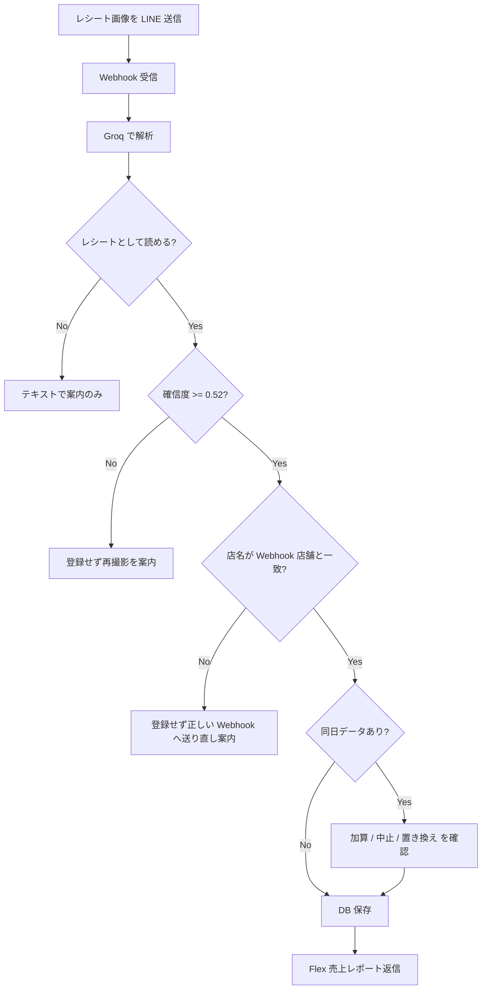

# LINE レシート解析システム

店舗の日次売上レシートを LINE で送ると、画像を AI で解析し、店舗別テーブルに保存して売上レポートを返信する機能の説明です。

旧システムにあったカレンダー連携・メディア管理・予約表などの機能は対象外です。**レシート画像の受信・解析・登録・返信**に絞って記載しています。

---

## 概要

| 項目 | 内容 |
|------|------|
| 受信方式 | LINE 公式アカウントへレシート画像を送信 |
| 解析エンジン | Groq Vision（`meta-llama/llama-4-scout-17b-16e-instruct`） |
| 保存先 DB | Supabase プロジェクト `hocbnifuactbvmyjraxy` |
| Edge Function | `line-webhook/{store_partition_key}` |
| 返信形式 | Flex Message（売上レポート）＋ 確認用 Flex / テキスト |

店舗ごとに **Webhook URL が分かれており**、どの URL に送ったかで保存先テーブルが決まります。レシートに印刷された店名から自動でテーブルを切り替えることはありません。

---

## アーキテクチャ

```
LINE トーク（店舗用 Webhook URL が設定された公式アカウント）
    │
    ▼
/functions/v1/line-webhook/{store_partition_key}
    │
    ├─ 生イベント保存 … line_webhook_raw__{store_partition_key}
    │
    ├─ 画像取得 → Groq で OCR 解析
    │
    ├─ 店名一致チェック
    ├─ 同日重複チェック
    │
    └─ レシート保存 … line_receipt__{store_partition_key}
            │
            └─ Flex 売上レポート返信（予算・前年同月比付き）
```

### 店舗レジストリ

`store_webhook_tables` に登録された店舗だけが Webhook を受け付けます。

| 列 | 説明 |
|----|------|
| `store_partition_key` | URL パスに使うキー（例: `marugoyotsuya`） |
| `display_name` | 表示名（例: `マルゴ 四谷`） |
| `webhook_raw_table` | 生 Webhook イベント（例: `line_webhook_raw__marugoyotsuya`） |
| `receipt_table` | レシート本体（例: `line_receipt__marugoyotsuya`） |

Webhook URL の例:

```
https://hocbnifuactbvmyjraxy.supabase.co/functions/v1/line-webhook/marugoyotsuya
```

---

## セットアップ

### 1. LINE Developers

1. 店舗（または共通）の Messaging API チャネルを用意する
2. Webhook URL に上記 `{store_partition_key}` 付き URL を登録する
3. Webhook の利用を ON にする

### 2. Supabase Edge Secrets（hocbn）

| Secret | 用途 |
|--------|------|
| `GROQ_API_KEY` | レシート画像解析 |
| `LINE_CHANNEL_ACCESS_TOKEN` | 共通アクセストークン |
| `LINE_CHANNEL_ACCESS_TOKEN__{STORE_KEY}` | 店舗別トークン（任意・優先） |
| `LINE_CHANNEL_SECRET` | 共通チャネルシークレット |
| `LINE_CHANNEL_SECRET__{STORE_KEY}` | 店舗別シークレット（任意・優先） |
| `ADMIN_DASHBOARD_TOKEN` | 管理画面の固定トークン認証。LINE の「売上推移を見る」は短命ログインチケット経由で利用 |

`{STORE_KEY}` は `store_partition_key` を大文字化したもの（例: `marugoyotsuya` → `MARUGOYOTSUya` ではなく `MARUGOYOTSUya` — 実装では `[^a-zA-Z0-9_]` を `_` に置換して大文字化）。

### 3. DB マイグレーション

店舗テーブル作成・レジストリ投入:

- `supabase/migrations/20260523140000_store_partition_webhook_tables.sql`
- 予算・休業日（Flex 返信の予算欄用）: `20260523150000_sales_budget_tables.sql`
- 修正・重複・店名不一致の保留テーブル: `20260523170000_*` 〜 `20260523190000_*`

### 4. デプロイ

```bash
npx supabase link --project-ref hocbnifuactbvmyjraxy
npx supabase db push
npx supabase functions deploy line-webhook --project-ref hocbnifuactbvmyjraxy
```

---

## 処理フロー（画像送信時）



### 解析項目

Groq が JSON 形式で抽出する主な項目:

| フィールド | 内容 |
|-----------|------|
| `storeName` | 店名 |
| `date` | レシート日付 |
| `netSales` | 純売上 |
| `taxAmount` | 消費税 |
| `grossSales` | 総売上（税込） |
| `partyCount` | 会計組数 |
| `guestCount` | 客数 |
| `unitPrice` | 客単価 |
| `items` | 明細（最大 5 件） |

確信度はモデル出力とヒューリスティックを合成し、閾値 **0.52 未満** は登録しません。

---

## 確認フロー

### 店名不一致

Webhook の登録店舗名と、レシート解析の店名が一致しない場合:

- **登録しない**
- 「この Webhook では登録できません」と案内
- 解析店名に対応する別店舗の Webhook が `store_webhook_tables` にあれば、送り先店舗名と Webhook URL を表示
- 見つからない場合は管理画面で設定確認を促す

例: 四谷の Webhook に CAVA CAVA のレシートを送った → 四谷には保存されず、CAVA CAVA 用 Webhook への送り直しを案内。

店名一致判定は正規化後の完全一致、または 4 文字以上の部分一致（含む関係）で行います。

### 同日重複

同じ店舗テーブルに **同じレシート日** のデータが既にある場合、登録前に確認します。

| 操作 | 動作 |
|------|------|
| **加算**（1 / はい） | 既存データは残し、今回分を追加保存 |
| **中止**（2 / いいえ） | 保存しない |
| **置き換え**（3） | 同日の既存行を削除し、今回分のみ保存 |

ボタンまたは「加算」「中止」「置き換え」のテキスト返信で選択できます。保留状態は 30 分で失効します。

---

## 登録成功時の Flex 返信

保存後、以下を含む Flex Message（売上レポート）を返します。

### 当日データ

- 店名、日付、消費税、総売上（税込）、会計組数、客数、客単価

### 月次集計

- 営業日数、月間総売上、1 日平均（売上・組数・客数）

### 予算（設定がある店舗・月のみ）

- 月次目標、月次実績（達成率）、当日目標
- 日次予算差、日次予算累計
- 達成率 100% 未満・マイナス差は赤表示

### 前年同月比（データがある場合）

- 売上・組数・客数・営業日数の前年差（% と差分）

### フッターボタン

| ボタン | 動作 |
|--------|------|
| この結果を修正 | 修正セッション開始（対象 LINE メッセージ ID 付き） |
| この解析結果を削除 | 当該解析結果を DB から削除 |
| 売上推移を見る | `analytics.html` へリンク（`store_key`・`month`・`from=line`・任意で `t=`） |

---

## テキスト操作

画像以外のテキストメッセージも処理します。優先順位:

1. 店名不一致の旧保留への返信（レガシー）
2. 同日重複確認への返信
3. 修正セッション中の入力
4. 削除・修正コマンド

### 修正

| 入力例 | 動作 |
|--------|------|
| `レシート修正 ID:{line_message_id}` | 該当レシートの修正開始 |
| `レシート修正` | 直近のレシートを修正 |

修正可能項目: 店名、日付、純売上、消費税、総売上、会計組数、客数、客単価。番号で項目を選び、値を入力して「確定」で保存します。

### 削除

| 入力例 | 動作 |
|--------|------|
| `レシート解析削除 ID:{line_message_id}` | 該当行を削除 |
| `レシート削除` | 直近のレシートを削除 |

Flex の「この解析結果を削除」ボタンから送る形式が確実です。

---

## 保存データ

`line_receipt__{store_partition_key}` に 1 画像 = 1 行（同日加算時は複数行）で保存します。

| 列 | 内容 |
|----|------|
| `line_message_id` | LINE メッセージ ID（ユニーク） |
| `room_id` | グループ / ルーム / 1:1 の ID |
| `store_name` | Webhook 登録店舗の表示名 |
| `receipt_date` | 正規化した日付（`YYYY-MM-DD`） |
| `gross_sales_yen` など | 数値化した売上・組数・客数 |
| `raw_payload` | 解析結果 JSON 一式（OCR の店名含む） |
| `created_at` | 登録日時 |

営業日の切り替えは JST **5 時** を基準に予算計算へ反映します（`RECEIPT_BUDGET_BUSINESS_DAY_START_HOUR_JST = 5`）。

---

## 売上分析画面

登録データの閲覧・予算設定は GitHub Pages の売上分析画面から行います。

- URL: https://marugo-s.github.io/line_report/analytics.html
- API: hocbn の `admin-api`（店舗別 `line_receipt__*` を集計）
- 設定の店舗名マッピング: `pages-config.js` の `STORE_NAMES`

Flex の「売上推移を見る」は同画面へ遷移します。LINE 経由では **その Bot の店舗だけ** 表示し、他店舗・メディア・予約表・売上シートへの導線は出しません（[CHANGELOG-2026-05.md](./CHANGELOG-2026-05.md) 参照）。

---

## 関連ソース（実装）

| パス | 役割 |
|------|------|
| `supabase/functions/line-webhook/index.ts` | Webhook エントリ（画像・テキスト振り分け） |
| `supabase/functions/_shared/receipt_vision.ts` | Groq 画像解析 |
| `supabase/functions/_shared/receipt_save_flow.ts` | 重複確認 → 保存 → 返信組み立て |
| `supabase/functions/_shared/receipt_store_mismatch.ts` | 店名不一致案内 |
| `supabase/functions/_shared/receipt_duplicate.ts` | 同日重複確認 |
| `supabase/functions/_shared/receipt_flex_reply.ts` | 売上レポート Flex |
| `supabase/functions/_shared/receipt_correction.ts` | 修正・削除・テキストハンドラ |
| `supabase/functions/_shared/receipt_reply_context.ts` | 月次集計・予算・前年比の計算 |
| `supabase/functions/_shared/store_receipt.ts` | 店舗別 CRUD |
| `pages-config.js` | Webhook URL・店舗名のフロント設定 |

---

## 運用上の注意

1. **店舗ごとに正しい Webhook URL を使う** — 別店舗のレシートは自動振り分けされません。
2. **撮影品質** — 影・反射があると確信度不足で登録されないことがあります。
3. **同日の再送** — 意図せず加算しないよう、重複確認の選択に注意してください。
4. **トークン** — 店舗別 `LINE_CHANNEL_ACCESS_TOKEN__*` が未設定の場合、共通トークンにフォールバックします。

---

## 変更履歴（要点）

- 店舗別 Webhook / テーブル分割（`store_partition_key` 方式）
- Flex 売上レポート（予算・前年同月比・フッター操作）
- 同日重複時の加算 / 中止 / 置き換え
- 店名不一致時は **登録せず** 正しい Webhook への送り直しを案内

**2026年5月以降の追加（詳細）:** [CHANGELOG-2026-05.md](./CHANGELOG-2026-05.md)

- レシート **電話番号** 照合（店名 OR 電話で一致）
- 管理画面から `receipt_phones` 編集
- スプレッドシート双方向同期の **更新日時マージ**・シート削除の DB 反映
- 売上分析: LINE 経由は **1 店舗固定**・メディア/予約表/売上シート非表示
- 「売上推移を見る」URL に `from=line`・`store_key`・`month`
