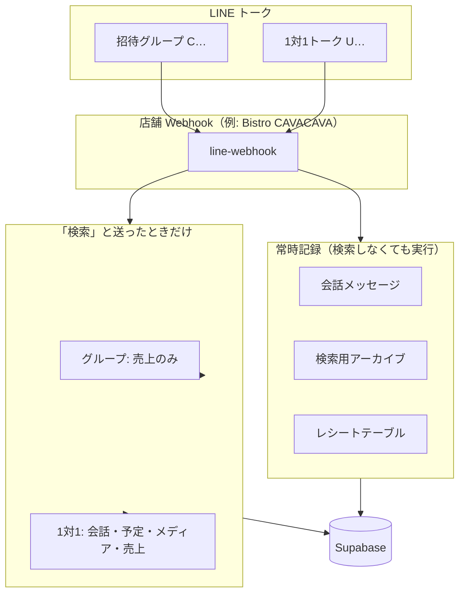

# LINE 検索機能 — プレゼン・説明用まとめ

店舗公式 LINE Bot に追加した **「過去データの検索」** 機能の全体像です。  
レシート／売上・会話・予定・メディアの **記録** と **検索** の違い、グループと1対1の使い分けを中心に整理しています。

**関連ドキュメント**

| ファイル | 用途 |
|----------|------|
| [CHANGELOG-2026-05.md](./CHANGELOG-2026-05.md) §9 | 開発者向け変更履歴・技術詳細 |
| [LINE-RECEIPT-ANALYSIS.md](./LINE-RECEIPT-ANALYSIS.md) | レシート画像の解析・登録 |
| [RESERVATION-GMAIL-GUIDE.md](./RESERVATION-GMAIL-GUIDE.md) | **メール予約**（本検索とは別系統） |
| [ROOM-PERMISSION-DETAIL-GUIDE.md](./ROOM-PERMISSION-DETAIL-GUIDE.md) | 管理画面のルーム権限 |
| [ROOM-LINKING-GUIDE.md](./ROOM-LINKING-GUIDE.md) | ルームと店舗 Webhook の連携 |

**本番:** Supabase `hocbnifuactbvmyjraxy` ／ Edge Function `line-webhook`

---

## 1. この機能でできること（30秒サマリー）

| やりたいこと | どこで使う | 方法の例 |
|--------------|------------|----------|
| 過去の会話をキーワードで探す | **1対1トーク**（Botを友だち追加） | 「検索」→ 会話検索 → `ヒューガルデン` |
| 予定・予定関連のトークを探す | **1対1** | 「検索」→ 予定検索 → キーワード |
| 画像・ファイルを探す | **1対1** | 「検索」→ メディア検索 → キーワード |
| ある日の/ある月のレシート売上を見る | **グループでも可**（**その店舗の Bot のみ**） | 「検索」→ ボタン → `20260521`（日次） または `202605`（月次） |
| レシート画像を登録する | **グループ等**（従来どおり） | 画像送信 → OCR → DB保存 |

**ポイント**

- **記録**は、Bot が入っているトークなら **常に** 行う（検索ON/OFFに関係なく蓄積）。
- **検索の返信**は、チャットの種類と管理画面の設定で **できることが変わる**。
- **売上検索**は **その Webhook の店舗だけ**（同店舗の全グループは対象、**他店舗は対象外**）。
- **会話・予定・メディア**（1対1）はルーム横断で、売上ほど店舗で厳密には分離されない。
- **メール予約**（食べログ／一休）は **別機能**（予約表・Gmail通知）。本ドキュメントの「予定検索」とはデータが別です。

---

## 2. 全体像（記録と検索は別）



| 区分 | 説明 |
|------|------|
| **記録** | トーク・レシート・メディアなどを DB に溜める。**毎日の運用そのもの**。 |
| **検索** | 溜まったデータを **キーワードや日付** で引き出す。**「検索」と操作したとき** に Bot が返信。 |

---

## 3. グループと1対1 — 何が違うか

### 3.1 一覧表（プレゼン用）

| | 招待グループ／複数人トーク | 1対1トーク（友だち登録） |
|--|---------------------------|-------------------------|
| **例** | 店舗スタッフ用グループ | 個人で Bot とトーク |
| **room_id** | `C…`（グループ）／`R…`（複数人） | `U…`（ユーザーID） |
| **レシート送信・解析** | ✅ 従来どおり | ✅ 可能 |
| **会話の常時記録** | ✅ | ✅ |
| **「検索」メニュー** | **売上のみ**（ボタン1つ） | **4種類**（会話・予定・メディア・売上） |
| **会話・予定・メディア検索** | ❌（1対1を案内） | ✅ 招待ルーム含め **横断検索** |
| **売上検索** | ✅ 日付8桁 または月6桁 | ✅ 日付8桁 または月6桁 |
| **売上の検索範囲** | **この Webhook の店舗のみ**（店舗内の全ルーム） | 同左 |
| **会話・予定・メディアの検索範囲** | — | 検索ONのルームを横断（**店舗をまたぐ場合あり**） |

### 3.2 店舗の切り分け（重要）

**どの Bot（Webhook）から検索したか** で、売上データの範囲が決まります。

| 検索の種類 | 他店舗のデータは見えるか | 同じ店舗の別グループは見えるか |
|------------|--------------------------|--------------------------------|
| **売上検索** | **見えない**（その店舗の `receipt_table` のみ） | **見える**（店舗内ルーム横断） |
| **会話・予定・メディア**（1対1） | 設定次第で **またがる可能性あり** | 見える（ルーム横断） |

**売上検索の例**

- Bistro CAVACAVA の Webhook に届いたレシート → `line_receipt__bistrocavacava` に保存  
- その Bot から売上検索 → **サバサバのレシートだけ**（四谷マルゴなど **別店舗は出ない**）
- 同じサバサバ Bot が入っている **複数のグループ** に溜まったレシートは、**まとめて** 検索対象

```
Webhook URL …/line-webhook/bistrocavacava
        ↓
store_webhook_tables（店舗キー → receipt_table）
        ↓
売上検索はこの receipt_table だけ参照
```

### 3.3 なぜ分けるか

- **グループ**は、日々のレシート送信・業務連絡が主。**売上確認**だけトーク内で完結させる。
- **会話・予定・メディア**はキーワード入力が必要で、グループではノイズになりやすいため **1対1に集約**。
- **1対1**では、複数グループに分散した記録を **まとめて検索** できる（横断）。

---

## 4. 検索の種類（4＋売上）

### 4.1 機能比較

| 種別 | 入力例 | 検索対象 | 結果のイメージ | 有効条件（管理画面） |
|------|--------|----------|----------------|----------------------|
| **会話検索** | `バドワイザー` | トーク本文（直近1年） | ルーム名・日時・**全文** | 会話検索（ルーム）ON |
| **予定検索** | `貸切` | 予定DB＋予定関連トーク | 件名・説明・日時 | 予定（カレンダー）機能 ON |
| **メディア検索** | `請求書` | 画像・動画・ファイル名など | 種別・ファイル名・日時 | メディア閲覧 ON |
| **売上検索** | `20260521` または `202605` | 店舗のレシートテーブル | 日次: **レシート返信と同型** / 月次: 合計サマリ（合計金額・人数・組数） | レシートレポート系 ON |

### 4.2 売上検索のデータの考え方

- 各店舗 Webhook には **専用のレシートテーブル** がある（例: `line_receipt__bistrocavacava`）。
- **その Webhook に結びついた店舗のデータだけ** が対象。**他店舗の売上は基本的に検索できない。**
- 同一店舗内では、グループ・1対1 **どちらから検索しても** **全ルーム分のレシート** を対象（ルーム ID では絞らない）。
- 検索用インデックスに無い過去分は、**レシートテーブルから自動で補完**する。

### 4.3 会話・予定・メディア検索のデータの考え方

| データ | 内容 |
|--------|------|
| **会話** | LINE で送られたテキスト等をルームごとに保存。検索ONのルームだけ結果に出る。 |
| **予定** | ① 構造化予定（`line_room_calendar_events`）② トークからの予定用アーカイブ。検索時は **Googleカレンダーを直接見ない**（DBのみ）。 |
| **メディア** | 画像・動画・ファイルのメタデータをアーカイブ。 |

**売上との違い:** 1対1の会話・予定・メディアは、管理画面で ON のルームを **横断** して検索するため、**店舗（Webhook）で厳密に分離されていない** 点に注意（運用・権限設定に依存）。

**メール予約（食べログ／一休）** は `tabelog_reservation_*` 等の **別テーブル** で、予約表・Gmail通知用。**予定検索には含めない**（仕様どおり維持）。

---

## 5. 操作の流れ（画面イメージ）

### 5.1 招待グループで「検索」

```
ユーザー: 検索
    ↓
Bot: 【このルームでできる検索：売上のみ】
     ・説明（段落分け）
     ・1対1なら会話・予定・メディアも検索できる旨
     ・[売上（レシート）を検索する] ボタン
    ↓
ユーザー: （ボタン）→ 表示「売上検索」
    ↓
Bot: 日付8桁（例: 20260521）または月6桁（例: 202605）を送ってください
    ↓
ユーザー: 202605
    ↓
Bot: 売上（月次）サマリ（合計（税込）・組数・人数）＋「売上推移を見る」
```

※ 日付8桁を **いきなり送る** だけでも売上検索可能（8桁=日次、6桁=月次）。

### 5.2 1対1で「検索」

```
ユーザー: 検索
    ↓
Bot: Flex【過去データの検索（1対1）】
     ・4ボタン: 会話／予定／メディア／売上
     ・グループ記録も横断できる説明
    ↓
ユーザー: 会話検索 → キーワード送信
    ↓
Bot: ヒット一覧（ルーム名・全文・最大5件表示など）
```

### 5.3 検索待ち（共通ルール）

| 項目 | 内容 |
|------|------|
| 待ち時間 | 種別を選んでから **15分以内** |
| 次の1通 | キーワード or 売上の日付（8桁/6桁） |
| 記録 | **待ち中に送ったキーワード1通は記録しない**（検索ノイズ防止） |
| キャンセル | 「キャンセル」「やめる」で解除 |

---

## 6. 記録のルール（検索以外の日常運用）

| 内容 | グループ | 1対1 |
|------|----------|------|
| 通常の会話・画像 | 記録する | 記録する |
| レシート画像 | 解析して DB 保存 | 同左 |
| 「検索」「会話検索」など操作文 | 記録スキップ可 | **記録する** |
| 検索待ちのキーワード1通 | 記録しない | 記録しない |
| 保持期間の目安 | **直近1年**（会話・検索アーカイブ） |

---

## 7. 管理画面との関係

ルームごとに `room_summary_settings` で ON/OFF します（店舗 Webhook の「権限・機能設定」）。

| 設定項目 | 記録 | 検索 |
|----------|------|------|
| 会話検索（ルーム） | 常時（会話テーブル） | ON のルームのみヒット |
| 予定（カレンダー）系 | トークは常時アーカイブ | ON のルームのみ |
| メディア閲覧 | 常時 | ON のルームのみ |
| レシート中間／月末レポート | レシート保存 | 売上検索に利用 |
| Gmail予約通知 | — | **別機能**（本検索とは無関係） |

**ルーム連携:** Webhook でメッセージを受けた LINE ルームが、店舗の管理対象として DB に登録される（[ROOM-LINKING-GUIDE.md](./ROOM-LINKING-GUIDE.md)）。

---

## 8. 技術構成（簡略・補足用スライド）

```
LINE Webhook（店舗キーごと）
    └── line-webhook
            ├── 常時: 会話記録・検索アーカイブ・レシート保存
            └── 「検索」時: line_search_bot.ts
                    ├── グループ → 売上案内 Flex のみ
                    └── 1対1 → 4ボタン Flex → RPC 検索
```

| レイヤ | 主なもの |
|--------|----------|
| Edge | `line-webhook`, `line_search_bot.ts` |
| DB | `line_room_messages_*`, `line_room_messages_search`, `line_room_*_search`, `line_receipt__{店舗}` |
| 環境変数 | `LINE_SEARCH_GUIDE_ENABLED`（検索案内の有効化）, `LINE_ROOM_MESSAGE_RECORDING` |

---

## 9. よくある質問（プレゼン Q&A）

### Q. グループで会話検索はできないの？

**A.** トーク内の検索メニューでは **売上のみ** です。会話・予定・メディアは **Bot を友だち追加した1対1** から、招待グループに溜まったデータも **横断検索** できます。

### Q. 他店舗の売上も検索できる？

**A.** **基本的にできません。** 売上検索は、メッセージを受け取った **その店舗の Webhook** に紐づくレシートテーブルだけを見ます。Bistro CAVACAVA の Bot からはサバサバの売上のみで、別店舗のレシートは出ません。同じ店舗の **別グループ** に溜まったレシートは出ます。

### Q. 売上検索で「データがありません」となる

**A.** その日付のレシートが DB に無い、または未インデックスの可能性があります。別の日付で試す、**その店舗の Webhook** 経由でレシートが登録されているか確認してください。検索は **その店舗の全ルーム** を見ます（そのグループだけには限定しません）。

### Q. Googleカレンダーの予定は検索に出る？

**A.** 検索実行時に GCal API は呼びません。**DBに入っている予定** が対象です。GCal 登録と DB の同期が弱い場合は、トークアーカイブ側でヒットすることがあります。

### Q. メール予約は？

**A.** **別系統**です。Gmail → `gmail-alert-cron` → 予約専用テーブル → 予約表・LINE通知。**変更予定なし**（[RESERVATION-GMAIL-GUIDE.md](./RESERVATION-GMAIL-GUIDE.md)）。

### Q. 古い「4ボタン」Flex がグループに残っている

**A.** 修正前のメッセージをタップすると古いメニューが開きます。**新しく「検索」と送り直す** と、売上のみの新UIになります。

---

## 10. 運用チェックリスト

| # | 確認項目 |
|---|----------|
| 1 | 対象店舗の `line-webhook` が本番デプロイ済みか |
| 2 | ルームが店舗 Webhook に **連携** されているか |
| 3 | 会話検索等を使うルームで、管理画面の該当フラグが **ON** か |
| 4 | スタッフに「詳しい検索は1対1で」と案内したか |
| 5 | グループでは **売上＝日付8桁/月6桁** と周知したか |

---

*最終更新: 2026-05-27（売上＝Webhook店舗単位・売上日次/月次（8桁/6桁）対応を追記）*
