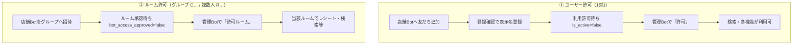

# LINE 利用許可・ユーザー管理 — セキュリティ強化（2026-05）

店舗 Bot の **誰が使えるか** と、グループ／複数人トークへの **Bot 参加** を、管理者が明示的に許可してから機能有効化する仕組みです。  
検索・レシート等の機能追加に合わせ、**未承認のまま全員が使える状態** をやめ、運用でコントロールできるようにしました。

**関連ドキュメント**

| ファイル | 内容 |
|----------|------|
| [LINE-SEARCH-PRESENTATION.md](./LINE-SEARCH-PRESENTATION.md) | 検索機能＋本強化のプレゼン向け要約 |
| [LINE-GROUP-BOT-IMPORTANT.md](./LINE-GROUP-BOT-IMPORTANT.md) | グループは公式 Bot **1体のみ**（LINE 仕様） |
| [ROOM-PERMISSION-TEST-CHECKLIST.md](./ROOM-PERMISSION-TEST-CHECKLIST.md) | ルーム権限・承認の動作確認 |
| [ROOM-LINKING-GUIDE.md](./ROOM-LINKING-GUIDE.md) | ルーム自動連携（承認とは別レイヤ） |
| [DOCS-INDEX.md](./DOCS-INDEX.md) | 全 MD 索引・用語集 |
| [CHANGELOG-2026-05.md](./CHANGELOG-2026-05.md) | 開発者向け変更履歴 |

**本番:** Supabase `hocbnifuactbvmyjraxy`  
**Edge Functions:** `line-webhook`（店舗＋`/admin` 分岐）、`line-admin-webhook`（管理 Bot 専用）

---

## 1. 何が強化されたか（30秒）

| 以前のリスク | いま |
|--------------|------|
| 店舗 Bot を友だち追加すれば誰でも検索・機能利用 | **管理者が許可するまで利用不可**（1対1） |
| グループに Bot を入れるとすぐレシート・検索が動く | **ルーム単位で承認待ち** → 許可後に稼働 |
| 承認作業が店舗 Bot と混在 | **管理 Bot（@392hdime）専用** で承認のみ |
| 管理画面に名前がなく ID だけ | **許可時に表示名・所属店舗を DB 登録** |
| 承認がテキストのみでミスしやすい | **Flex カードの「許可／不許可」ボタン** |

---

## 2. 二段階のゲート

| ゲート | 対象 | DB の主な列 | 未許可時 |
|--------|------|-------------|----------|
| **ユーザー** | 1対1（`U…`） | `line_user_permissions.is_active` | 「利用許可待ち」返信。機能ブロック |
| **ルーム** | グループ等（`C…` / `R…`） | `room_summary_settings.bot_access_approved` | Bot は **退出しない**。当該ルームで機能停止 |

**既存データ:** マイグレーション時点のユーザー・ルームは **すべて許可済み**（従来運用を維持）。**新規**のみ承認待ち。

---

## 3. 管理 Bot（@392hdime）— 承認専用

| 項目 | 内容 |
|------|------|
| **役割** | 新規友だち・新規ルームの **許可／不許可のみ** |
| **やらないこと** | レシート解析、会話記録、検索、店舗データへの書き込み |
| **Webhook** | `…/functions/v1/line-admin-webhook` または `…/line-webhook/admin` |
| **承認者** | `LINE_USER_APPROVAL_ADMIN_USER_IDS`（Supabase Secret）に登録した LINE ユーザー ID のみ操作可 |
| **UI** | 承認待ちは **Flex カード**（表示名・店舗名・ID ＋ 許可／不許可ボタン） |

### 承認操作

| 方法 | 例 |
|------|-----|
| ボタン | カードの **許可** / **不許可** |
| テキスト | `許可 U…` / `不許可 U…` / `許可ルーム C…` / `不許可ルーム R…` |
| 補助 | `使い方` / `管理者情報`（運用・ID 確認用） |

---

## 4. 店舗 Bot — スタッフ向け

| タイミング | Bot の動き |
|------------|------------|
| 友だち追加直後 | ウェルカームカード ＋ **「登録確認」** ボタン |
| 登録確認タップ | LINE 表示名を DB に保存（管理画面に載る名前の元） |
| 承認前にメッセージ | **利用許可待ち** カード（登録確認ボタン付き） |
| 管理者が許可後 | 店舗 Bot から「利用許可が完了」通知。機能利用可 |

**注意:** 登録確認だけでは **利用許可にはならない**。必ず管理 Bot での **許可** が必要。

---

## 5. 管理画面「ユーザー権限」との連携

画面: `index.html` → **ユーザー権限（LINE user 単位）**

| イベント | 管理画面への反映 |
|----------|------------------|
| 友だち追加 | `line_user_permissions` に行作成（**有効権限 0/7**） |
| 登録確認 | `display_name` 更新 |
| **管理 Bot で許可** | `is_active` ＋ 各権限 ON、**表示名を LINE から再取得して保存**、所属店舗が未設定なら **登録元店舗ラベル** を自動設定 |
| ページ再読み込み | 一覧に表示（リアルタイム自動更新ではない） |

承認直後に名前・所属が揃うため、**「誰を許可したか」** をカード表示名で追いやすくなります。

---

## 6. セキュリティ上のポイント

### 6.1 多層防御のイメージ

| 層 | 内容 |
|----|------|
| **入口** | 未承認ユーザーは Bot 機能に到達しない |
| **ルーム** | 未承認ルームではレシート・検索を処理しない |
| **分離** | 管理 Bot は店舗データを変更しない専用チャネル |
| **承認者限定** | 管理 Bot の操作は登録済み管理者 ID のみ |
| **管理画面** | 従来どおりトークン認証・CSP 等（[CHANGELOG §5.5](./CHANGELOG-2026-05.md)） |

### 6.2 ルーム自動連携との関係

- ルームの **Webhook 連携（店舗への紐付け）** は従来どおり **自動** です（[ROOM-LINKING-GUIDE.md](./ROOM-LINKING-GUIDE.md)）。
- 今回の **ルーム承認** は、そのルームで **Bot 機能を動かすか** の別スイッチです。
- 誤招待グループが連携されても、**許可するまでレシート登録等は走らない** ようにできます。

### 6.3 グループに Bot は1体のみ

LINE 仕様で **1グループ＝1公式アカウント**。管理 Bot と店舗 Bot を同じグループに入れられません。  
→ [LINE-GROUP-BOT-IMPORTANT.md](./LINE-GROUP-BOT-IMPORTANT.md)

---

## 7. 運用チェックリスト

| # | 確認 |
|---|------|
| 1 | 承認担当者が **@392hdime** を友だち追加している |
| 2 | 承認担当者の LINE ID が `LINE_USER_APPROVAL_ADMIN_USER_IDS` に入っている |
| 3 | 管理 Bot の Webhook URL・チャネルシークレットが本番設定済み |
| 4 | 店舗グループには **店舗 Bot のみ**（管理 Bot は別トーク） |
| 5 | 新規グループは **許可ルーム** 済みか（無反応＝退出ではないことが多い） |
| 6 | 新規スタッフは **許可 U…** 後、管理画面で所属店舗・役職を必要に応じて調整 |
| 7 | 管理画面は承認後に **再読み込み** して一覧を確認 |

---

## 8. 環境変数・マイグレーション（参考）

| 名前 | 用途 |
|------|------|
| `LINE_CHANNEL_ACCESS_TOKEN__ADMIN` | 管理 Bot トークン |
| `LINE_CHANNEL_SECRET__ADMIN` | 管理 Bot Webhook 署名 |
| `LINE_USER_APPROVAL_ADMIN_USER_IDS` | 承認操作可能な `U…`（カンマ区切り） |
| `line_user_permissions.registration_source_store` | 友だち追加した店舗キー |
| `room_summary_settings.bot_access_approved` | ルーム許可フラグ |

マイグレーション例:

- `20260528120000_admin_bot_user_approval.sql`
- `20260528130000_admin_store_approval_only.sql`
- `20260528140000_room_bot_access_approval.sql`

---

## 9. プレゼン用（そのまま読める）

> 検索やレシート機能を店舗 Bot で使えるようにする前に、**誰を使わせるか** と **どのグループで Bot を動かすか** を、専用の管理 LINE で承認する仕組みを入れました。  
> 未登録の人は機能が使えず、新しいグループも許可するまで Bot は動きません。承認と同時に、管理画面上のユーザー一覧に **名前と店舗** が載るので、運用管理もしやすくなっています。

---

*最終更新: 2026-05-28（[DOCS-INDEX.md](./DOCS-INDEX.md) と用語統一）*
