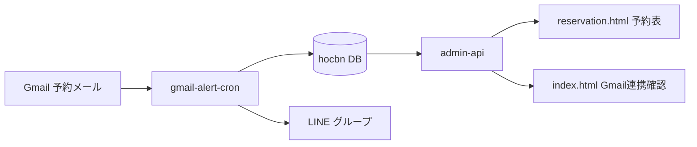

# Gmail 予約 → LINE 通知・予約表 運用ガイド

Gmail で届く食べログ／一休の予約メールを取り込み、**LINE グループへ通知**し、**予約表**（`reservation.html`）で参照するための仕様・DB・デプロイ手順です。

**関連ドキュメント**

| ファイル | 内容 |
|----------|------|
| [README-PAGES.md](./README-PAGES.md) | Pages URL・Supabase 本番・全体デプロイ |
| [CHANGELOG-2026-05.md](./CHANGELOG-2026-05.md) | 2026年5月の変更履歴一覧 |
| [ROOM-PERMISSION-DETAIL-GUIDE.md](./ROOM-PERMISSION-DETAIL-GUIDE.md) | ルームの「Gmail予約通知」権限 |
| [ROOM-LINKING-GUIDE.md](./ROOM-LINKING-GUIDE.md) | ルーム連携（通知先ルームの前提） |
| [DOCS-INDEX.md](./DOCS-INDEX.md) | 全 MD 索引・用語集 |
| [LINE-SEARCH-PRESENTATION.md](./LINE-SEARCH-PRESENTATION.md) | LINE 会話検索（**本ガイドの予約とは別系統**） |

---

## 1. 全体の流れ



| 段階 | 処理 |
|------|------|
| 1. 取り込み | `gmail-alert-cron` が Gmail API で未通知メールを取得 |
| 2. 記録 | `record_tabelog_reservation_visit` / `record_ikyu_reservation_visit` でイベント・集計・履歴テーブルを更新 |
| 3. 通知 | `gmail_reservation_alert_enabled` が ON のルームへ Flex／テキスト送信 |
| 4. 参照 | 予約表は `GET /reservations/calendar` 等で同じ DB を表示 |

**本番 Supabase:** `hocbnifuactbvmyjraxy`（hocbn）  
**旧 jhpm:** Gmail シークレットは hocbn へ移行済み（2026-05 以降は hocbn のみ運用）

---

## 2. 管理画面（接続・Gmail 確認）

### 2.1 API の向き先

| 機能 | プロジェクト | パス |
|------|-------------|------|
| 管理・予約表・メディア | hocbn | `/functions/v1/admin-api` |
| Gmail 連携先の確認 | **hocbn**（jhpm ではない） | `GET /gmail/account` |
| 売上分析 | hocbn | `/receipts/sales` など |

設定の単一ソース: [`pages-config.js`](./pages-config.js) の `PROJECT_URL` / `GMAIL_SHARED_PROJECT_URL`（いずれも hocbn）。

### 2.2 「Gmail連携先を確認」

- ボタン: 管理画面「接続設定」内
- 成功時: `Gmail連携先: （メールアドレス）`（緑ピル）
- 失敗時: ピルにマウスを乗せると **ツールチップにエラー全文**（例: `Unauthorized` → 管理トークン不一致、`invalid_grant` → refresh token 要再発行）

### 2.3 接続 UI（2026-05 以降）

「同じアドレスなら自動ログイン」チェックボックスは **表示しない**（常時 ON 相当の挙動は `auth-session.js` 側で維持）。  
接続欄は **Project URL（読取専用）→ トークン → 保存して接続** のみ。

---

## 3. LINE 通知の表示（過去の予約日・最大5件）

### 3.1 表示例

食べログ経路の「予約回数」欄（一休は「履歴」欄）:

```text
予約回数：
来店回数　３回
キャンセル回数　１回
過去の予約
2026/05/08(木) 19:00
2026/04/01(土) 18:30（キャンセル）
```

（Flex では上記の **1行＝1段落** で縦に表示。見出し行は太字・グレー）

- **来店回数**: キャンセルを除いた集計（`visit_count`）
- **キャンセル回数**: 履歴テーブル上のキャンセル件数（`cancelled_count`）
- **過去の予約**: 見出しのみの段落のあと、今回メール **以外** の直近 **最大5件** の日時（JST。キャンセル行は `（キャンセル）` 付き）
- キャンセルメール受信時は `visit_count` を減算し、履歴行は `is_cancelled = true` で残す

### 3.2 実装

| 項目 | 場所 |
|------|------|
| Edge Function | `supabase/functions/gmail-alert-cron/index.ts` |
| 履歴の記録・返却 | RPC `record_*_reservation_visit` → JSON `{ visit_count, cancelled_count, recent_visits }` |
| マイグレーション | `20260526220000_...`（初回）、`20260526230000_reservation_history_include_cancelled.sql`（キャンセル表示） |

---

## 4. データベース

### 4.1 テーブル一覧

| テーブル | 用途 |
|----------|------|
| `tabelog_reservation_visit_events` | 食べログ：メール1通＝1行（`gmail_message_id` 一意） |
| `tabelog_reservation_visit_summaries` | 食べログ：顧客単位の `visit_count` / `last_visit_at` |
| `ikyu_reservation_visit_events` | 一休：同上 |
| `ikyu_reservation_visit_summaries` | 一休：同上 |
| **`reservation_customer_visit_history`** | **LINE 用履歴ログ**（経路×メールID、最大5件表示の元） |
| `gmail_reservation_alert_logs` | 通知済み Gmail メッセージ ID |

### 4.2 `reservation_customer_visit_history`（新規）

| 列 | 説明 |
|----|------|
| `partner` | `tabelog` / `ikyu` |
| `gmail_message_id` | 重複取り込み防止（`partner` と複合 UNIQUE） |
| `customer_name` / `customer_phone` | 顧客キー（予約表と同じ） |
| `visit_at` | 予約来店日時 |
| `reservation_type` / `reservation_detail` | キャンセル判定・予約表表示用 |
| `is_cancelled` | キャンセル予約なら `true` |

既存の `*_visit_events` から **バックフィル** 済み（マイグレーション適用時）。

### 4.3 RPC

| 関数 | 戻り値（6引数版） |
|------|-------------------|
| `record_tabelog_reservation_visit` | `jsonb` … `{ "visit_count": number, "recent_visits": [{ "visit_at": "..." }, ...] }` |
| `record_ikyu_reservation_visit` | 同上 |
| `get_reservation_recent_visits_json` | 直近 N 件の `visit_at` 配列（内部利用） |
| `reservation_visit_looks_cancelled` | キャンセル判定（type / detail / JSON キー） |

---

## 5. ルーム設定（通知先）

管理画面 → ルーム設定 → **カレンダー／予約** タブ:

| 項目 | 説明 |
|------|------|
| **Gmail予約通知** | ON のルームだけ `gmail-alert-cron` の送信先になる |
| 店舗一括 / ルーム個別 | 連携ルームが2件以上のとき個別上書き可（[ROOM-PERMISSION-DETAIL-GUIDE.md](./ROOM-PERMISSION-DETAIL-GUIDE.md)） |

cron が `no_target_rooms` でスキップされる場合は、**1件以上** ルームで Gmail予約通知を ON にする。

---

## 6. Edge Secrets（hocbn）

`gmail-alert-cron` と `admin-api` の `/gmail/account` で使用:

| シークレット | 必須 | 説明 |
|--------------|------|------|
| `GMAIL_CLIENT_ID` | ○ | Google OAuth クライアント |
| `GMAIL_CLIENT_SECRET` | ○ | 同上 |
| `GMAIL_REFRESH_TOKEN` | ○ | Gmail 読取権限付き refresh token |
| `GMAIL_ALERT_ENABLED` | 推奨 | `true` / `1` で有効 |
| `GMAIL_ALERT_QUERY` | 任意 | 既定: 未読・7日・予約キーワード |
| `GMAIL_ALERT_MAX_MESSAGES` | 任意 | 1回の最大処理件数（上限20） |
| `LINE_CHANNEL_ACCESS_TOKEN` | ○ | LINE 送信 |
| `GROQ_API_KEY` | 任意 | 予約メール本文の AI 抽出 |

### jhpm から hocbn へシークレットコピー

```bash
# jhpm に secret-bridge をデプロイし SECRET_BRIDGE_TOKEN 等を設定したうえで
SECRET_BRIDGE_TOKEN=... node scripts/sync-gmail-secrets-jhpm-to-hocbn.mjs
```

スクリプト: [`scripts/sync-gmail-secrets-jhpm-to-hocbn.mjs`](./scripts/sync-gmail-secrets-jhpm-to-hocbn.mjs)

---

## 7. デプロイ手順

### 7.1 DB マイグレーション

```bash
npx supabase link --project-ref hocbnifuactbvmyjraxy
npx supabase db push
```

未適用時は少なくとも次を含める:

- `20260526220000_reservation_customer_visit_history.sql`

### 7.2 Edge Functions

```bash
npx supabase functions deploy admin-api gmail-alert-cron \
  --project-ref hocbnifuactbvmyjraxy
```

### 7.3 GitHub Pages（静的 UI）

```bash
git push origin main
```

反映: `index.html`, `reservation.html`, `pages-config.js` など。

---

## 8. 予約表（キャンセルと visit_count）

予約表の来店回数は **イベント履歴から再計算**（キャンセルで -1）。  
詳細は [README-PAGES.md § 予約表: キャンセル時の来店履歴カウント](./README-PAGES.md#予約表-キャンセル時の来店履歴カウント)。

LINE 通知の「過去5件」とは別ロジックだが、同じ `*_visit_events` / `reservation_customer_visit_history` を元にする。

---

## 9. トラブルシューティング

| 症状 | 想定原因 | 対処 |
|------|----------|------|
| Gmail連携先: 取得失敗（401） | hocbn 用トークン未保存 / 期限切れ | 管理トークンを再入力・LINE から再ログイン |
| Gmail token取得エラー invalid_grant | refresh token 失効 | Google Cloud で再発行 → `GMAIL_REFRESH_TOKEN` 更新 |
| cron `gmail_alert_disabled` | hocbn に Gmail シークレットなし | §6 のコピー手順 |
| cron `no_target_rooms` | 通知 ON のルームが0 | ルーム設定で Gmail予約通知を ON |
| cron `already_notified` | 同一メールは再通知しない | 正常（新着メール待ち） |
| 過去の予約が出ない | 履歴が今回メールのみ | DB の `reservation_customer_visit_history` を確認（キャンセル行も含む） |
| 予約表に新規が出ない | cron 未実行・別DB参照 | hocbn の events テーブル・Pages の `PROJECT_URL` を確認 |

### 手動で cron を試す

```bash
curl -s "https://hocbnifuactbvmyjraxy.supabase.co/functions/v1/gmail-alert-cron" \
  -H "Authorization: Bearer <SERVICE_ROLE_KEY>"
```

---

## 10. 変更履歴（要点）

| 日付目安 | 内容 |
|----------|------|
| 2026-05 | Gmail API・予約取り込みを **hocbn** に統一（jhpm 認証ずれを解消） |
| 2026-05 | `reservation_customer_visit_history` 追加、LINE に **過去予約日最大5件** |
| 2026-05 | 接続画面から「同じアドレスなら自動ログイン」チェックを非表示 |
