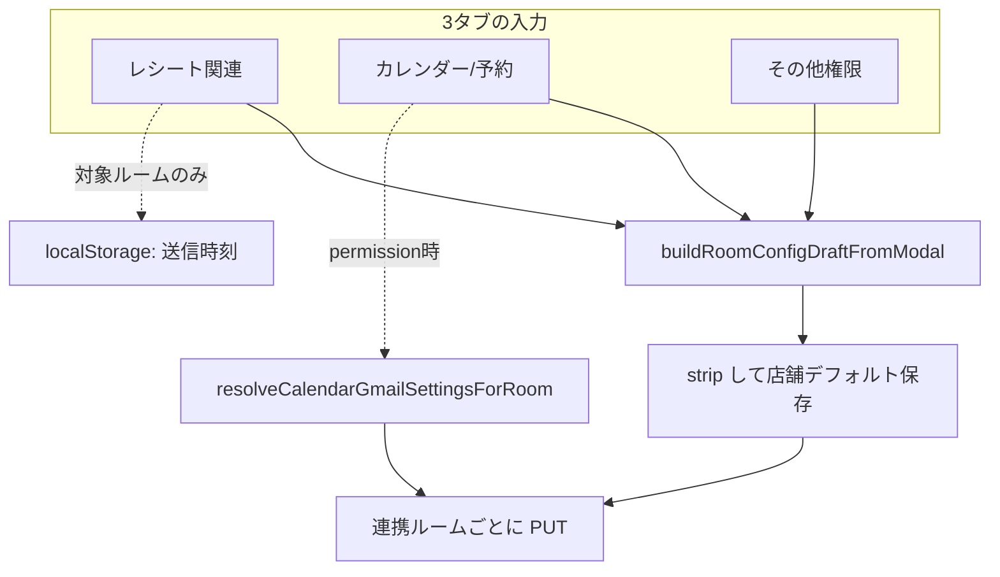

# ルーム権限・Webhook 設定 — 動作確認チェックリスト

> ## ⚠️ 先に読む: [ルーム「連携」ガイド（必読）](./ROOM-LINKING-GUIDE.md)
>
> ### 🔓 自動連携は **管理者の承認なし** で行われます（セキュリティ注意）
>
> Webhook 受信・管理画面同期でルームが **連携** されます（**連携のための手動承認は不要**）。誤 URL・テストグループも登録され得ます。  
> 詳細・無効化（`RECEIPT_ROOM_AUTO_LINK=0`）はガイド参照。残った未連携は「一括連携」で手動補完。  
> **注意:** 連携されても **新規グループはルーム承認（`bot_access_approved`）** が別途必要 → [LINE-USER-APPROVAL-SECURITY.md](./LINE-USER-APPROVAL-SECURITY.md)

> ### ⚠️ グループに Bot を2体入れられない（LINE 仕様）
>
> **1つの招待グループ／複数人トークに公式 Bot は1体まで**です。すでに別 Bot がいると2体目は参加できず「すぐ退出」したように見えます（当システムの `leave` ではありません）。  
> Bot が **残って無反応** なら **ルーム承認待ち** → 管理 Bot で **許可ルーム**。  
> → [**LINE-GROUP-BOT-IMPORTANT.md**](./LINE-GROUP-BOT-IMPORTANT.md)（必読）

---

管理画面（`index.html`）の **ルーム単位機能設定** と **LINE ユーザー権限** の確認用です。  
3 タブ化モーダル（レシート / カレンダー・予約 / その他）は **GitHub Pages に最新 `index.html` が反映されたあと** に実施してください。

**関連コード:** `index.html`（`roomConfigModal`, `userPermission*`, Webhook カード）  
**API:** `admin-api` … `GET /state`, `PUT /settings/rooms`, `line_user_permissions` 系  
**運用説明:**

- [`DOCS-INDEX.md`](./DOCS-INDEX.md) — 全 MD 索引・用語集
- [`ROOM-LINKING-GUIDE.md`](./ROOM-LINKING-GUIDE.md) — 連携・自動連携・セキュリティ
- [**`LINE-USER-APPROVAL-SECURITY.md`**](./LINE-USER-APPROVAL-SECURITY.md) — **利用許可・ユーザー管理（セキュリティ強化）**
- [**`ROOM-PERMISSION-DETAIL-GUIDE.md`**](./ROOM-PERMISSION-DETAIL-GUIDE.md) — **細かい権限の意味**（優先順位、カレンダー一括/個別、連携ルーム数による画面、Bistro CAVACAVA 表示名 など）
- [**`RESERVATION-GMAIL-GUIDE.md`**](./RESERVATION-GMAIL-GUIDE.md) — Gmail 予約 → LINE 通知、過去の予約日（最大5件）、hocbn デプロイ

---

## タブ間の相互作用（設計メモ）

3 タブは **画面上は分かれている** が、**保存時は 1 つの設定オブジェクトにまとめて** 全連携ルームへ反映されます。  
「タブ A のチェックを切ってもタブ B のチェックは動かない」＝ **UI 上はほぼ独立** ですが、次の項目は **タブをまたぐ** か、**保存時にだけ合体** します。

### 一覧：どこが独立で、どこが連動するか

| 区分 | 内容 | タブ |
|------|------|------|
| **独立（UI）** | 他タブのチェックを ON/OFF しても、別タブのチェック状態は変わらない | レシート ↔ その他 ↔ カレンダー |
| **独立（UI）** | タブを切り替えても、他タブで入れた値はモーダル内に保持されたまま | 全体 |
| **タブ内連動** | 添付保存 OFF → **解析返信** が操作不可 | レシートのみ |
| **タブ内連動** | 個別スケジュール OFF → 中間/月末の **日・時刻** が非表示 | レシートのみ |
| **タブ内連動** | GCal 自動登録 OFF → **登録内容返信・低確度確認** が操作不可 | カレンダーのみ |
| **タブ内連動** | ルーム要約 ON ↔ **全体要約** OFF（同時 ON 不可） | その他のみ |
| **タブ跨ぎ（UI）** | **対象ルーム**（レシートタブのプルダウン）を変えると、カレンダー個別パネルの内容も **そのルーム用に読み直し** | レシート → カレンダー |
| **タブ跨ぎ（保存）** | **保存** 1 回で 3 タブ分を `buildRoomConfigDraftFromModal()` で合体し、店舗の全ルームへ PUT | 全体 |
| **タブ跨ぎ（保存）** | `is_enabled`（ルーム有効）は、**複数タブのフラグの OR** で再計算（会話検索だけ ON では `is_enabled` は立たない） | 保存時 |
| **permission のみ** | カレンダー **インライン**＝店舗一括、**個別（*Perm）**＝ルーム別。保存時にルームごとマージ | カレンダー＋保存 |

### 図：保存時の流れ



### レシート関連タブ

| 相互作用 | あり/なし | 詳細 |
|----------|-----------|------|
| → その他タブ | **なし** | AI 返信・会話検索などは連動しない |
| → カレンダータブ | **対象ルームのみ** | プルダウン変更時に `applyCalendarGmailToRoomConfigModal` が走る（`onRoomConfigReceiptScheduleRoomChange`） |
| タブ内 | **あり** | `syncRoomConfigMediaSubOptions` … 添付保存 → 解析返信 |
| タブ内 | **あり** | `syncRoomConfigReceiptScheduleFields` … 個別スケジュール → 日時入力 |
| 保存 | **全ルーム** | 中間/月末 **ON/OFF**・メディア・解析返信は **全連携ルーム同一** |
| 保存 | **選択ルームのみ** | 送信 **日時** は `localStorage`（`line_room_receipt_schedule__{roomId}`）。保存直前に **選択中ルーム** だけ確定 |

### カレンダー/予約タブ

**詳細は [`ROOM-PERMISSION-DETAIL-GUIDE.md` §4](./ROOM-PERMISSION-DETAIL-GUIDE.md#4-カレンダー予約タブ--なぜ二段に見えるか) を参照。**

| 連携ルーム数 | 画面（permission） |
|--------------|-------------------|
| 0 | 連携促しのみ |
| 1 | **店舗一括のみ**（個別ブロック非表示） |
| 2+ | 上: 店舗一括／下: ルーム個別（個別 ON 時は上一括を隠す） |

| 相互作用 | あり/なし | 詳細 |
|----------|-----------|------|
| → レシートタブ | **なし**（一方通行） | カレンダー側からレシートのチェックは動かさない。**対象ルームはレシートタブのプルダウンに依存** |
| → その他タブ | **なし** | AI 返信 ON でもカレンダーの GCal チェックは自動では変わらない |
| タブ内（上部インライン） | **あり** | `syncRoomConfigCalendarSubOptions` … GCal 自動登録 → 返信系 2 項目 |
| タブ内（個別 *Perm） | **あり** | 個別設定 OFF → `*Perm` パネル非表示。明日予定 ON ＋ 個別 ON で時刻・件数表示 |
| タブ内（インライン vs Perm） | **あり（permission）** | 個別 ON 時は **Perm のみ**保存（上一括は非表示）。OFF 時はインライン＝一括 |
| 保存（setup） | **全ルーム同一** | インラインのみ有効（`.store-permission-panel` は非表示） |
| 保存（permission） | **ルーム差あり可** | インライン相当は一括。`calendar_gmail_settings_override` 時は **ルーム別**（`resolveCalendarGmailSettingsForRoom`） |

### その他権限タブ

| 相互作用 | あり/なし | 詳細 |
|----------|-----------|------|
| → レシート / カレンダー | **なし** | 会話検索・AI 返信は他タブの UI を無効化しない |
| タブ内 | **あり** | `syncRoomSummaryMutualExclusion` … ルーム要約 ↔ 全体要約 |
| 保存 | **全ルーム** | 会話検索・資料検索・AI 返信・要約系は **全連携ルーム同一** |
| 保存と `is_enabled` | **間接** | `message_search_*` は **`is_enabled` に含まれない**。`bot_reply` / 要約 / メディア（レシート）/ カレンダー系が効く |

### 保存ボタンで必ず合体するもの（コード参照）

| 関数 | 役割 |
|------|------|
| `buildRoomConfigDraftFromModal()` | 3 タブの DOM を 1 オブジェクトに集約 |
| `saveRoomConfigModal()` | 店舗デフォルト保存 → ルームごと `saveRoomRow` |
| `computeRoomEnabledFromFeatureConfig()` | 保存 payload の `is_enabled` を決定 |

**permission モード保存のイメージ**

1. レシート・その他の ON/OFF → **全ルーム同じ**
2. カレンダー上部（インライン）→ **全ルームのベース**
3. カレンダー個別（*Perm）＋オーバーライド ON → **ルームごと上書き**（選択ルームを変えてから保存すると差が付く）
4. レシート送信時刻 → **選択していたルーム** の `localStorage` のみ更新（他ルームの時刻は変えない）

### 全体権限設定カード（優先順位）

| 順位 | ラベル | 保存のしかた | 一括上書き |
|------|--------|--------------|------------|
| 0 | 全体 | **全体権限を編集** → 保存 | 全体保存で上書きされる |
| 1 | 店舗 | 店舗カード **権限・機能設定** → 保存 | 全体保存で上書き。店舗保存ではルーム個別はスキップ |
| 2 | ルーム個別 | 連携ルームの **個別設定** → 保存 | 全体・店舗の一括保存では **スキップ** |

- **継承** ボタン: DB ルーム設定を削除し、店舗＋全体のマージ値に戻す（順位 → 店舗）
- **受信済みルームを一括連携**: 全体カードから全店舗分をまとめて連携（店舗カードの「受信済みルームを連携する」と同じ処理・UI はカスタム確認/完了）
- 全体カードは「すべて表示」のときだけグリッド先頭に表示

### ユーザー権限（LINE user）との関係

| 項目 | ルーム 3 タブとの関係 |
|------|------------------------|
| 画面下部「ユーザー権限」 | **別モーダル・別 DB**（`line_user_permissions`）。ルーム 3 タブとは **保存も UI も連動しない** |
| `resolveRoomDisplayLabel` | **表示のみ**。`U…` の room_id をユーザー表示名に置き換える（レシートの対象ルーム表示など） |

---

## 「サーバーに接続できません」（ブラウザ全体のエラー）

Safari / Chrome が **ページ自体を取得できない** ときの表示です（管理トークン入力前の段階）。

| 原因 | 対処 |
|------|------|
| ローカルサーバー未起動 | ターミナルで `./scripts/open-local-admin.sh` または `./scripts/local-line-report-pages.sh` |
| ポート違い（例: **8785** のブックマーク） | **8765** か **8785** のどちらかで `python3 -m http.server` が動いているか確認。両方使う場合は `PORT=8785 ./scripts/local-line-report-pages.sh` を別ターミナルで起動 |
| **`https://127.0.0.1`** | **`http://`** に変更（https はローカルで証明書エラー） |
| 正しい URL | `http://127.0.0.1:8765/line_report/index.html`（8785 で起動した場合はポートを 8785 に） |

本番のみ使う場合: https://marugo-s.github.io/line_report/index.html（ローカルサーバー不要）

---

## 接続トークンが「無反応」に見えるとき

| 確認 | 内容 |
|------|------|
| ブラウザ開発者ツール | **Console** に赤エラーがないか（`pages-config.js` / `auth-session.js` 読込失敗、`addEventListener` of null など） |
| 入力の種類 | **ADMIN_DASHBOARD_TOKEN**（固定トークン）または **`lrst_` で始まるセッション**（`lt` は URL 用・手入力不可） |
| ローカル | **`http://127.0.0.1:8765/line_report/`** で開く（**`https://127.0.0.1` は不可** — 旧 CSP の `upgrade-insecure-requests` で JS が TLS エラーになる） |
| 接続中の表示 | 修正後はボタンが **「接続中…」**、画面に **「接続中」オーバーレイ** → 成功で **「ログイン済み」** ピル |
| 失敗時 | **アラート** で HTTP ステータス付きメッセージ（401 = トークン不一致） |

---

## 0. 事前準備

| # | 確認項目 | OK |
|---|----------|-----|
| 0.1 | 最新 `index.html` が GitHub Pages に反映されている（ハードリロード: Cmd+Shift+R） | ☐ |
| 0.2 | 管理トークンでログイン済み（`lrst_` セッション or 手動接続） | ☐ |
| 0.3 | テスト用に **通信中** の店舗 Webhook が 1 件以上ある | ☐ |
| 0.4 | 同じ店舗に **連携ルームが 2 件以上** ある（ルーム差分の確認用。無い場合は 2 ルーム連携してから） | ☐ |
| 0.5 | （任意）`U…` 形式の `room_id` を 1 件含む（表示名解決の確認用） | ☐ |

---

## 1. Webhook カードの入口（setup / permission）

### 1.1 通信前（未通信・セットアップカード）

| # | 操作 | 期待結果 | OK |
|---|------|----------|-----|
| 1.1.1 | 未通信店舗カードの **「Webhook設定」** をクリック | モーダルタイトルが **「Webhook設定」**（`data-webhook-mode="setup"`） | ☐ |
| 1.1.2 | モーダル下部 | **テスト送信・効果確認** などが表示される（`.receipt-permission-only-hidden` が非表示でない） | ☐ |
| 1.1.3 | モーダル | **「権限・機能設定」** ボタンは無い（通信前カードのみ） | ☐ |

### 1.2 通信中（権限カード）

| # | 操作 | 期待結果 | OK |
|---|------|----------|-----|
| 1.2.1 | 通信中カードの **「権限・機能設定」** をクリック | タイトルが **「権限・機能設定」**（`data-webhook-mode="permission"`） | ☐ |
| 1.2.2 | 同上 | **テスト送信・効果確認** が **非表示** | ☐ |
| 1.2.3 | 同上・連携ルームあり | 初期表示タブが **「カレンダー/予約」**（`activeTab` 未指定時） | ☐ |
| 1.2.4 | 連携ルーム表の行から設定を開く（従来導線） | 同店舗の Webhook モーダルが開く | ☐ |

### 1.3 カード上のユーザー権限ブロック

| # | 操作 | 期待結果 | OK |
|---|------|----------|-----|
| 1.3.1 | 所属ユーザーがいる店舗 | **「ユーザー権限（N名）」** に最大 5 名表示 + 「他 X 名」 | ☐ |
| 1.3.2 | **「ユーザー権限を編集」** | 画面下部「ユーザー権限」へスクロールし、**その店舗名でフィルタ** | ☐ |
| 1.3.3 | フィルタ中の **「フィルタ解除」** | 全ユーザー表示に戻る | ☐ |
| 1.3.4 | 所属ユーザーがいない店舗 | 「まだいません」+ 編集ボタン | ☐ |

---

## 2. モーダル 3 タブ（UI・遷移）

| # | 操作 | 期待結果 | OK |
|---|------|----------|-----|
| 2.1 | **レシート関連** タブ | レシート系チェック・スケジュールパネルのみ表示 | ☐ |
| 2.2 | **カレンダー/予約** タブ | カレンダー・Gmail 系が表示 | ☐ |
| 2.3 | **その他権限** タブ | AI 返信・会話検索・要約系が表示 | ☐ |
| 2.4 | タブ切替 | 非アクティブペインは `hidden`、アクティブのみ表示 | ☐ |
| 2.5 | キーボード / 見た目 | タブの `aria-selected` と `.active` が一致 | ☐ |

---

## 3. レシート関連タブ

| # | 操作 | 期待結果 | OK |
|---|------|----------|-----|
| 3.1 | **対象ルーム** プルダウン | 当該 Webhook の連携ルームが並ぶ | ☐ |
| 3.2 | ルーム未連携・受信済みのみ | 「受信済みルームを連携する」が表示される | ☐ |
| 3.3 | **このルームで送信時刻を個別設定** OFF | 一括設定の時刻が使われる（ヒント表示と一致） | ☐ |
| 3.4 | 個別設定 ON | 日・時刻フィールドが表示され編集可能 | ☐ |
| 3.5 | ルーム A で個別時刻を変更 → 保存 | 保存メッセージに **選択中ルーム名** が含まれる | ☐ |
| 3.6 | ルーム B に切替（保存せず） | B の個別/一括状態が正しく読み込まれる | ☐ |
| 3.7 | 中間/月末レポートの ON/OFF | 保存後、Webhook カードの「有効機能」要約が更新される | ☐ |

---

## 4. カレンダー/予約タブ（重要）

### 4.1 上部の簡易チェック（インライン）

対象: `roomConfigTomorrowReminder`, `roomConfigGoogleCalendarAutoRegister`, … `roomConfigGmailAlert`  
（クラス `store-permission-inline-hidden` — setup モードでも表示）

| # | 操作 | 期待結果 | OK |
|---|------|----------|-----|
| 4.1.1 | GCal 自動登録 OFF | 登録内容返信・低確度確認が **disabled** または OFF 連動 | ☐ |
| 4.1.2 | 簡易チェックのみ変更 → 保存（permission） | **全連携ルーム** に同じカレンダー系フラグが反映 | ☐ |

### 4.2 ルーム個別パネル（`*Perm`）

対象: `roomConfigCalendarGmailOverride` + `*Perm` フィールド

| # | 操作 | 期待結果 | OK |
|---|------|----------|-----|
| 4.2.1 | 連携ルーム 0 件 | 「個別設定」チェックが **disabled** | ☐ |
| 4.2.2 | 個別設定 OFF | `roomConfigCalendarGmailFields` が **hidden** | ☐ |
| 4.2.3 | 個別設定 ON | `*Perm` チェックと明日予定の時刻・件数が編集可能 | ☐ |
| 4.2.4 | ルーム A: 個別 ON + 明日予定時刻 `19` / ルーム B: 個別 OFF | 保存後、A のみ個別値、B は一括（インライン）に従う | ☐ |
| 4.2.5 | permission モードで保存 | `saveRoomConfigModal` がルームごとに `resolveCalendarGmailSettingsForRoom` をマージしている（DB 上でルーム間差分が残る） | ☐ |

### 4.3 setup モードとの差

| # | 操作 | 期待結果 | OK |
|---|------|----------|-----|
| 4.3.1 | **Webhook設定**（setup）で開く | `.store-permission-panel`（個別 `*Perm` パネル）が **非表示** | ☐ |
| 4.3.2 | setup でカレンダー変更 → 保存 | 全ルームへ同一設定（個別オーバーライド UI が無いため） | ☐ |

---

## 5. その他権限タブ

| # | 操作 | 期待結果 | OK |
|---|------|----------|-----|
| 5.1 | AI会話返信 ON / **完全無し** ON | 仕様どおり（完全無し時は返信しない想定） | ☐ |
| 5.2 | ルーム要約 ON + 全体要約 ON | **相互排他**（一方 ON にすると他方 OFF） | ☐ |
| 5.3 | 会話検索・資料検索 | 保存後も状態維持 | ☐ |
| 5.4 | 保存 | 当該 Webhook の **全連携ルーム** に同じ「その他」系フラグ | ☐ |

---

## 6. 保存の横断確認

| # | 操作 | 期待結果 | OK |
|---|------|----------|-----|
| 6.1 | permission で複数項目変更 → **保存** | 成功アラート、モーダルが閉じる、一覧が再読込 | ☐ |
| 6.2 | 保存直後 | Webhook カードの **有効機能** 行が変更内容と一致 | ☐ |
| 6.3 | 連携ルーム `<details>` 内 | 各ルームの設定バッジ／要約が期待どおり | ☐ |
| 6.4 | ブラウザをリロード | 設定が DB から復元される | ☐ |
| 6.5 | 未割当ルーム | 「Webhook 未割当」アラートでモーダルが開かない | ☐ |

---

## 7. ルーム表示名（`resolveRoomDisplayLabel` / Webhook 用）

詳細: [`ROOM-PERMISSION-DETAIL-GUIDE.md` §5](./ROOM-PERMISSION-DETAIL-GUIDE.md#5-ルーム表示名店舗名と-line-トーク名)

| # | 条件 | 期待結果 | OK |
|---|------|----------|-----|
| 7.1 | `room_name` が通常テキスト | その名前が表示 | ☐ |
| 7.2 | `room_id` が `U…` かつユーザー権限に display_name あり | **display_name** がルーム表・モーダル・保存メッセージに出る | ☐ |
| 7.3 | `U…` だがユーザー権限に未登録 | `room_id` または既存 `room_name` のフォールバック | ☐ |
| 7.4 | `bistrocavacava` で LINE 名が `Cava Cava` 等 | モーダル・対象ルームに **Bistro CAVACAVA**（店舗名。LINE 名と混同しない） | ☐ |

---

## 8. LINE ユーザー権限（別レイヤー）

ルーム設定とは **DB・API が別** です。混同しないよう併せて確認します。

| # | 操作 | 期待結果 | OK |
|---|------|----------|-----|
| 8.1 | **名前一覧** でユーザー行をクリック | 編集モーダルが開く（行全体・名前ボタンどちらでも） | ☐ |
| 8.2 | 利用可 OFF | 即時 or 保存後、検索系が使えない（仕様どおり） | ☐ |
| 8.3 | 予定閲覧 OFF | 予定作成・更新が **OFF に連動** | ☐ |
| 8.4 | 所属店舗・役職を変更 | 名前一覧のグループ（店舗／役職者）が更新される | ☐ |
| 8.5 | **ルーム選択**（会話検索スコープ） | 対象ルームの保存が効く | ☐ |

---

## 9. 回帰・エッジ

| # | 項目 | 期待結果 | OK |
|---|------|----------|-----|
| 9.1 | モーダルを開いたままタブだけ切替 → **キャンセル** | DB 変更なし | ☐ |
| 9.2 | 連携ルーム 1 件のみの店舗 | カレンダーは **一括のみ**（個別ブロックなし）。保存 OK | ☐ |
| 9.2b | 連携ルーム 2 件以上 | カレンダーで一括／個別の切替が意味を持つ | ☐ |
| 9.3 | ダーク / ライトテーマ | タブ・権限リストのホバーが視認できる | ☐ |
| 9.4 | スマホ幅（任意） | モーダルがスクロール可能（permission 時 `max-height`） | ☐ |
| 9.5 | ローカル `127.0.0.1:8765`（任意） | localhost 注意表示のあとログイン・表示が可能 | ☐ |

---

## 10. Gmail 予約 → LINE 通知（過去の予約日・最大5件）

**仕様:** [RESERVATION-GMAIL-GUIDE.md](./RESERVATION-GMAIL-GUIDE.md)

| # | 手順 | 期待結果 | ☐ |
|---|------|----------|---|
| 10.1 | 管理画面「Gmail連携先を確認」 | hocbn のメールアドレスが緑ピルで表示（取得失敗でない） | ☐ |
| 10.2 | 対象ルームで **Gmail予約通知** を ON に保存 | `gmail-alert-cron` の送信先になる | ☐ |
| 10.3 | 食べログ／一休の **新規予約メール** を Gmail に届ける（または cron 手動実行） | 対象ルームに LINE Flex／テキストが届く | ☐ |
| 10.4 | 同一顧客で **2回目以降** の予約通知 | 「予約回数」または「履歴」に `来店N回` と `過去の予約日:` が **最大5行** ある | ☐ |
| 10.5 | 日時表記 | `YYYY/MM/DD(曜) HH:mm` 形式（JST） | ☐ |
| 10.6 | 接続画面 | 「同じアドレスなら自動ログイン」チェックが **表示されない** | ☐ |

---

## 11. 記録用テンプレート

```
実施日:
実施者:
Pages コミット / デプロイ:
admin-api デプロイ日時:

店舗（store_key）:
連携ルーム数:
permission / setup 各:

不具合メモ:
-
```

---

## クイック参照 — モードと保存の違い

| 項目 | setup（Webhook設定） | permission（権限・機能設定） |
|------|----------------------|------------------------------|
| 開き方 | 未通信カード | 通信中カード・自動 permission |
| 初期タブ | レシート関連 | カレンダー/予約（連携ルームあり時） |
| テスト送信・効果確認 | 表示 | 非表示 |
| `*Perm` 個別パネル | 非表示 | 表示 |
| カレンダー保存 | 主にインライン → 全ルーム同一 | ルームごとに `resolveCalendarGmailSettingsForRoom` をマージ |
| レシート送信時刻 | 選択ルームに個別保存可能 | 同左 |

---

*作成: ルーム権限 UI 改修用（`index.html` 3 タブ・permission モード）。Gmail 予約 LINE 通知は §10・[RESERVATION-GMAIL-GUIDE.md](./RESERVATION-GMAIL-GUIDE.md)。*
