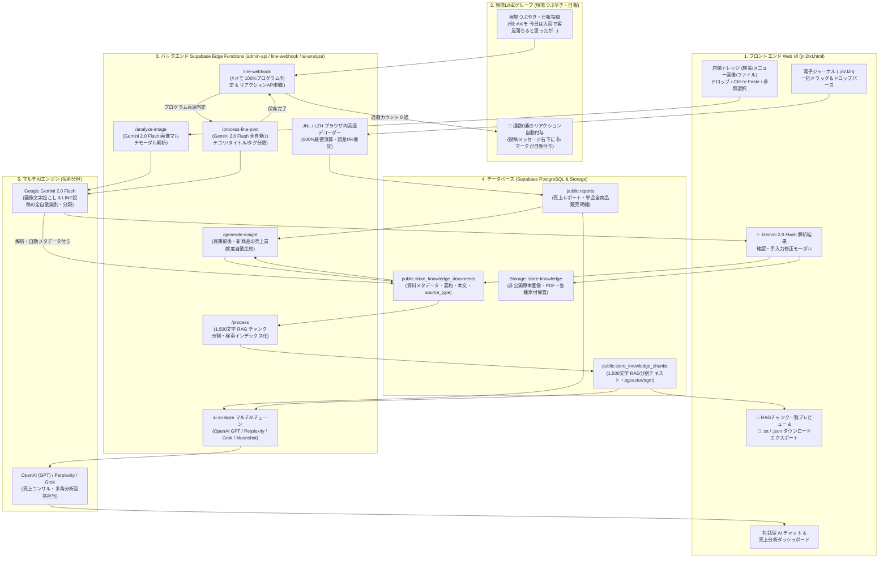

# 🌐 Journal Report 全機能・全体アーキテクチャ & 運用仕様書 (SYSTEM_ARCHITECTURE_OVERVIEW.md)

本ドキュメントは、電子ジャーナル（`.jnl` / `.lzh`）の全自動パース・100%厳密演算エンジン、Gemini 2.0 Flash を活用した店舗ナレッジ（メニュー画像等）のマルチモーダルAI解析、現場LINE投稿（`#メモ`）の全自動識別・連動、通数0通のLINEメッセージリアクション（👍）、1,500文字の最適化 RAG チャンク基盤、および売上数値と定性ナレッジを掛け合わせた「売上貢献度・効果測定クロス分析」まで、**Journal Report の全機能と技術仕様・データフローを1枚に包括・全網羅した決定版仕様書**です。

---

## 📐 1. システム全体アーキテクチャ & 全機能データフロー図

---

## 🌟 2. Journal Report 全機能の包括一覧

### ① 電子ジャーナル (.jnl / .lzh) 全自動解凍・パース・確定売上集計
- **全自動デコード**: レジから出力されるバイナリ電子ジャーナル（`.jnl`）や LHA 圧縮書庫（`.lzh`）をブラウザ上で全自動解凍 (`fflate.min.js`) し、Shift-JIS 文字コードをパース。
- **誤差ゼロの数値集計**: 総売上高、客数、客単価、フード/ドリンク比率、時間帯別・曜日別推移、および**全商品の単品販売数量・売上金額**をプログラム演算（誤差0%）で集計。
- **データベース蓄積**: 店舗識別キー（`store_partition_key`）ごとに `public.reports` テーブルへ保存。

### ② Gemini 2.0 Flash マルチモーダル画像AI解析 & 確認修正モーダル
- **多様な入力に対応**: 画像・PDF・テキスト・CSV・Markdown のファイル選択・ドラッグ＆ドロップ・クリップボードからの画像貼り付け (`Ctrl+V` / `Cmd+V`) に完全対応。
- **全自動AI解析 (`/analyze-image`)**: **Gemini 2.0 Flash** が画像や資料を解析し、タイトル、1〜3行の要約、構造化された文字起こし本文（メニュー名・価格・説明）、タグを自動抽出。
- **確認・手動修正モーダル (`#knImageModal`)**: 解析結果が即座にポップアップ表示され、必要に応じて人間がその場で直接手入力で確認・修正・追記可能。
- **デュアル保存**: 原本画像は Supabase Storage (`store-knowledge`) へ、テキストデータは DB (`store_knowledge_documents`) へ安全保管。

### ③ 現場LINE投稿 (`#メモ`) の全自動判別・AI分類・即時連動
- **100%プログラム高速判定（コスト0円）**: 店舗LINEグループの投稿から `#メモ`（または `#日報` / `#note`）をプログラムの条件分岐で判定。関係のない日常雑談はAIを起動させず即時スルー（AI APIコスト0円）。
- **全自動AI構造化 (`/process-line-post`)**: `#メモ` が付いた投稿のみを Gemini 2.0 Flash が解読し、15文字タイトル（例: `「大雨での赤ワイン煮込み好評」`）、カテゴリー（`施策`/`メニュー`/`価格改定`/`イベント`/`マニュアル`/`その他`）、サマリー、タグを自動生成して DB へ登録。

### ④ 配信通数 0 通（無料）の LINE メッセージ・リアクション機能
- **通数カウント 0 通のメッセージリアクション**: LINE Messaging API の Message Reaction API (`POST /v2/bot/message/react`) を使用。LINE公式アカウントの月間配信通数枠を**1通たりとも消費せずに（カウント0通）** 投稿メッセージの右下に **👍 (thumbs_up)** マークを自動付与。
- **現場への安心フィードバック**: LINEグループ内に返信文を流さず静かに、かつ一目で「AIがDBに保存した」ことを現場へ通知。

### ⑤ 1,500文字 RAG チャンク全自動生成 & 閲覧・エクスポート基盤
- **最適化された 1,500文字 チャンク分割 (`/process`)**: 長文のワイン解説やメニュー表が切れないよう、約1,500文字単位（前後200文字重複オーバーラップ）で自動分割。段落 (`\n\n`) ➔ 改行 (`\n`) ➔ 句点 (`。`) の優先順で自然な文章境界で切断。
- **ハイブリッド検索 (`store_knowledge_chunks`)**: `pg_trgm` 全文検索および `pgvector` ベクトル検索インデックスにより関連チャンクを即座にピンポイント抽出。
- **画面での RAG プレビュー (`#knRagModal`)**: 各資料カードの **「📑 RAG表示」** ボタンでAI分割データの一覧を閲覧。
- **手元へのテキストダウンロード**: **「💾 RAGをDL (.txt / .json)」** ボタンでAI解読文および RAG データをローカルPCへワンクリック保存。

### ⑥ 売上データ × 店舗ナレッジの「売上貢献度・効果測定クロス分析」
- **定性・定量クロスマッチング**: 新ボトルや施策の導入日・現場LINE投稿と、ジャーナルの単品売上（数量・金額・単価影響）を自動同期。
- **表記ゆれ吸収（スマートマッチング）**: レジの略称（`ヴィランロゼ`）と資料正式名（`ドメーヌ・ヴィラン V・ド・テロワール ロゼ 2024`）を Bigram 類似度 ＋ LLMの自然言語理解でスマート紐付け。
- **誤差ゼロ計算 ＋ AIコンサルティング**: 数値計算はプログラムが厳密に行い、その結果をプロンプトとして渡すため、AIが計算ミスすることなく「客単価 +320円 向上」「売上貢献度 8.4%」といった具体的で高度なアドバイスを出力。
- **効果測定インサイトの自動蓄積 (`/generate-insight`)**: 施策前後の売上変化から「※推測です」付きの効果測定レポート（`source_type='ai_insight'`）を DB へ継続蓄積。

### ⑦ ハイコントラスト UI/UX & 店舗隔離セキュリティ
- **ハイコントラスト UI デザイン**: ライトモード／ダークモード双方でドロップゾーンや注釈テキストがクッキリ読める洗練されたデザイン。
- **店舗分離セキュリティ**: `store_partition_key` により 22 店舗のデータを完全隔離。

---

## ⚙️ 3. 信頼性を担保する重要設計仕様

### ① AIエンジンの明確な役割分担
- **画像OCR & LINE投稿全自動識別担当 (Gemini 2.0 Flash)**:
  画像読み取り、およびLINEの `#メモ` 投稿からタイトル・要約・カテゴリ・タグを自動生成して構造化日本語テキストへ変換する専門エンジン。
- **売上分析・コンサルティング担当 (OpenAI GPT / Perplexity / Grok / Moonshot)**:
  Gemini によって文字起こしされたナレッジテキスト・現場LINEログと売上数値を読み合わせ、経営コンサルティング回答や外部動向検索を担うメインAIパイプライン。

### ② 決定論的プログラムによる「売上数値の絶対的正確性（誤差ゼロ保証）」
- **計算処理は AI に任せない**:
  販売本数、売上金額、構成比、客単価などの数え上げ・計算処理は、AIの推測や感覚に任せず **JavaScript パースエンジンによる1本・1円単位の厳密な決定論的プログラム計算（誤差0%）** を実行。
- **正確な数値のみを AI に渡す**:
  プログラムが100%正確に集計した数値結果をプロンプトとして分析AI（GPT/Grok）に受け渡すため、**AIによる計算間違いや数え落としが構造上絶対に発生しない安心設計**となっています。

---

## 🗄️ 4. データベース & API 設計

### 主要テーブル

| テーブル名 | 役割・内容 |
|---|---|
| `public.reports` | 保存済み売上レポート（サマリー数値・曜日時間帯推移・単品販売明細） |
| `public.store_knowledge_documents` | 店舗ナレッジ（タイトル・カテゴリ・要約・本文・期間・添付パス・`source_type`） |
| `public.store_knowledge_chunks` | RAG検索用分割チャンク（`document_id`, `chunk_index`, `chunk_text`, `search_text`, `embedding`） |
| `storage.buckets ('store-knowledge')` | 非公開原本画像・PDF等の保管先（上限 20MB） |

### バックエンド API ルート

- `POST /pos-journals/knowledge/analyze-image`: Gemini 2.0 Flash マルチモーダル画像解析
- `POST /pos-journals/knowledge/process-line-post`: LINE `#メモ` のプログラム高速判別 & AI全自動カテゴリ・タイトル・タグ分類
- `POST /pos-journals/knowledge`: ナレッジ新規保存・更新 & 1,500文字自動RAGチャンク化
- `POST /pos-journals/knowledge/upload`: 添付ファイルアップロード (Storage + SHA-256)
- `POST /pos-journals/knowledge/process`: ドキュメントのRAGチャンク再生成 (1,500文字)
- `POST /pos-journals/knowledge/generate-insight`: 施策効果測定インサイト自動生成
- `GET /pos-journals/knowledge`: ナレッジ＆合致RAGチャンクのハイブリッド検索
- `GET /pos-journals/knowledge/item`: 単一ドキュメント & RAG チャンク一覧の全詳細取得
- `GET /pos-journals/knowledge/download`: 署名付きURL発行
- `DELETE /pos-journals/knowledge/item`: 論理削除 / 物理削除

---

## 🚀 5. デプロイメント・運用仕様

- **本番Webアプリ**: [https://marugo-s.github.io/line_report/jnm/jnl2txt.html](https://marugo-s.github.io/line_report/jnm/jnl2txt.html)
- **GitHubリポジトリ**: `MARUGO-s/line_report` (`main` ブランチ)
- **店舗分離セキュリティ**: `store_partition_key` により22店舗のデータアクセスを完全隔離。

---
*本ドキュメントにより、後続のAIアシスタントや開発チームが Journal Report の全機能、データフロー、画像AI解析、LINE投稿連動、通数0通リアクション、1,500文字RAGチャンク生成、マルチAIの役割分担、表記ゆれ吸収、および誤差ゼロの売上数値計算設計を完全に把握できます。*
