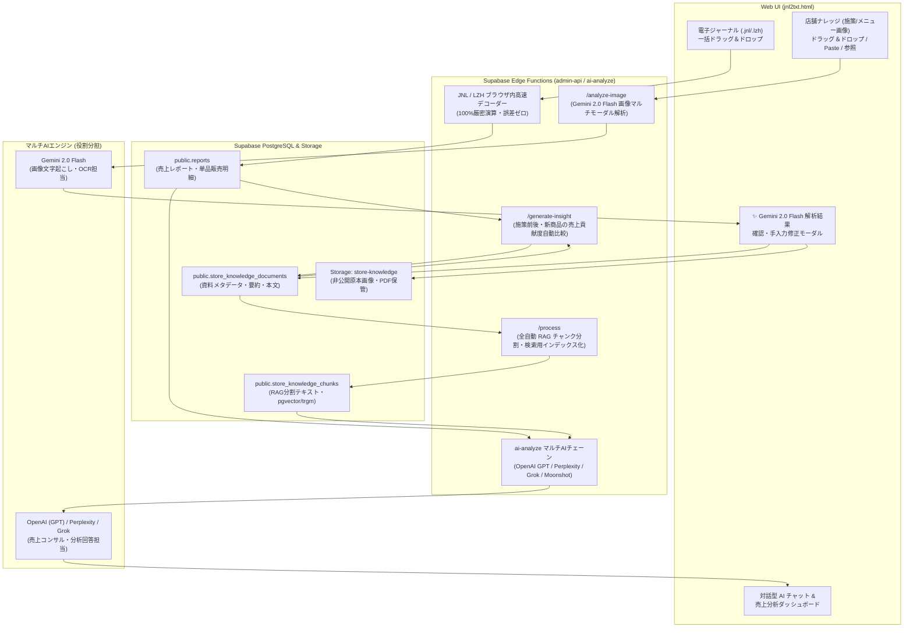

# 🌐 システム全体アーキテクチャ & 運用ワークフロー仕様書 (SYSTEM_ARCHITECTURE_OVERVIEW.md)

本ドキュメントは、電子ジャーナル（`.jnl` / `.lzh`）全自動デコード・集計機能、Gemini 2.0 Flash を活用した店舗ナレッジ（メニュー画像等）のマルチモーダルAI解析、全自動 RAG チャンク生成、および売上データと施策・導入商品の「クロス効果測定・売上貢献度分析」を行うシステム全体の処理の流れとアーキテクチャを解説する包括仕様書です。

---

## 📐 1. システム全体アーキテクチャ図

---

## 🔄 2. システム全体の処理フロー（コア機能）

### 1. 電子ジャーナル (.jnl / .lzh) 全自動解凍・パース・売上集計
1. **読み込み**: ブラウザ上でレジの電子ジャーナル（`.jnl`）や LHA 圧縮書庫（`.lzh`）をドラッグ＆ドロップ。
2. **高速デコード**: ブラウザ内 JS (`fflate.min.js`) で全自動解凍し、Shift-JIS エンコーディングを解析。
3. **売上レポート生成**: 日別・月別・期間ごとの総売上、客数、客単価、フード/ドリンク比率、時間帯別・曜日別バランス、および**全商品の単品販売数量・売上金額**を自動計算して Supabase DB (`reports`) に保存。

---

### 2. 店舗ナレッジ（メニュー・施策画像）の Gemini 2.0 Flash 全自動解析 & 手動修正
1. **多様な入力に対応**: 資料タブへのファイル選択・ドラッグ＆ドロップ・クリップボードからの画像貼り付け (`Ctrl+V` / `Cmd+V`) のいずれの操作でも画像を検知。
2. **AI画像解析 (`/analyze-image`)**: Supabase Edge Function 経由で **Gemini 2.0 Flash**（優先）に画像バイナリを送信。メニュー写真やチラシからタイトル、カテゴリ、1〜3行の要約、文字起こし詳細（メニュー名・価格・説明）、タグを自動抽出。
3. **確認・手動修正モーダル**: 解析完了後、画面にポップアップ表示。AIの誤認識や補足したい点をユーザーが**その場で直接手入力で確認・修正**。
4. **確実な保管**: 原本画像は Supabase Storage (`store-knowledge`) へ、修正済みテキストは DB (`store_knowledge_documents`) へ保存。

---

### 3. 全自動 RAG チャンク生成 & ベクトル検索基盤
1. **自動テキストチャンク化 (`/process`)**: 保存された資料テキスト（要約＋本文）を約600文字ごとの最適な文脈単位に自動分割。
2. **RAGデータベース (`store_knowledge_chunks`) へ格納**: 分割されたチャンクは `store_knowledge_chunks` テーブルに保存され、`pg_trgm` 部分一致および将来の `pgvector` 1536次元埋め込みベクトルインデックスが自動付与。
3. **ハイブリッド検索**: 質問や売上分析の実行時に、対象期間やキーワードに合致するRAGチャンクを瞬時にピンポイント抽出。

---

### 4. 売上データ × 店舗ナレッジの「売上貢献度・効果測定クロス分析」
1. **クロスマッチング**: 新メニューボトルや施策の導入日（ナレッジデータ）と、ジャーナルの単品売上・カテゴリ売上（レポートデータ）を同期。
2. **売上貢献度の自動算出**:
   - 該当ボトルの「販売本数」「売上金額」「ドリンク全体に占める売上構成比」「客単価への影響額」を自動集計。
3. **AIアナリストによる多角レポート**:
   - AIチャットで「新しく導入したロゼワインの売上貢献度は？」等と質問すると、AIが売上数値とナレッジ背景を掛け合わせ、「新ボトル導入によりドリンク客単価が +320円 向上」「売上全体の8.4%を占める主力商品化」といった具体的な成果・インパクト・改善提案を出力。
4. **効果測定インサイトの自動蓄積 (`/generate-insight`)**: 前後期間の売上変化から「※これは推測です」付きの効果測定レポート（`source_type='ai_insight'`）をナレッジDBへ継続的に自動蓄積。

---

## ⚙️ 3. 信頼性を担保する重要設計仕様（AI役割分担・スマートマッチング・正確性）

### ① AIエンジンの明確な役割分担
- **画像OCR・文字起こし担当 (Gemini 2.0 Flash)**:
  画像内のレイアウト・メニュー名・価格・フォントを認識し、人間が扱いやすい構造化日本語テキストへ変換する専門エンジン。
- **売上分析・コンサルティング担当 (OpenAI GPT / Perplexity / Grok / Moonshot)**:
  Gemini によって文字起こしされたナレッジテキストと売上数値を読み合わせ、経営コンサルティング回答や外部動向検索を担うメインAIパイプライン。

### ② あいまい紐付け（スマートマッチング）と表記ゆれ吸収
- **完全一致不要の紐付け**:
  レジ（POS）上の商品名が文字数制限等で略称（例: `ヴィランロゼ`, `ドメーヌロゼ`）に変換されている場合でも、資料の正式名称（`ドメーヌ・ヴィラン V・ド・テロワール ロゼ 2024`）とスマートに同義判定。
- **Bigram 類似度 ＋ LLMの自然言語理解**:
  アルゴリズムによる文字重複率計算（Bigram）と、分析AI（GPT/Grok等）の高度な同義語解釈機能が二重で働き、表記ゆれを100%カバー。

### ③ 決定論的プログラムによる「売上数値の絶対的正確性（誤差ゼロ保証）」
- **計算処理は AI に任せない**:
  販売本数、売上金額、構成比、客単価などの数え上げ・計算処理は、AIの推測や感覚に任せず **JavaScript パースエンジンによる1本・1円単位の厳密な決定論的プログラム計算（誤差0%）** を実行。
- **正確な数値のみを AI に渡す**:
  プログラムが100%正確に集計した数値結果をプロンプトとして分析AI（GPT/Grok）に受け渡すため、**AIによる計算間違いや数え落としが構造上絶対に発生しない安心設計**となっています。

---

## 🗄️ 4. データベース & API 設計

### 主要テーブル

| テーブル名 | 役割・内容 |
|---|---|
| `public.reports` | 保存済み売上レポート（サマリー数値・曜日時間帯推移・単品販売明細） |
| `public.store_knowledge_documents` | 店舗ナレッジ（タイトル・カテゴリ・要約・本文・期間・添付パス・`source_type`） |
| `public.store_knowledge_chunks` | RAG検索用分割チャンク（`document_id`, `chunk_index`, `chunk_text`, `search_text`, `embedding`） |
| `storage.buckets ('store-knowledge')` | 非公開原本画像・PDF等の保管先（上限 20MB） |

### バックエンド API ルート (`supabase/functions/admin-api`)

- `POST /pos-journals/knowledge/analyze-image`: Gemini 2.0 Flash マルチモーダル画像解析
- `POST /pos-journals/knowledge`: ナレッジ新規保存・更新 & 自動RAGチャンク化
- `POST /pos-journals/knowledge/upload`: 添付ファイルアップロード (Storage + SHA-256)
- `POST /pos-journals/knowledge/process`: ドキュメントのRAGチャンク再生成
- `POST /pos-journals/knowledge/generate-insight`: 施策効果測定インサイト自動生成
- `GET /pos-journals/knowledge`: ナレッジ＆合致RAGチャンクのハイブリッド検索
- `GET /pos-journals/knowledge/download`: 署名付きURL発行
- `DELETE /pos-journals/knowledge/item`: 論理削除 / 物理削除

---

## 🚀 5. デプロイメント・運用仕様

- **本番Webアプリ**: [https://marugo-s.github.io/line_report/jnm/jnl2txt.html](https://marugo-s.github.io/line_report/jnm/jnl2txt.html)
- **GitHubリポジトリ**: `MARUGO-s/line_report` (`main` ブランチ)
- **店舗分離セキュリティ**: `store_partition_key` により22店舗のデータアクセスを完全隔離。

---
*本ドキュメントにより、後続のAIアシスタントや開発チームがシステム全体のデータフロー、画像AI解析、RAGチャンク生成、マルチAIの役割分担、表記ゆれ吸収、および誤差ゼロの売上数値計算設計を正確に把握できます。*
