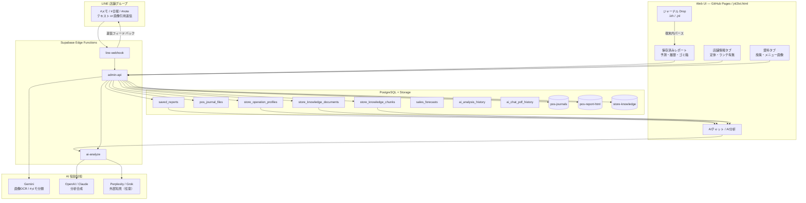

# Journal Report 全体アーキテクチャ & 機能仕様書（決定版）

本ドキュメントは、POS電子ジャーナル（`.jnl` / `.lzh`）の取り込み・厳密集計・クラウド保存から、店舗情報・店舗ナレッジ・LINE `#メモ` 連携、予約事実、売上予測、AIチャット／分析まで、**現行 Journal Report の全機能とデータフローを1本にまとめた正本仕様**です。

- **対象アプリ**: Journal Report（`public/jnm/jnl2txt.html`。`public/jnm/index.html` は `/jnm/` を本体へ転送するスタブ）
- **本番URL**: https://marugo-s.github.io/line_report/jnm/jnl2txt.html
- **GitHub**: `MARUGO-s/line_report`（`main`）
- **Supabase プロジェクト**: `hocbnifuactbvmyjraxy`
- **最終更新**: 2026-08-07（AI構成から Qwen／Kimi を除外して記載同期。機能正本は `docs/JOURNAL-REPORT-FEATURES.md`）

関連ドキュメント（詳細の深掘り用）:

| 文書 | 内容 |
|---|---|
| `docs/JOURNAL-REPORT-FEATURES.md` | **機能カタログの正本**（タブ／`#メモ`／店舗情報／AI／予測） |
| `JOURNAL-STORE-KNOWLEDGE.md` / `docs/JOURNAL-STORE-KNOWLEDGE.md` | 店舗ナレッジ詳細 |
| `docs/JOURNAL-AI-CHAT-RULES.md` | AIチャット確定集計・プロンプト規約 |
| `HANDOVER.md` | 運用・デプロイ注意（特に Dropbox ミラーを supabase に戻さないこと） |
| `docs/RESERVATION-GMAIL-GUIDE.md` | 予約（Gmail）取り込み |
| `.cursor/rules/ai-enrichment-additive.mdc` | AI確定集計の Additive 原則 |

---

## 1. システムの目的

Journal Report は「AIチャットツール」ではなく、**マルゴグループ各店舗の売上データ基盤**です。

1. レジが出す電子ジャーナルを、再現可能な **確定売上の正本** にする  
2. 正本の上でだけ AI が分析・提案する（AI に足し算させない）  
3. 施策・メニュー・定休・現場メモ・予約を同じ店舗空間で突き合わせる  
4. 店舗データを完全隔離しつつ、管理者だけ横断できる  

設計の一言:

> **数値はプログラム。AIは解釈。ナレッジは背景。**

---

## 2. 全体アーキテクチャ



### 主要コンポーネント

| 層 | 実体 | 役割 |
|---|---|---|
| フロント | `public/jnm/jnl2txt.html` | パース・レポートUI・AIプロンプト組立・店舗UI |
| 設定 | `pages-config.js` / `auth-session.js` / `journal-ai-client.js` | 店舗一覧・API URL・認証・AI通信 |
| API | `admin-api` | 認証付き CRUD・アップロード・ナレッジ・予約事実・コホート等 |
| AI | `ai-analyze` | `analyze` / `chat` / `clarify` |
| LINE | `line-webhook` | `#メモ` 判定・ナレッジ登録・返信フィードバック（他業務も同居） |
| DB | PostgreSQL | 店舗キー分離テーブル群 |
| Storage | 3バケット | ジャーナル原本・レポートHTML・資料原本 |

---

## 3. エンドツーエンドの流れ

### 3.1 ジャーナル → レポート → AI（主経路）

```
1. ユーザーが .lzh / .jnl（または月フォルダ）を Drop
2. ブラウザ内で LHA 解凍・制御コード除去・文字コード変換
3. 伝票確定・VOID除外・商品分類・ランチ/ディナー・天候・テーブル集計
4. autoBuildAndSaveAfterLoad()
   - 月別・フォルダ別に日別＋月間レポートを自動作成
   - 管理トークン必須でクラウド保存
5. saveCurrentReport()
   - POST /pos-journals/saved-reports → saved_reports
   - 詳細HTML → POST .../saved-reports/html → pos-report-html
   - ジャーナル原本 → POST /pos-journals/upload → pos-journals + pos_journal_files
6. AIチャット時
   - searchSavedReportsByQuery → summarizeMatched
   - enrich* レイヤで確定事実を追加
   - store-ops / knowledge / reservations を統合
   - POST ai-analyze（action=chat）
```

**重要**: レポート保存はクラウド必須。端末 LocalStorage を正本にしない（キャッシュは明示パージ）。

### 3.2 店舗情報（定休など）

```
店舗情報タブで入力 → POST /pos-journals/store-ops
  → store_operation_profiles.profile (jsonb)
  → 毎AIターン formatStoreOpsBlockForAi で注入
  → 定休曜日の売上ゼロを「弱点」扱いにしない
```

### 3.3 店舗ナレッジ（資料）

```
資料タブで手入力 / ファイルDrop / Ctrl+V
  →（画像なら）POST .../knowledge/analyze-image（Gemini）
  → 確認モーダルで人手修正可
  → POST .../knowledge/upload → store-knowledge
  → POST .../knowledge → store_knowledge_documents
  → 自動 RAG 分割 → store_knowledge_chunks（約1500字・overlap 200）
  → AIは期間重なり＋類似度で添付（数値出典には使わない）
```

### 3.4 LINE `#メモ` → 資料

```
店舗LINEグループで:
  A) テキストに #メモ / #日報 / #note（全角＃可）
  B) 画像・ファイルを送り、引用返信で #メモ
       → registerQuotedImageAsKnowledge
       → analyze-image → upload → knowledge（source_type=line_post 相当）
フィードバック:
  - replyToken での短文返信（配信通数を消費しない経路）
  - ※旧ドキュメントの Message Reaction API（👍）は LINE に存在せず廃止済み
```

画像メッセージ単体には text が無いため、**画像だけ送ってもナレッジ登録されない**。必ず引用返信で `#メモ` が必要。

### 3.5 予約 → AI事実

```
食べログ/一休（Gmail自動）+ 手動（LINEスクショ等）
  → GET /reservations/ai-facts
  → enrichReservationFacts
  → 予約組数・人数・チャネル・新規/リピート
  → walkInMonthly = POS組数/客数 − 予約（推定）
  → データが無い店・期間は節ごと省略（無理に「予約なし」と強調しない）
```

---

## 4. 画面構成（UI）

### 4.1 タブ

| タブ | `data-tab` | 内容 |
|---|---|---|
| 使い方 | `guide` | 操作説明 |
| 変換 | `convert` | 既定。取り込み・分析ツール・ファイル一覧 |
| 店舗情報 | `storeops` | 定休・ランチ/ディナー有無・特別営業・メモ |
| 資料 | `knowledge` | 施策・メニュー等の登録・一覧・RAG |

### 4.2 変換タブの主な操作

| UI | 役割 |
|---|---|
| 管理トークン接続 | クラウド保存・AI・履歴の前提 |
| 店舗セレクト | `STORE_KEY`（`store_partition_key`）切替 |
| Drop / ファイル選択 | `.lzh` / `.jnl` 再帰読込 |
| レポートを作成 | 手動ビルド（通常は読込後自動） |
| 保存済みレポート | 一覧・開く・合算分析・ゴミ箱へ |
| 売上予測 / 予測履歴・MAPE | 予測作成と実績比較 |
| AI分析履歴 | レポートAI分析の履歴 |
| AIチャットPDF履歴 | 質問＋回答のPDF化履歴 |
| ゴミ箱・復元 | レポート／予測／AI履歴／チャットPDF |
| 店舗横断サマリー | **管理者のみ** |
| AIチャット | 保存レポート根拠の対話 |

### 4.3 レポートプレビュー

- HTMLで保存 / 印刷・PDF / AI分析 / AIチャット / テーマ切替  
- **旧解析版（stale）** は HTML・印刷を止め、「元データから再作成」を促す  

バージョンタグ例:

- `PARSER_VERSION`（例: `2026-07-31-v19`）  
- `VERIFICATION_VERSION`（例: `split-bill-reconcile-v3`）  
- `CATEGORY_VERSION`（例: `pos-food-drink-room-bycode-v3`）  
- `MEAL_PERIOD_VERSION`（`lunch-before-1600-v1`）  

---

## 5. 認証と店舗分離

| 概念 | 実装 |
|---|---|
| 認証ヘッダ | `x-admin-token` + `x-admin-surface: line_report` |
| セション | `/auth/session` / LINEリンクログイン等 |
| 店舗キー | クライアント `STORE_KEY` → API `store_key` → DB `store_partition_key` |
| 管理者 | `authStoreScope = null` → 全店切替可・横断サマリー可 |
| 店舗スコープ | 自店のみ。`STORE_SCOPED_ALLOWED_PATHS` 外は拒否。他店キーは 403 |
| 公開ページ | DB/Storage に直接触れない。必ず Edge + `service_role` |
| RLS | Journal 系テーブルは anon/authenticated 直接アクセス遮断 |

店舗マスタは `pages-config.js` の `STORE_NAMES`（約22店: marugo, bistrocavacava, …）。

---

## 6. ジャーナル解析エンジン（端末内）

| 項目 | 仕様 |
|---|---|
| 書庫 | LHA `.lzh`（`unlzh`）。展開バイトをクラウド原本にも保管 |
| 文字コード | Shift-JIS（既定）/ UTF-8 / EUC-JP |
| 抽出モード | 成功会計 / 全件 / VOID 等 |
| VOID・取消 | 状態語＋対象 No. で除外。商品名の「取消」行は純額に必要なら除外しない |
| ランチ/ディナー | **16:00未満＝ランチ、以降＝ディナー**（全店共通規則） |
| カテゴリ | 商品コード帯＋名称ヒューリスティクス。店舗別オーバーライドをクラウド同期 |
| 天候 | 「天候入力」レコード → 気温・天候を日次に紐付け |
| テーブル | テーブルNo. 別集計 |
| 再取り込み | 同一SHAは重複スキップ。同一営業日で中身が違う場合は既存保護で拒否 |

集計KPI例: 総売上、組数、客数、客単価、F/D、室料、チャージ、曜日・時間帯、売れ筋、支払方法。

---

## 7. 保存済みレポートとクラウド容量設計

### 7.1 テーブル・API

| 操作 | API | テーブル / Storage |
|---|---|---|
| 保存 | `POST /pos-journals/saved-reports` | `saved_reports` |
| 一覧（軽量） | `GET .../saved-reports?kind=all\|daily\|monthly` | メタ中心（lazy hydrate） |
| 詳細 | `GET .../saved-reports/item` | フル `data` |
| HTML保管 | `POST/GET .../saved-reports/html` | バケット `pos-report-html` |
| HTML退避 | `POST .../html-offload` | JSONB から巨大 body を外す |
| 削除 | `DELETE .../item` + confirmation | `deleted_at` 論理削除 |
| 復元 | `PATCH .../item` `{ action: 'restore' }` | |

> 旧ドキュメントの `public.reports` 表記は誤り。正本は **`saved_reports`**。

### 7.2 その他レポート周辺

| 機能 | 説明 |
|---|---|
| 旧解析版 | パーサ／分類バージョン不一致 → 再作成必須 |
| 選択合算分析 | 複数保存レポートを合算して分析 |
| ジャーナル原本 | `pos_journal_files` + `pos-journals` |
| HTML MIME | Storage は `text/html` 厳密一致。charset 付きは 415 になるためサーバ側で正規化 |

---

## 8. AIチャット・AI分析（確定集計パイプライン）

### 8.1 通信

- エンドポイント: `.../functions/v1/ai-analyze`  
- `action`: `analyze` | `chat` | `clarify`  
- 店舗スコープ検証・レート制限あり  
- 売上合成: OpenAI（既定 `gpt-5.6-luna`）→ Anthropic Claude Haiku フォールバック  
- 外部知見: Perplexity / Grok（オーケストレーション時）。数値出典にはしない  
- **Gemini は売上アナリストではない**（画像・#メモ分類専用）  
- **情報流出対策**: Journal／フードコートの業務データ経路から **Qwen（通義）／Kimi（Moonshot）は構成外**。旧キーやコード残骸があっても現行経路では呼び出さない  

### 8.2 `summarizeMatched` 内の Additive レイヤ（順序固定）

新機能は既存レイヤを消さず **追加**する（`.cursor/rules/ai-enrichment-additive.mdc`）。

| # | 関数 | 確定事実 |
|---|---|---|
| 1 | `enrichMonthlyMealCategorySplit` | 月次ランチ/ディナー別 F/D |
| 2 | `enrichMonthlyAnomalyItemFacts` | 異常月ドリルダウン（高単価コース寄与等） |
| 3 | `enrichProductTimelineFacts` | 商品初出・導入月（**targets[] 並列**。ファミリー最古で固有開始月を潰さない） |
| 3b | `enrichCourseLineupFacts` | コースラインナップ（必ず q=コース、単価帯主力・例外・coverageGaps） |
| 4 | `enrichJournalCohortComparisons` | 汎用会計比較（meal / weekday / item 等）＋互換 `productCohortFacts` |
| 5 | `rankProductsForAiDisplay` 等 | 売れ筋（★大分類除外・コース合算） |
| 6 | `enrichReservationFacts` | 予約確定事実＋予約 vs 飛び込み（月次・推定） |

補助API:

- `GET /pos-journals/product-search`  
- `GET /pos-journals/product-cohort`（互換）  
- `POST /pos-journals/cohort-compare`  

### 8.3 期間クエリの解釈

| 言い方 | 意味 |
|---|---|
| `2026年1月から7月まで` / `2026年1月〜7月` | **1〜7月の全月**（端点2か月ではない） |
| `2026年1月と7月を比較` | 比較（範囲ではない） |
| `2025年4月から2026年3月まで` | 年またぎ範囲 |

プロンプト規約にも「期間の読み方」を明記（規約13 / 会社コンテキストの期間表現節）。

### 8.4 AIが毎ターン突き合わせる3系統

1. **ジャーナル確定集計**（数値・予約vs飛び込み含む）  
2. **店舗営業情報**（定休・ランチ等）  
3. **店舗資料 / #メモ**（施策・メニュー。数値出典禁止）  

欠けた系統を推測で埋めない。ナレッジ由来は「登録資料によると」、仮説は「※これは推測です」。

---

## 9. 店舗情報（store-ops）

| 項目 | 内容 |
|---|---|
| テーブル | `store_operation_profiles`（PK: `store_partition_key`） |
| API | `GET/POST /pos-journals/store-ops` |
| 主なフィールド | `closedWeekdays`, `lunchOffered`, `dinnerOffered`, overflow 規則, `specialOpenPolicy`, `notes`, `journalSalesSync`（既定 OFF）, `calendarEvents[]`, `wineMl` |
| UI | 「店舗情報」タブ。保存／リセット、プレビュー、過去売上同期 ON/OFF、施策・イベントカレンダー、ワインml換算 |
| AI効果 | 定休ゼロ売上を機会損失と誤診しない。特別営業を区別。カレンダー登録を期間背景として注入。ワイン提供量(ml)を分析項目に |
| ワインml | `wineMl: { glassMl, decanterMl, bottleMl:750固定, pairingMl }`。Glass/デキャンタ/Bottle/ペアリング点数×ml → `wineVolumeAnalysis`。AIチャットは点数／総ml／両方を確認可 |
| 過去売上同期 | `journalSalesSync===true` のとき journal → `line_sales_manual_day` / `_month_gross`（ジャーナル店舗向け） |
| カレンダー | `calendarEvents: [{ id, title, kind, start, end, note }]`。プレビュー／AI に自動反映。詳細資料は店舗ナレッジ側 |

---

## 10. 店舗ナレッジ（資料）

詳細は `JOURNAL-STORE-KNOWLEDGE.md`。要約:

| 項目 | 内容 |
|---|---|
| テーブル | `store_knowledge_documents` / `store_knowledge_chunks` |
| カテゴリ | 施策 / メニュー / 価格改定 / イベント / マニュアル / その他 |
| `source_type` | `manual` / `upload` / `ai_insight` / `line_post` |
| 画像解析 | Gemini 2.0 Flash（フォールバックあり）→ 確認モーダル |
| RAG | サーバ分割 **約1500文字・overlap 200**（UI文言に「約600文字」が残っている場合あり。実装は1500） |
| 検索 | 期間重なり＋ trgm 類似。embedding 列はあるが生成パイプラインは未配線 |
| 効果測定 | `POST .../generate-insight` → `source_type='ai_insight'` |
| 削除 | 既定は論理削除（過去分析のため）。`purge` で完全削除 |
| 閲覧 | **資料タブの一覧が正本**（LINE `#メモ` もここに蓄積。LINE上だけでは一覧不可） |
| 詳細 | `docs/JOURNAL-REPORT-FEATURES.md` §6、`docs/JOURNAL-STORE-KNOWLEDGE.md` |

---

## 11. LINE 連携（Journal Report 関連）

| 機能 | 現状 |
|---|---|
| トリガタグ | `#メモ` / `#日報` / `#note`（全角＃可）。プログラム判定（コスト0） |
| テキストメモ | `POST /pos-journals/knowledge/process-line-post` → Gemini でタイトル・カテゴリ・タグ |
| 画像メモ | 引用返信 `#メモ` → `registerQuotedImageAsKnowledge`（`x-internal-key` ブリッジ） |
| 成功フィードバック | **replyToken 返信**（Reaction API は非存在のため不使用） |
| 空の `#メモ` | 使い方ガイドを返信 |
| 画像だけ | 登録しない（text が無い） |

※ `line-webhook` にはレシート・日計など Journal 以外の業務も同居する。本節はナレッジ連携に限定して記載。

---

## 12. 予約と飛び込み推定

| 項目 | 内容 |
|---|---|
| API | `GET /reservations/ai-facts` |
| チャネル | tabelog / ikyu / manual（スクショ等） |
| 出すもの | 件数・人数・キャンセル・新規/リピート・チャネル別・月次・氏名・予約内容 |
| 出さないもの | **電話番号** |
| 飛び込み | POS組数/客数 − 予約（必ず「推定」。ノーショー・未通知・日付ズレで一致しない） |
| 空データ | 予約節ごとスキップ（未導入店を無理に語らない） |

---

## 13. 売上予測と MAPE

| 項目 | 内容 |
|---|---|
| 入力 | カテゴリ付きの保存済み **月間** レポート系列 |
| 生成 | `buildSalesForecast()`（前年・季節性・直近平均など） |
| 保存 | `POST /pos-journals/sales-forecasts` → `sales_forecasts` |
| 比較 | `compareForecastToActuals()` で MAPE |
| UI | 売上予測ボタン / 予測履歴・MAPE / ゴミ箱対応 |

---

## 14. 履歴・ゴミ箱

論理削除（`deleted_at`）＋復元 UI（`#journalTrashBtn`）:

| 種別 | API プレフィックス | テーブル |
|---|---|---|
| 保存済みレポート | `/pos-journals/saved-reports` | `saved_reports` |
| 売上予測 | `/pos-journals/sales-forecasts` | `sales_forecasts` |
| AI分析履歴 | `/pos-journals/report-ai-history` | `ai_analysis_history` |
| AIチャットPDF | `/pos-journals/chat-pdf-history` | `ai_chat_pdf_history` |

復元: `PATCH` + `{ action: 'restore' }`。Storage 上の HTML はゴミ箱でも保持。

---

## 15. 店舗横断サマリー

- `GET /pos-journals/saved-reports/cross-store-summary`  
- **フル管理者のみ**（店舗スコープ allowlist 外）  
- 店舗ごとの非削除 `saved_reports` 件数などを表示  

---

## 16. データベース一覧（Journal 中心）

| テーブル | 役割 |
|---|---|
| `saved_reports` | 日別・月間レポート本体（JSONB + HTMLパス） |
| `pos_journal_files` | 営業日ジャーナルメタ＋解析サマリ |
| `store_operation_profiles` | 定休・営業形態 |
| `store_knowledge_documents` | 資料メタ・本文 |
| `store_knowledge_chunks` | RAGチャンク |
| `sales_forecasts` | 予測履歴 |
| `ai_analysis_history` | レポートAI分析履歴 |
| `ai_chat_pdf_history` | チャットPDF履歴 |
| `pos_journal_ai_analyses` | 旧/並行のPOSジャーナルAI系（UI主経路は `ai_analysis_history`） |

予約系テーブルは予約機能側（Gmail / 予約表）と共有。AIは `/reservations/ai-facts` 経由で読む。

---

## 17. Storage バケット

| バケット | 用途 | 備考 |
|---|---|---|
| `pos-journals` | `.lzh` 原本 | 非公開・サイズ上限あり |
| `pos-report-html` | レポート詳細HTML | 非公開・5MB/件。MIME は `text/html` |
| `store-knowledge` | 資料添付 | 非公開・20MB 級 |
| `line-media` | LINE添付一時 | `#メモ` 画像経路で利用。登録成功後に掃除する場合あり |

---

## 18. API 一覧（Journal 関連・要約）

店舗スコープ許可の代表パス（`STORE_SCOPED_ALLOWED_PATHS` の Journal 部分）:

```
/auth/logout
/reservations/ai-facts  （他 reservations/* も店舗業務で利用）
/pos-journals
/pos-journals/upload | file | download
/pos-journals/product-search | product-cohort | cohort-compare
/pos-journals/saved-reports | item | html | html-offload
/pos-journals/sales-forecasts | item
/pos-journals/report-ai-history | item
/pos-journals/chat-pdf-history | item
/pos-journals/knowledge | item | upload | download
/pos-journals/knowledge/analyze-image | process | generate-insight
/pos-journals/store-ops
```

管理者専用の例:

- `GET /pos-journals/saved-reports/cross-store-summary`

内部ブリッジ:

- `POST /pos-journals/knowledge/process-line-post`  
- webhook → admin-api は `x-internal-key`（service_role ブリッジ）  

AI:

- `POST /functions/v1/ai-analyze`

---

## 19. セキュリティ原則

1. 公開 Pages は業務テーブルへ直接アクセスしない  
2. Edge が `service_role` で DB/Storage に触る  
3. 店舗スコープは allowlist ＋ `store_key` 強制（IDOR 防止）  
4. RLS 有効。anon/authenticated の直接権限を落としている  
5. LINE Webhook 署名検証（fail-closed）  
6. AI はスコープ外 `storeKey` を拒否  
7. 認証・AI・アップロードにレート制限  
8. バケットは非公開。取得は署名URL経由  

---

## 20. デプロイ・リポジトリ運用

| 項目 | 値 |
|---|---|
| 本番 Pages | https://marugo-s.github.io/line_report/ |
| 正本リポジトリ | `MARUGO-s/line_report` |
| Supabase ref | `hocbnifuactbvmyjraxy` |
| 主要 Functions | `admin-api`, `ai-analyze`, `line-webhook`, … |
| Dropbox `解凍変換ソフト/` | HTML 作業コピー。**ここにある `supabase/` を本番へ戻し書きしない**（HANDOVER 必須） |

デプロイは通常 GitHub Actions（Pages + Edge Functions）。

---

## 21. 旧ドキュメントからの主な訂正

| 旧記載 | 現行の真実 |
|---|---|
| テーブル名 `public.reports` | **`saved_reports`** |
| LINE 👍 Reaction API で通数0フィードバック | **API非存在。replyToken 返信に変更** |
| LocalStorage 二重保存が正本 | **クラウド必須。ローカルはキャッシュ扱い** |
| AI＝Gemini が分析担当 | **Geminiは画像/#メモ。分析は OpenAI Luna → Claude Haiku** |
| 機能はジャーナル＋簡易AIのみ | **店舗情報・資料・LINE・予約・予測・コホート・HTML分離・ゴミ箱等が追加済み** |
| RAG「600文字」 | **サーバ実装は約1500文字**（UIコピーが古い場合あり） |
| 売上合成の退避が Moonshot/Kimi | **Claude Haiku へ変更（情報流出対策で Qwen/Kimi は構成外）** |

---

## 22. 主要クライアント関数（索引）

| 領域 | 関数名 |
|---|---|
| 取込 | `addFiles`, `unlzh`, `process`, `autoBuildAndSaveAfterLoad` |
| レポート | `buildBothReports`, `saveCurrentReport`, `writeSavedReports`, `isStaleReport` |
| AI検索 | `searchSavedReportsByQuery`, `extractRangeRef`, `summarizeMatched` |
| 確定enrich | `enrichMonthlyMealCategorySplit`, `enrichMonthlyAnomalyItemFacts`, `enrichProductTimelineFacts`, `enrichCourseLineupFacts`, `enrichJournalCohortComparisons`, `enrichReservationFacts`, `rankProductsForAiDisplay` |
| 統合プロンプト | `buildIntegratedAnalysisContext`, `strictSystemInstruction`, `formatStoreOpsBlockForAi`, `formatStoreKnowledgeBlock` |
| 予測 | `buildSalesForecast`, `compareForecastToActuals` |
| 履歴 | `JOURNAL_TRASH_TYPES`, `renderJournalTrash` |

Webhook 側: `registerQuotedImageAsKnowledge`, `#メモ` 判定（`knowledge_memo_tag`）。

---

## 23. 機能チェックリスト（実装済み）

- [x] `.lzh` / `.jnl` Drop → 端末内厳密集計  
- [x] 日別・月間レポートのクラウド自動保存  
- [x] ジャーナル原本クラウド保管・再アップロード重複ガード  
- [x] レポートHTMLの Storage 分離・offload  
- [x] 旧解析版検出と再作成誘導  
- [x] 店舗切替・管理者横断・店舗スコープ制限  
- [x] 店舗情報（定休等）→ AI毎ターン注入  
- [x] 施策・イベントカレンダー／過去売上同期／ワインml換算  
- [x] 資料タブ・Gemini画像解析・確認モーダル  
- [x] RAGチャンク生成・プレビュー・DL  
- [x] LINE `#メモ`（テキスト／画像引用）→ 資料（閲覧は資料タブ）  
- [x] AIチャット（期間範囲の全月展開・ワイン点数/ml確認含む）  
- [x] Additive 確定集計（昼夜F/D・異常月・初出・コース・コホート・予約）  
- [x] 売上予測と MAPE 履歴  
- [x] AI分析履歴 / チャットPDF履歴  
- [x] ゴミ箱・復元（4系統）  
- [x] 店舗横断サマリー（管理者）  
- [x] テーマ（ライト／ダーク）  

機能カタログの読み物正本: `docs/JOURNAL-REPORT-FEATURES.md`。
---

*本ファイルは Journal Report の全体像の正本です。個別機能の細部は関連ドキュメントと `admin-api` / `jnl2txt.html` の実装を優先してください。旧版は同名ファイルの `.backup-*` に保管しています。*
