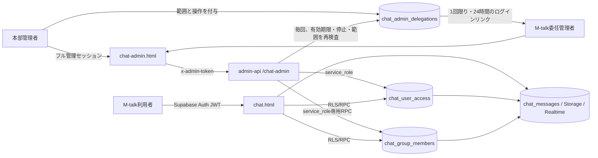

# M-talk（chat.html）専用管理・権限設計

`public/chat-admin.html` は M-talk だけを管理する画面。LINE Bot の
`line_user_permissions`、店舗管理権限、Supabase Auth の利用可否には連動しない。

- 管理画面: `https://marugo-s.github.io/line_report/chat-admin.html`
- 管理API: `admin-api /chat-admin/*`
- 対象アプリ: `public/chat.html` と、その通知・画像・予約送信・ルーム設定経路

## 信頼境界

ブラウザへ `service_role` を渡さない。管理画面でボタンを隠すだけではなく、
Data APIを直接呼ばれてもDBのRLS・RPC・Storage policyで同じ判定を行う。
従来の店舗管理、ルーム設定、cron用セッションは `/chat-admin/*` を利用できない。
委任管理は `metadata.scope=mtalk_admin` という別スコープで、通常の売上・予約・資料・
店舗設定APIをすべて403にする。委任レコードを停止または期限切れにすると、既発行の
セッションも次のAPI呼び出しから失効する。管理範囲・操作権限・期限の変更、停止・再開では`session_version`を
増やすため、停止前のセッションは再開しても復活しない。再開後は本部が新しいリンクを発行する。

## 委任管理者の最小権限

本部管理者だけが `chat-admin.html` の「M-talk委任管理者」から作成・変更・停止・
ログインリンク再発行を行える。リンクは24時間・1回限りで、交換後のセッションも
期限付き。委任設定そのものにも有効期限を必須とし、新規作成時は30日後を初期値にする。
操作能力の初期値は`view`だけで、必要なものを本部が追加する。委任レコードの状態は
ログイン時だけでなく、API呼び出しごとにDBから読み直す。

| 範囲 | 見える対象 | 書込み境界 |
| --- | --- | --- |
| `all` | M-talk内の全ユーザー・全ルーム | 与えた操作能力だけ。`manage_users`はこの範囲だけに付与可 |
| `stores` | 選択店舗の所属ユーザー、店舗Bot、`store_key`が一致するルーム | 他店舗・無所属ルーム・全体ユーザー停止は不可 |
| `rooms` | 明示したルームと参加者 | 同一店舗でも未選択ルームは不可。全体ユーザー停止とBot停止は不可 |

| 操作能力 | 許可内容 |
| --- | --- |
| `view` | 許可範囲のユーザー・ルームを閲覧。全委任に必須 |
| `audit_read` | 許可範囲の監査ログを閲覧 |
| `manage_members` | 許可ルーム内の4権限とアクセス解除 |
| `manage_rooms` | 許可ルームのゴミ箱・復元。復元不能な完全削除は本部だけ |
| `manage_bots` | 全体、または選択店舗と一致する店舗Botの論理削除・復元 |
| `manage_templates` | 許可ルームを明示したテンプレート適用。`manage_members`も必須 |
| `manage_users` | M-talk全体の利用停止・論理削除。`all`だけに付与可 |
| `revert_audit` | 許可範囲の復元。対象操作に応じて`manage_users`または`manage_members`も必須 |

書込み時はTypeScript側の能力検査に加え、service-role専用の
`chat_admin_delegated_execute`が委任行をロックし、`chat_admin_delegation_allows_*`で
委任ID・対象・能力を確認した**同じDBトランザクション内**で既存管理RPCを実行する。
停止処理と管理操作が同時でも直列化され、停止完了後に古い確認結果の変更が滑り込まない。
`/chat-admin/state` はメッセージ本文、添付パス、署名URL、売上、予約、資料を返さない。
複数店舗所属ユーザーの所属表示も許可店舗だけへ絞り、委任設定の作成・変更・リンク発行に
関する本部監査ログは委任管理者へ返さない。

## 権限モデル

### ユーザー全体（`chat_user_access`）

| 項目 | 効果 |
| --- | --- |
| `access_enabled` | falseならM-talk全体を停止 |
| `restricted_until` | 未来日時なら、その日時まで一時停止 |
| `can_start_direct` | 新しい1対1トークを開始できる |
| `can_create_group` | 新しい複数人ルームを作成できる |
| `can_browse_users` | 友だち・招待候補のユーザー一覧を見られる |
| `signup_status` | pending / approved / denied。新規の人間ユーザーは pending |
| `default_can_send` | falseなら以後のグループ参加は閲覧のみ |
| `deleted_at` | M-talk上の論理削除。再ログインしても利用不可 |

既存ユーザーは既定で有効（`signup_status=approved`、`default_can_send=true`）。
新規の人間ユーザーは承認待ちで始まり、許可後も閲覧のみ。Botは従来どおり有効。
許可／不許可カード（`signup_approval` など）は専用の「管理者通知」ルームへ送る。
予約通知Botの1対1は使わない（削除した予約通知ルームを同じ相手キーで復活させない）。
店舗ルームでは `can_manage` がある人だけが読める。一般メンバーの未読にも載せない。
Botの削除・復元は、通常のM-talk画面では行えず、**本部管理者、または対象店舗と
`manage_bots`を明示付与された委任管理者の`chat-admin.html`だけ**で行う。
物理削除はせず `chat_users.bot_deleted_at`
による論理削除とし、過去メッセージ・所属履歴を保持する。削除済みBot名義の
新規投稿はDBトリガで拒否し、店舗Bot解決・予約通知・検索応答の候補からも外す。

### ルーム別（`chat_group_members`）

| 項目 | 効果 |
| --- | --- |
| `can_view` | ルーム、参加者、参加時刻以降の本文、検索、画像、既読、未読、通知を利用 |
| `can_send` | 本文、画像、感情イラスト、リアクション、予約送信を利用 |
| `can_invite` | 招待リンクの発行・更新、利用中ユーザーの追加 |
| `can_manage` | ルーム名・アイコン・設定、メンバー退出、ゴミ箱・復元 |

`can_send`、`can_invite`、`can_manage` は `can_view` が前提。1対1は当事者2人だけで、
第三者の追加、招待、通常ルームへの書き換えを禁止する。

## 管理API

| Method | Path | 用途 |
| --- | --- | --- |
| GET | `/chat-admin/state` | 集計、ユーザー、ルーム、メンバー権限、監査ログ |
| GET | `/chat-admin/delegations` | 本部だけが委任管理者一覧を取得 |
| POST | `/chat-admin/delegations` | 本部だけが委任設定を作成し、1回限りのリンクを発行 |
| PATCH | `/chat-admin/delegations/:id` | 本部だけが範囲・操作・期限・有効状態を変更 |
| POST | `/chat-admin/delegations/:id/link` | 本部だけが新しい1回限りのリンクを再発行 |
| PATCH | `/chat-admin/users/:id` | 全体利用と3つの全体権限、一時制限・理由 |
| POST | `/chat-admin/users/:id/remove` | 表示名再入力後にM-talkだけ論理削除 |
| POST | `/chat-admin/users/:id/restore` | 論理削除を解除 |
| POST | `/chat-admin/bots/:id/remove` | Bot名の再入力後にBotを論理削除 |
| POST | `/chat-admin/bots/:id/restore` | 論理削除したBotを復元 |
| POST | `/chat-admin/rooms/:id/trash` | 店舗固定以外のルームをゴミ箱へ移動 |
| POST | `/chat-admin/rooms/:id/restore` | ゴミ箱のルームを復元 |
| POST | `/chat-admin/rooms/:id/purge` | 本部だけ。ルーム名再入力後にゴミ箱のルームを完全削除 |
| PATCH | `/chat-admin/rooms/:id/members/:userId` | 4つのルーム権限を更新 |
| DELETE | `/chat-admin/rooms/:id/members/:userId` | 通常ルームの4権限を無効化（履歴保持・再設定可） |
| GET | `/chat-admin/templates` | 権限テンプレート一覧と一括適用の上限 |
| POST | `/chat-admin/templates/apply` | テンプレートの一括適用。`dry_run`でプレビュー |
| GET | `/chat-admin/users/:id/access` | ユーザー1人の実効アクセス一覧（ページネーション） |
| POST | `/chat-admin/audit/:id/revert` | 監査ログからの復元。`dry_run`で差分のみ |

変更は `chat_admin_audit_log` へ、操作者、対象、変更内容、日時を記録する。

`dry_run` は省略時 `true`。書き込みは `dry_run: false` を明示したときだけ行う。

## 「ユーザー削除」の意味

管理画面の削除は、Supabase Authや`chat_users`の物理削除ではない。

1. `chat_user_access` を無効化し `deleted_at` を設定する。
2. 全ルームへのアクセスは全体利用判定で即時遮断する。ルーム別の細かな権限値は、復元時に元どおり戻せるよう保持する。
3. 未送信の予約送信を取消し、Web Push購読を無効化する。
4. 過去の発言、他ユーザーの履歴、作成済みルームは保持する。

`chat_users`を物理削除すると外部キーのcascadeで作成ルームと履歴まで消え、
`auth.users`を削除・banするとM-talk以外にも影響するため、どちらも行わない。

## 主な防御

- 非メンバーはルームの存在、参加者、本文、画像を取得できない。
- 生の`chat_group_members` INSERT/DELETEによる自己参加・退出迂回を禁止する。
- ルーム作成・メンバー追加は権限検査付きRPCだけを使う。
- `created_by`、`is_direct`、`direct_key`、`store_key`等の保護列は直接更新できない。
- 停止・削除・閲覧不可のユーザーをRealtime、未読数、Web Push対象から外す。
- 予約送信は予約時と送信時の両方で`can_send`を確認する。
- 予約画像のpayloadは登録時と配信時に再構築し、画像サイズは数値だけに限定する。画面側もサイズをHTML文字列へ連結しない。
- ユーザー全体権限は`updated_at`で競合を検出して409にし、ルーム権限はDBで行ロック後に指定項目だけを更新する。別管理者の変更を古い画面値で巻き戻さない。
- `chat-icons`の書込みは本人のパス、または管理可能ルームのパスだけに限定する。
- `chat-images`は`can_view`で閲覧、`can_send`で保存する。
- `anon`には`chat_*`テーブル・sequence権限を与えない。停止・一時制限・論理削除中は
  Keepと個人メモも、本人固定の`chat_is_registered()`ゲートで遮断する。
- PostgreSQLトリガ専用関数はData APIから呼ばせず、`public / anon / authenticated`の
  EXECUTEを剥がす。

通常のM-talk画面では、ルームの完全削除は復元不能なため、`can_manage`だけでは許可せず
作成者本人に限定する。M-talk管理画面では、本部と`manage_rooms`を付与された委任管理者が
対象範囲をゴミ箱へ移動・復元できる。**管理画面からの完全削除は本部管理者だけ**で、
ルーム名の再入力と最終確認が必要。操作は監査ログへ記録する。

## 管理画面のルームゴミ箱とBot削除

- 「すべて / ルーム / 1対1」はゴミ箱のルームを除外し、「ゴミ箱」タブへ分離する。
- 店舗固定ルームは管理画面からもゴミ箱・完全削除できない。
- ゴミ箱のルームは送信・参加・権限変更を行えない。委任管理者には「復元」だけ、
  本部管理者には「復元」「完全削除」を表示する。
- 完全削除で消えるのは対象ルームのメッセージ・画像・ルーム予定・ルームスコープデータだけ。
  他のルーム、店舗の予約・売上・資料には触れない。
- Bot削除は `bot_deleted_at` を設定する論理削除。`chat_users` と過去メッセージ、
  既存の所属行は保持する。
- Bot削除中は新規投稿をDBトリガで拒否し、Bot検索・店舗Bot解決から除外する。
- Bot名の再入力＋二段階確認が必要。管理画面から復元できる。
- 管理RPCはすべて `service_role` 専用で、`anon` / `authenticated` には実行権限を与えない。

署名済みの画像URLは発行後最大1時間有効。権限取消後の新しいURL発行は拒否するが、
発行済みURLを即時失効させる仕様ではない。

## 権限テンプレートと一括設定

`chat_permission_templates` に、ルーム別4権限の組み合わせを保存する。組込は
`viewer`（閲覧のみ）、`member`（一般メンバー）、`room_admin`（ルーム管理者）。

- 適用は `chat_admin_apply_room_template(group_ids, user_ids, template_key, dry_run, actor)`。
  1回の呼び出しが1トランザクションで、成功と失敗が混ざらない。
- 管理画面の「対象ルーム」は **このルームだけ** または **チェックしたルーム**。
  ルーム一覧のチェックボックスが `group_ids` になる。APIはもともと配列対応で、
  DB変更は不要。対象メンバーはこれまでどおり「全員／チェックしたメンバー」。
- `dry_run = true` は一切書き込まず、適用時とまったく同じ差分（対象、現在値、適用後、変更有無）を返す。
  管理画面のプレビューはこの結果をそのまま表示する。
- 1回の上限は100件（`chat_admin_apply_room_template` と `admin-api` の
  `CHAT_ADMIN_TEMPLATE_MAX_TARGETS` の両方に持つ。変更するときは必ず両方そろえる）。
  これは性能ではなく**被害範囲**の制限。2026-08-24の本番実測では全参加行57、
  1ルーム最大3人、1ユーザー最大27ルームなので、正常な操作は通り、指定を誤って
  全件を巻き込んだときだけ止まる。超えた場合はルームまたはユーザーで絞る。
- Botと論理削除済みユーザーは対象外として `skipped` に返す。削除済みユーザーのルーム権限は
  復元用のスナップショットなので、テンプレートで上書きしない。
- 4権限の正規化は `chat_admin_normalize_member_permissions` に一本化した。
  `can_view = false` なら他3権限もfalse、1対1は招待・管理を常にfalse。
  単体更新RPCもテンプレート適用も同じ関数を通るので、テンプレート経路から保護を迂回できない。
- 実際の書き込みは既存の `chat_admin_update_member_permissions` へ委譲する。
  行ロック、`chat_group_members_view_required` 制約、監査ログが単体更新とまったく同じになる。
- 監査には、対象ごとの `member_permissions_update` と、1件の `template_apply` サマリを残す。

## ユーザー別アクセス一覧

`chat_admin_user_effective_access(user_id, limit, offset)` は、ユーザー1人について
全体権限、参加ルーム、ルームごとの付与値と実効値、そして**利用できない理由コード**を返す。

| コード | 意味 |
| --- | --- |
| `user_deleted` | M-talk上で論理削除済み |
| `user_disabled` | 全体の`access_enabled`がfalse |
| `user_restricted` | `restricted_until`が未来 |
| `room_view_denied` | そのルームの`can_view`がfalse |
| `room_send_denied` / `room_invite_denied` / `room_manage_denied` | 対応する権限がfalse |
| `room_direct_locked` | 1対1のため招待・管理は付与できない |
| `room_trashed` | ルームがゴミ箱にある |

実効値の判定は `chat_has_active_access` と同じ条件で行い、画面側で再計算しない。
メッセージ本文や顧客情報は返さない。`/chat-admin/state` は互換のため据え置き、
規模が増える詳細だけをこのページネーションAPIへ分けている。

## 監査ログからの復元

`chat_admin_revert_audit(audit_id, dry_run, actor)` は、監査ログの`before_state`へ戻す。

- 対象は `user_access_update` / `user_remove` / `member_permissions_update` / `member_remove` のみ。
  ルーム完全削除やメッセージ消去のような復元不能操作はホワイトリストに入れない。
- 現在値がその操作の**直後の状態**（`after_state`）と一致するときだけ実行する。
  別の管理者が後から更新していれば `40001` を送出し、APIは409で止める。
- `chat_admin_audit_log.source_audit_id` で二重復元を防ぐ。同じログは1度しか戻せない。
- 削除状態へ戻す方向（`before_state.deleted_at` が非null）は実行しない。復元は常に安全側へ倒す。
- 実際の書き戻しは既存の `chat_admin_restore_user` / `chat_admin_update_user_access` /
  `chat_admin_update_member_permissions` へ委譲する。復元専用の書き込み経路を新設しない。
- 復元自体も `audit_revert` として監査に残し、`source_audit_id` で元ログと関連付ける。
- `user_remove` の復元は「復元RPC → 全体権限をbefore_stateへ戻す」の2段になるため、
  監査には委譲先の記録も残る。これは意図した挙動。

## 運用確認

1. anon、一般ユーザー、停止ユーザーで管理APIが403/401になる。
2. 停止ユーザーの既存JWTで本文・画像・Realtime・RPCを利用できない。
3. 閲覧のみでは本文を読めるが送信・リアクション・予約送信ができない。
4. 招待不可のメンバーが招待トークンを発行・更新できない。
5. 1対1の空席へ第三者が生INSERTできない。
6. 論理削除後もAuthユーザー、過去発言、既存ルームが残る。
7. 従来の店舗・ルーム設定セッションから`/chat-admin/*`を取得できない。
8. M-talk委任セッションから売上・予約・資料・店舗設定APIを取得できない。
9. 店舗委任で他店舗・無所属ルーム、ルーム委任で未選択ルームを表示・変更できない。
10. `manage_users`のない委任者が全体停止・削除・その監査復元をできない。
11. 委任レコードを停止すると、既存セッションが次のAPI呼び出しで403になる。
12. 停止更新と委任書込みを同時実行し、DB行ロックにより停止完了後の書込みが0件になる。
13. 停止後に再開しても旧`session_version`のリンク・セッションは403になり、新しいリンクだけ通る。
13. 委任管理者の完全削除が403で、本部だけが実行できる。
14. テンプレートの`dry_run`が1件も書き込まない。適用後に`can_view=false`の行で他3権限がtrueにならない。
15. 1対1へ`room_admin`テンプレートを適用しても、招待・管理がfalseのままになる。
16. 別の管理者が先に更新した監査ログの復元が409で止まる。同じ監査ログを2度復元できない。
