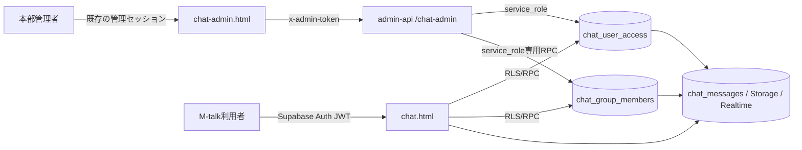

# M-talk（chat.html）専用管理・権限設計

`public/chat-admin.html` は M-talk だけを管理する画面。LINE Bot の
`line_user_permissions`、店舗管理権限、Supabase Auth の利用可否には連動しない。

- 管理画面: `https://marugo-s.github.io/line_report/chat-admin.html`
- 管理API: `admin-api /chat-admin/*`
- 対象アプリ: `public/chat.html` と、その通知・画像・予約送信・ルーム設定経路

## 信頼境界

ブラウザへ `service_role` を渡さない。管理画面でボタンを隠すだけではなく、
Data APIを直接呼ばれてもDBのRLS・RPC・Storage policyで同じ判定を行う。
店舗限定、ルーム限定、cron用の管理セッションは `/chat-admin/*` を利用できない。

## 権限モデル

### ユーザー全体（`chat_user_access`）

| 項目 | 効果 |
| --- | --- |
| `access_enabled` | falseならM-talk全体を停止 |
| `restricted_until` | 未来日時なら、その日時まで一時停止 |
| `can_start_direct` | 新しい1対1トークを開始できる |
| `can_create_group` | 新しい複数人ルームを作成できる |
| `can_browse_users` | 友だち・招待候補のユーザー一覧を見られる |
| `deleted_at` | M-talk上の論理削除。再ログインしても利用不可 |

既存ユーザーと新規登録ユーザーは、現在の利用方法を壊さないため既定で有効。
Botは管理画面から停止・削除できない。

### ルーム別（`chat_group_members`）

| 項目 | 効果 |
| --- | --- |
| `can_view` | ルーム、参加者、参加時刻以降の本文、検索、画像、既読、未読、通知を利用 |
| `can_send` | 本文、画像、感情イラスト、リアクション、予約送信を利用 |
| `can_invite` | 招待リンクの発行・更新、利用中ユーザーの追加 |
| `can_manage` | ルーム名・アイコン・設定、メンバー退出、ゴミ箱・復元 |

`can_send`、`can_invite`、`can_manage` は `can_view` が前提。1対1は当事者2人だけで、
第三者の追加、招待、通常ルームへの書き換えを禁止する。

## 管理API

| Method | Path | 用途 |
| --- | --- | --- |
| GET | `/chat-admin/state` | 集計、ユーザー、ルーム、メンバー権限、監査ログ |
| PATCH | `/chat-admin/users/:id` | 全体利用と3つの全体権限、一時制限・理由 |
| POST | `/chat-admin/users/:id/remove` | 表示名再入力後にM-talkだけ論理削除 |
| POST | `/chat-admin/users/:id/restore` | 論理削除を解除 |
| PATCH | `/chat-admin/rooms/:id/members/:userId` | 4つのルーム権限を更新 |
| DELETE | `/chat-admin/rooms/:id/members/:userId` | 通常ルームの4権限を無効化（履歴保持・再設定可） |
| GET | `/chat-admin/templates` | 権限テンプレート一覧と一括適用の上限 |
| POST | `/chat-admin/templates/apply` | テンプレートの一括適用。`dry_run`でプレビュー |
| GET | `/chat-admin/users/:id/access` | ユーザー1人の実効アクセス一覧（ページネーション） |
| POST | `/chat-admin/audit/:id/revert` | 監査ログからの復元。`dry_run`で差分のみ |

変更は `chat_admin_audit_log` へ、操作者、対象、変更内容、日時を記録する。

`dry_run` は省略時 `true`。書き込みは `dry_run: false` を明示したときだけ行う。

## 「ユーザー削除」の意味

管理画面の削除は、Supabase Authや`chat_users`の物理削除ではない。

1. `chat_user_access` を無効化し `deleted_at` を設定する。
2. 全ルームへのアクセスは全体利用判定で即時遮断する。ルーム別の細かな権限値は、復元時に元どおり戻せるよう保持する。
3. 未送信の予約送信を取消し、Web Push購読を無効化する。
4. 過去の発言、他ユーザーの履歴、作成済みルームは保持する。

`chat_users`を物理削除すると外部キーのcascadeで作成ルームと履歴まで消え、
`auth.users`を削除・banするとM-talk以外にも影響するため、どちらも行わない。

## 主な防御

- 非メンバーはルームの存在、参加者、本文、画像を取得できない。
- 生の`chat_group_members` INSERT/DELETEによる自己参加・退出迂回を禁止する。
- ルーム作成・メンバー追加は権限検査付きRPCだけを使う。
- `created_by`、`is_direct`、`direct_key`、`store_key`等の保護列は直接更新できない。
- 停止・削除・閲覧不可のユーザーをRealtime、未読数、Web Push対象から外す。
- 予約送信は予約時と送信時の両方で`can_send`を確認する。
- 予約画像のpayloadは登録時と配信時に再構築し、画像サイズは数値だけに限定する。画面側もサイズをHTML文字列へ連結しない。
- ユーザー全体権限は`updated_at`で競合を検出して409にし、ルーム権限はDBで行ロック後に指定項目だけを更新する。別管理者の変更を古い画面値で巻き戻さない。
- `chat-icons`の書込みは本人のパス、または管理可能ルームのパスだけに限定する。
- `chat-images`は`can_view`で閲覧、`can_send`で保存する。

ルームの完全削除は復元不能なため、`can_manage`だけでは許可せず、従来どおり作成者本人に限定する。

署名済みの画像URLは発行後最大1時間有効。権限取消後の新しいURL発行は拒否するが、
発行済みURLを即時失効させる仕様ではない。

## 権限テンプレートと一括設定

`chat_permission_templates` に、ルーム別4権限の組み合わせを保存する。組込は
`viewer`（閲覧のみ）、`member`（一般メンバー）、`room_admin`（ルーム管理者）。

- 適用は `chat_admin_apply_room_template(group_ids, user_ids, template_key, dry_run, actor)`。
  1回の呼び出しが1トランザクションで、成功と失敗が混ざらない。
- `dry_run = true` は一切書き込まず、適用時とまったく同じ差分（対象、現在値、適用後、変更有無）を返す。
  管理画面のプレビューはこの結果をそのまま表示する。
- 1回の上限は100件（`chat_admin_apply_room_template` と `admin-api` の
  `CHAT_ADMIN_TEMPLATE_MAX_TARGETS` の両方に持つ。変更するときは必ず両方そろえる）。
  これは性能ではなく**被害範囲**の制限。2026-08-24の本番実測では全参加行57、
  1ルーム最大3人、1ユーザー最大27ルームなので、正常な操作は通り、指定を誤って
  全件を巻き込んだときだけ止まる。超えた場合はルームまたはユーザーで絞る。
- Botと論理削除済みユーザーは対象外として `skipped` に返す。削除済みユーザーのルーム権限は
  復元用のスナップショットなので、テンプレートで上書きしない。
- 4権限の正規化は `chat_admin_normalize_member_permissions` に一本化した。
  `can_view = false` なら他3権限もfalse、1対1は招待・管理を常にfalse。
  単体更新RPCもテンプレート適用も同じ関数を通るので、テンプレート経路から保護を迂回できない。
- 実際の書き込みは既存の `chat_admin_update_member_permissions` へ委譲する。
  行ロック、`chat_group_members_view_required` 制約、監査ログが単体更新とまったく同じになる。
- 監査には、対象ごとの `member_permissions_update` と、1件の `template_apply` サマリを残す。

## ユーザー別アクセス一覧

`chat_admin_user_effective_access(user_id, limit, offset)` は、ユーザー1人について
全体権限、参加ルーム、ルームごとの付与値と実効値、そして**利用できない理由コード**を返す。

| コード | 意味 |
| --- | --- |
| `user_deleted` | M-talk上で論理削除済み |
| `user_disabled` | 全体の`access_enabled`がfalse |
| `user_restricted` | `restricted_until`が未来 |
| `room_view_denied` | そのルームの`can_view`がfalse |
| `room_send_denied` / `room_invite_denied` / `room_manage_denied` | 対応する権限がfalse |
| `room_direct_locked` | 1対1のため招待・管理は付与できない |
| `room_trashed` | ルームがゴミ箱にある |

実効値の判定は `chat_has_active_access` と同じ条件で行い、画面側で再計算しない。
メッセージ本文や顧客情報は返さない。`/chat-admin/state` は互換のため据え置き、
規模が増える詳細だけをこのページネーションAPIへ分けている。

## 監査ログからの復元

`chat_admin_revert_audit(audit_id, dry_run, actor)` は、監査ログの`before_state`へ戻す。

- 対象は `user_access_update` / `user_remove` / `member_permissions_update` / `member_remove` のみ。
  ルーム完全削除やメッセージ消去のような復元不能操作はホワイトリストに入れない。
- 現在値がその操作の**直後の状態**（`after_state`）と一致するときだけ実行する。
  別の管理者が後から更新していれば `40001` を送出し、APIは409で止める。
- `chat_admin_audit_log.source_audit_id` で二重復元を防ぐ。同じログは1度しか戻せない。
- 削除状態へ戻す方向（`before_state.deleted_at` が非null）は実行しない。復元は常に安全側へ倒す。
- 実際の書き戻しは既存の `chat_admin_restore_user` / `chat_admin_update_user_access` /
  `chat_admin_update_member_permissions` へ委譲する。復元専用の書き込み経路を新設しない。
- 復元自体も `audit_revert` として監査に残し、`source_audit_id` で元ログと関連付ける。
- `user_remove` の復元は「復元RPC → 全体権限をbefore_stateへ戻す」の2段になるため、
  監査には委譲先の記録も残る。これは意図した挙動。

## 運用確認

1. anon、一般ユーザー、停止ユーザーで管理APIが403/401になる。
2. 停止ユーザーの既存JWTで本文・画像・Realtime・RPCを利用できない。
3. 閲覧のみでは本文を読めるが送信・リアクション・予約送信ができない。
4. 招待不可のメンバーが招待トークンを発行・更新できない。
5. 1対1の空席へ第三者が生INSERTできない。
6. 論理削除後もAuthユーザー、過去発言、既存ルームが残る。
7. 店舗・ルーム限定の管理セッションから`/chat-admin/state`と新しい`/chat-admin/*`を取得できない。
8. テンプレートの`dry_run`が1件も書き込まない。適用後に`can_view=false`の行で他3権限がtrueにならない。
9. 1対1へ`room_admin`テンプレートを適用しても、招待・管理がfalseのままになる。
10. 別の管理者が先に更新した監査ログの復元が409で止まる。同じ監査ログを2度復元できない。
