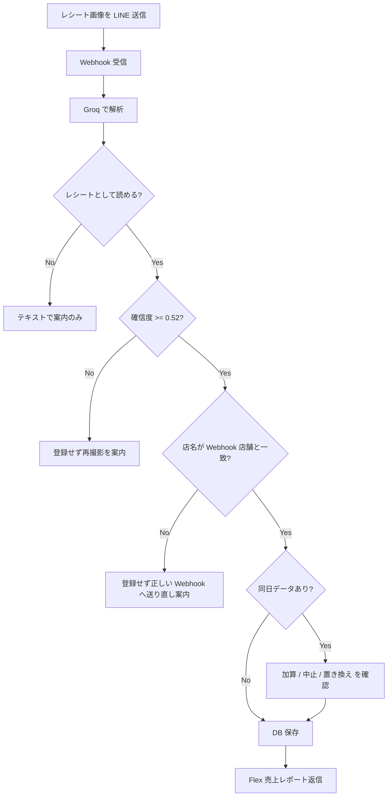

# LINE レシート解析システム

店舗の日次売上レシートを LINE で送ると、画像を AI で解析し、店舗別テーブルに保存して売上レポートを返信する機能の説明です。

旧システムにあったカレンダー連携・メディア管理・予約表などの機能は対象外です。**レシート画像の受信・解析・登録・返信**に絞って記載しています。

---

## 概要

| 項目 | 内容 |
|------|------|
| 受信方式 | LINE 公式アカウントへレシート画像を送信 |
| 解析エンジン | Azure Foundry（`gpt-5.4-nano`） |
| 保存先 DB | Supabase プロジェクト `hocbnifuactbvmyjraxy` |
| Edge Function | `line-webhook/{store_partition_key}` |
| 返信形式 | Flex Message（売上レポート）＋ 確認用 Flex / テキスト |

店舗ごとに **Webhook URL が分かれており**、どの URL に送ったかで保存先テーブルが決まります。レシートに印刷された店名から自動でテーブルを切り替えることはありません。

**関連:** [DOCS-INDEX.md](./DOCS-INDEX.md)（用語）／ [LINE-USER-APPROVAL-SECURITY.md](./LINE-USER-APPROVAL-SECURITY.md)（新規ルーム承認）／ [ROOM-LINKING-GUIDE.md](./ROOM-LINKING-GUIDE.md)（自動連携）

---

## アーキテクチャ

```
LINE トーク（店舗用 Webhook URL が設定された公式アカウント）
    │
    ▼
/functions/v1/line-webhook/{store_partition_key}
    │
    ├─ 生イベント保存 … line_webhook_raw__{store_partition_key}
    │
    ├─ 画像取得 → Azure Foundry で OCR / 構造化解析
    │   （失敗時のみ Gemini、次に Claude Haiku へ退避）
    │
    ├─ 店名一致チェック
    ├─ 同日重複チェック
    │
    └─ レシート保存 … line_receipt__{store_partition_key}
            │
            └─ Flex 売上レポート返信（予算・前年同月比付き）
```

### 店舗レジストリ

`store_webhook_tables` に登録された店舗だけが Webhook を受け付けます。

| 列 | 説明 |
|----|------|
| `store_partition_key` | URL パスに使うキー（例: `marugoyotsuya`） |
| `display_name` | 表示名（例: `マルゴ 四谷`） |
| `webhook_raw_table` | 生 Webhook イベント（例: `line_webhook_raw__marugoyotsuya`） |
| `receipt_table` | レシート本体（例: `line_receipt__marugoyotsuya`） |

Webhook URL の例:

```
https://hocbnifuactbvmyjraxy.supabase.co/functions/v1/line-webhook/marugoyotsuya
```

---

## セットアップ

### 1. LINE Developers

1. 店舗（または共通）の Messaging API チャネルを用意する
2. Webhook URL に上記 `{store_partition_key}` 付き URL を登録する
3. Webhook の利用を ON にする
4. **Messaging API タブの `Allow bot to join group chats` を ON にする**

### ⚠️ グループ招待で bot がすぐ退出して見える場合（必読）

**詳細・チェックリスト・運用方針:** [LINE-GROUP-BOT-IMPORTANT.md](./LINE-GROUP-BOT-IMPORTANT.md)

コード上は bot 自身が `leave` API を叩く処理を持っていません。  
次のどれかが原因です（**当方の「ルーム承認待ち」でグループから追い出すことはありません**）。

| 原因 | 症状 |
|------|------|
| `Allow bot to join group chats` が **OFF**（招待 Bot のチャネルで要確認） | グループに参加できない |
| そのグループに **別の LINE Official Account がすでに参加している** | **2体目は入れず、すぐ消えたように見える**（LINE 仕様: **1グループ＝1公式アカウント**） |
| **ルーム承認待ち**（`bot_access_approved = false`） | **メンバーには残る**がレシート・検索等は動かない → 管理 Bot で **許可ルーム** |

**よくある誤解:** 管理 Bot（@392hdime）と店舗 Bot（バルペロタ等）を **同じグループに両方入れることはできません**。

### 2. Supabase Edge Secrets（hocbn）

| Secret | 用途 |
|--------|------|
| `GROQ_API_KEY` | レシート画像解析 |
| `LINE_CHANNEL_ACCESS_TOKEN` | 共通アクセストークン |
| `LINE_CHANNEL_ACCESS_TOKEN__{STORE_KEY}` | 店舗別トークン（任意・優先） |
| `LINE_CHANNEL_SECRET` | 共通チャネルシークレット |
| `LINE_CHANNEL_SECRET__{STORE_KEY}` | 店舗別シークレット（任意・優先） |
| `ADMIN_DASHBOARD_TOKEN` | 管理画面の固定トークン認証。LINE の「売上推移を見る」は URL の `lt` を `/auth/link-login` で `lrst_` セッションに交換して利用（LINE 経由は端末に **最大 3 日** 保持） |

`{STORE_KEY}` は `store_partition_key` を大文字化したもの（例: `marugoyotsuya` → `MARUGOYOTSUYA`。実装では `[^a-zA-Z0-9_]` を `_` に置換して大文字化）。

### 3. DB マイグレーション

店舗テーブル作成・レジストリ投入:

- `supabase/migrations/20260523140000_store_partition_webhook_tables.sql`
- 予算・休業日（Flex 返信の予算欄用）: `20260523150000_sales_budget_tables.sql`
- 修正・重複・店名不一致の保留テーブル: `20260523170000_*` 〜 `20260523190000_*`

### 4. デプロイ

```bash
npx supabase link --project-ref hocbnifuactbvmyjraxy
npx supabase db push
npx supabase functions deploy line-webhook --project-ref hocbnifuactbvmyjraxy
```

---

## 処理フロー（画像送信時）



### 解析項目

Groq が JSON 形式で抽出する主な項目:

| フィールド | 内容 |
|-----------|------|
| `storeName` | 店名 |
| `date` | レシート日付 |
| `netSales` | 純売上 |
| `taxAmount` | 消費税 |
| `grossSales` | 総売上（税込） |
| `partyCount` | 会計組数 |
| `guestCount` | 客数 |
| `unitPrice` | 客単価 |
| `items` | 明細（最大 5 件） |

確信度はモデル出力とヒューリスティックを合成し、閾値 **0.52 未満** は登録しません。

---

## 確認フロー

### 店名不一致

Webhook の登録店舗名と、レシート解析の店名が一致しない場合:

- **登録しない**
- 「この Webhook では登録できません」と案内
- 解析店名に対応する別店舗の Webhook が `store_webhook_tables` にあれば、送り先店舗名と Webhook URL を表示
- 見つからない場合は管理画面で設定確認を促す

例: 四谷の Webhook に CAVA CAVA のレシートを送った → 四谷には保存されず、CAVA CAVA 用 Webhook への送り直しを案内。

店名一致判定は正規化後の完全一致、または 4 文字以上の部分一致（含む関係）で行います。

### 同日重複

同じ店舗テーブルに **同じレシート日** のデータが既にある場合、登録前に確認します。

| 操作 | 動作 |
|------|------|
| **加算**（1 / はい） | 既存データは残し、今回分を追加保存 |
| **中止**（2 / いいえ） | 保存しない |
| **置き換え**（3） | 同日の既存行を削除し、今回分のみ保存 |

ボタンまたは「加算」「中止」「置き換え」のテキスト返信で選択できます。保留状態は 30 分で失効します。

---

## 登録成功時の Flex 返信

保存後、以下を含む Flex Message（売上レポート）を返します。

### 当日データ

- 店名、日付、消費税、総売上（税込）、会計組数、客数、客単価

### 月次集計

- 営業日数、月間総売上、1 日平均（売上・組数・客数）

### 予算（設定がある店舗・月のみ）

- 月次目標、月次実績（達成率）、当日目標
- 日次予算差、日次予算累計
- 達成率 100% 未満・マイナス差は赤表示

### 前年同月比（データがある場合）

- 売上・組数・客数・営業日数の前年差（% と差分）

### フッターボタン

| ボタン | 動作 |
|--------|------|
| この結果を修正 | 修正セッション開始（対象 LINE メッセージ ID 付き） |
| この解析結果を削除 | 当該解析結果を DB から削除 |
| 売上推移を見る | `analytics.html` へリンク（`store_key`・`month`・`from=line`・任意で `t=`） |

---

## テキスト操作

画像以外のテキストメッセージも処理します。優先順位:

1. 店名不一致の旧保留への返信（レガシー）
2. 同日重複確認への返信
3. 修正セッション中の入力
4. 削除・修正コマンド

### 修正

| 入力例 | 動作 |
|--------|------|
| `レシート修正 ID:{line_message_id}` | 該当レシートの修正開始 |
| `レシート修正` | 直近のレシートを修正 |

修正可能項目: 店名、日付、純売上、消費税、総売上、会計組数、客数、客単価。番号で項目を選び、値を入力して「確定」で保存します。

### 削除

| 入力例 | 動作 |
|--------|------|
| `レシート解析削除 ID:{line_message_id}` | 該当行を削除 |
| `レシート削除` | 直近のレシートを削除 |

Flex の「この解析結果を削除」ボタンから送る形式が確実です。

---

## 保存データ

`line_receipt__{store_partition_key}` に 1 画像 = 1 行（同日加算時は複数行）で保存します。

| 列 | 内容 |
|----|------|
| `line_message_id` | LINE メッセージ ID（ユニーク） |
| `room_id` | グループ / ルーム / 1:1 の ID |
| `store_name` | Webhook 登録店舗の表示名 |
| `receipt_date` | 正規化した日付（`YYYY-MM-DD`） |
| `gross_sales_yen` など | 数値化した売上・組数・客数 |
| `raw_payload` | 解析結果 JSON 一式（OCR の店名含む） |
| `created_at` | 登録日時 |

営業日の切り替えは JST **5 時** を基準に予算計算へ反映します（`RECEIPT_BUDGET_BUSINESS_DAY_START_HOUR_JST = 5`）。

---

## 売上分析画面

登録データの閲覧・予算設定は GitHub Pages の売上分析画面から行います。

- URL: https://marugo-s.github.io/line_report/analytics.html
- API: hocbn の `admin-api`（店舗別 `line_receipt__*` を集計）
- 設定の店舗名マッピング: `pages-config.js` の `STORE_NAMES`

Flex の「売上推移を見る」は同画面へ遷移します。LINE 経由では **その Bot の店舗だけ** 表示し、他店舗・メディア・予約表・売上シートへの導線は出しません（[CHANGELOG-2026-05.md](./CHANGELOG-2026-05.md) 参照）。

---

## 経費・小口現金（出金）取込

日々の **売上レシート** とは別に、**経費（仕入・備品・レジ出金など）のレシート** を小口現金として記録する独立フローです。売上テーブルには一切入れず、`petty_cash_entries` に保存します。

### 取込の3つの入口

| 入口 | きっかけ | 挙動 |
|------|---------|------|
| **A. 「経費」先打ち** | トークで `経費`（`経費登録`/`出金`/`小口` 等）と送る → 続けて画像 | 画像待ち(`await_image`)。画像が来たら **経費として解析** → 確認カード → 「この内容で記録」で保存 |
| **B. レジ出金伝票の自動検知** | 出金伝票（`レジ出金`/`出金額` 等のマーカー）を送る | 売上に入れず「経費（小口）として記録」を案内 |
| **C. 店名不一致（他店レシート）** | 自店 Webhook に別店舗のレシートを送る | 売上に登録できない旨＋「経費（小口）として記録」ボタンを表示 |

いずれも最後は **確認カード（店舗・日付・本体・税・出金額）→「この内容で記録」** で `petty_cash_entries` に保存します（`source='line_image'`、`line_message_id` で二重登録防止）。確認待ちは 30 分で失効。

> **ルーム権限**: レシート関連タブの「**小口レシートの解析をする**」（`petty_receipt_analysis_enabled`・既定ON）でルーム単位にON/OFF可能。**ONなら「AI返信完全無し」(hard mute) でも経費フローの解析・返信は優先して行う**。OFFなら経費フローは無反応（レジ出金伝票の検知だけは維持し売上への誤登録は防ぐ。カードは出さない）。

### 解析パイプライン（“精算→経費”の2パス）

アップロード時点では **売上レシートか経費レシートかをシステムは知りません**。そのため原則：

1. まず **精算（売上）として解析**（多数派）。
2. そこで **経費だと判明したときだけ**（B のマーカー検知 / C の店名不一致 / A の先打ち）、**経費専用プロンプト（`EXPENSE_RECEIPT_PROMPT_ADDITION`）で再解析** し、明細・税区分・仕入先を取り直す。

精算用プロンプトは総売上・客数向けで、経費の **明細・税・仕入先** をうまく取れないため、別プロンプトでの再解析が必要です。

#### AI 呼び出し回数（現在＝売上はGroq、経費の明細だけClaude）

| ケース | 売上(精算)解析 | 経費再解析(③) | 合計 |
|--------|:---:|:---:|:---:|
| 売上レシート（自店） | ✓(Groq) | – | Groq1 |
| 経費（店名不一致・レジ出金） | ✓(Groq) | ✓(Groq) | Groq2 |
| 経費（A：先打ち） | **省略** | ✓(Groq) | Groq1 |

> 売上(精算)も経費の明細再解析(`reanalyzeAsExpense`)も **Groq**（ソバージュ・鮨こるりの売上は Gemini）。
> ※**2026-06-12**: claudia2の売上を Claude→Groq、さらに**経費の明細も Claude→Groq** へ変更（Claude(Haiku)はTOBU等で**JANコード行の混入・品名誤読・品目欠落**が多く不正確、かつ高コストと実測で判明。同じTOBUレシートをGroqの方が正確に読めた）。→ **現在 Claude は全経路で不使用**。Claude売上解析の経路（＋下記オプションB最適化）は休止・コードは再有効化用に残置。

### オプションA：経費「先打ち」時は精算解析をスキップ（2026-06-10）

`経費` 等を **先打ち**（`await_image` pending）してから画像を送った場合のみ、**精算解析（① Groq 判定＋② Claude/Gemini）をスキップ** し、**経費専用解析だけ** 実行します。

- 実装: `processReceiptImageEvent`（`line-webhook/index.ts`）で、精算解析の **前** に `handlePettyCashImageIfPending(receipt:null)` を呼び、`await_image` なら 経費解析 → 確認カード返信 → `return`（精算解析に到達しない）。`pending` 無し／期限切れは `{handled:false}` で通常の精算解析へフォールスルー。
- 効果: 先打ちフローの AI 呼び出しを **経費解析1回** に削減（Groq判定＋精算Claude の2回分を節約）。「解析中」push も省略＝**push 枠も節約**。
- **不変**: **先打ちしない通常アップロードは従来どおり**（精算解析 → 必要時のみ経費再解析）。

> **運用推奨**: 経費レシートは **先に「経費」と送ってから画像** を送る運用にすると、経費1枚ごとに Claude 呼び出しを1回節約できます（先打ちなしでも下記オプションBで自動節約）。

### オプションB：店名不一致(経費)はGroq事前判定で精算パスを自動スキップ（2026-06-12）

> ⚠️ **現在休止中**：同日に claudia2 を Claude→Groq へ変更し `CLAUDE_RECEIPT_STORE_KEYS` が空になったため、Claude売上解析の経路自体が走らず、この最適化も発動しません。**Claude売上解析店を再設定すると自動で有効化**されます（コードは残置）。

Claude採用店（claudia2）に**別店舗のレシート（＝経費）**を送ると、従来は「精算解析(②Claude)→経費再解析(③Claude)」で**Claudeが2回**走っていた（店名不一致は②の結果で初めて判明する仕組みだったため）。これを、**先打ちしなくても**①Groqの事前判定で店名不一致を確定できたら②を省く方式にした。

- 実装: `processReceiptImageEvent`（`line-webhook/index.ts`）の Claude採用店ブランチで、Claude精算解析の**前**に、本処理と同じ `receiptStoreNameMatchesRegistry`（電話番号照合つき）を **Groqの事前判定結果**へ適用。
- **スキップ条件（売上精度を守るため厳しめ）**: ①Groqが店名を**非空で読めた** ②受け取った**確信度が `RECEIPT_ANALYSIS_CONFIDENCE_MIN` 以上** ③自店と**明確に不一致** ④経費許可ON。これら全部を満たすときだけ②を省き、`analyzed=pre` として後段の店名不一致→経費候補（③Claude経費）へ流す。
- **フォールバック（不変）**: 店名が読めない／自店と一致／低確信度のときは**従来どおりClaudeで精算解析**。＝**自店の売上レシートの精度は一切落とさない**。経費許可OFFの部屋もスキップしない。
- 効果: 明確な仕入先レシート（TOBU等）で **Claude呼び出しを2回→1回**に削減（先打ち不要・自動）。

### 仕入先別ルール（経費プロンプト）と TOBU デパートのテンプレート

経費プロンプト（`EXPENSE_RECEIPT_PROMPT_ADDITION`）は **共通コア**（全レシート普遍ルール）＋ **仕入先/形式別ブロック**（`EXPENSE_VENDOR_PROMPT_BLOCKS`・発動条件つき）で構成。新しい仕入先で誤読が出たら**ブロックを1つ足すだけ**（共通コア・他ブロックは触らない＝既存解析を壊さない）。実装: [`_shared/receipt_prompt.ts`](../supabase/functions/_shared/receipt_prompt.ts)。

#### TOBU（東武百貨店）レシートのテンプレート仕様

実例（2026-06-04 池袋店・売場 富澤商店、合計8点 ¥5,003）の形式：

- 最上部ロゴ「**TOBU** ◯◯店 / www.tobu-dept.jp」、「クレジットご利用票 お客様控え」。
- 明細は **2行1組**：上段＝「**部門コード＋13桁JANコードだけの数字行**」（例 `77411-62-160 4932503350428`）、下段＝「**（※）品名 …… ¥価格#**」。
- **※** が付く品目＝**軽減税率8%**、付かない品目＝**10%**（脚注「商品明細の※は軽減税率対象商品です」）。
- **品目金額は税抜**表記（各品目の合算＝税抜小計。検算: ※品目合計 4,628 ＝ 軽8%税込 4,998 − うち税額 370）。
- 下部に税率別集計：「**軽8%税込 ¥◯ ／ うち税額 ¥◯**」「**10%税込 ¥◯ ／ うち税額 ¥◯**」「**合計 ◯点 ¥◯**（＝支払総額）」。
- 下部「売場名: ◯◯」はテナント名（例 富澤商店）、「登録番号: T…」は適格請求書番号。

#### TOBU 解析ルール（確立済み）

1. `store_name` は最上部ロゴ「TOBU（◯◯店）」。「売場名」はテナント名なので store_name にしない。
2. **JANコード行は無視**。品名と**同じ行**の右端 ¥金額だけを price にする（末尾「#」除く）。
3. **金額の取り違え厳禁**：各 price は必ずその品名と同じ行の金額。隣の品目の金額を流用しない（誤読例: モルトパウダー¥230 を次行コナゼラチン¥540 で埋めて合計が ¥5,003→¥5,338 にズレた事案あり）。「合計 ◯点」と件数を突き合わせる。
4. 税率は **※の有無だけ**で 8/10 を機械判定。
5. **税率別集計（軽8%税込／10%税込／うち税額／合計）を tax_breakdown と gross_sales に必ず反映＝支払総額の正本**。品目金額を1つ読み違えても支払総額（amount_yen）は崩れない。

### 品目モデル（勘定科目・税率は品目ごと）

`petty_cash_entries.items`(jsonb) = `[{ n:品目, p:税抜価格, acct:'shokuzai'|'shomohin'|'alcohol', rate:8|10 }]`。1枚のレシートで 食材(8%)＋消耗品(10%)＋アルコール(10%) の混在に対応。金額の権威は `amount_yen`(税込合計)/`tax_yen`(税額)＝本体 `Σp`、税は**税率ごとに税抜小計をまとめてから 1円未満切り捨て**＝`floor(Σp(8%)×8%)＋floor(Σp(10%)×10%)`（レシートの「うち税額」と同じ方式）、出金額＝本体+税。

LINE取込は品名から `acct` を推定し（飲料→アルコール／洗剤・消毒・ペーパー等→消耗品／他→食材）、`rate` は食材8%・他10% を既定で付与（記録後にページで修正可。金額は OCR 値のまま＝ドリフト無し）。旧データ（`items` 無し）は従来の単一フィールド表示にフォールバック。

### 小口現金ページ

- URL: https://marugo-s.github.io/line_report/petty_cash.html
- 手入力（品目ごとに勘定科目・税率・価格）／編集・削除、月集計（科目別内訳チップ）、高密度台帳。
- **項目別CSVダウンロード**（Excel対応）。詳細は下記「[経費CSVエクスポート（Excel対応）](#経費csvエクスポートexcel対応)」。
- **店舗ロック＝キオスク化**: LINE完了カードの「小口現金ページを開く」（`from=line&store_key&lt`）から開くと、その店舗のみ閲覧＋**サイドバー等を非表示**にして他ページへ遷移させない（店舗スタッフが管理画面・他店データに到達しない）。本部（非ロック）は全機能・全店舗。
- ワンタイムログイン(`lt`)は売上分析と同じ仕組み。ロック画面右上の **「管理者ログイン」** に本部の管理トークンを入力して認証すると、店舗ロックを解除して全メニュー・全店舗に戻せる（売上分析ページも同様。認証失敗時はロック維持＝店舗スタッフは解除不可）。

### 経費CSVエクスポート（Excel対応）

小口現金ページの出金台帳バーの **「CSV」ボタン** から、**現在の店舗 × 対象月** の記録を **品目ごと1行** に展開してダウンロードできます（会計処理・Excel取り込み用）。

- **出力単位**: 品目（行）単位。1レシートに複数品目があれば品目数の行に分割し、同じ `記録ID` を付与（Excel側でレシート単位に集約可能）。旧データ（`items` 無し）はレコード単位で1行（品目テキストは改行を ` / ` に平坦化、税率は空欄）。
- **列構成（12列）**: `日付 / 店舗 / 品目 / 勘定科目 / 税率(%) / 本体(税抜) / 税額 / 出金額(税込) / 取扱者 / メモ / 取込元 / 記録ID`
- **Excel対応**:
  - 先頭に **UTF-8 BOM** を付与し、日本語の文字化けを防止。
  - カンマ・二重引用符・改行を含むセルは `"…"` で囲み、内部の `"` は `""` にエスケープ（RFC 4180 準拠）。
  - 金額・税率・記録IDは **素の数値** で出力（Excelでそのまま集計・ピボット可能）。
- **対象データ**: 画面で選択中の **店舗 × 対象月**（科目フィルター・検索の絞り込みは反映せず、その月の全件）。記録が無い月はボタン無効。**LINE店舗ロック中でも自店分はダウンロード可**。
- **ファイル名**: `小口現金_<店舗 or 全店舗>_<YYYY-MM>.csv`
- **実装**: フロント完結（`Blob` ＋ `URL.createObjectURL` ＋ `<a download>`）。サーバ・DB・マイグレーション変更なし。

### 関連ソース（経費・小口）

| パス | 役割 |
|------|------|
| `supabase/functions/_shared/petty_cash_flow.ts` | 経費フロー（トリガー／解析抽出／確認・記録／ページリンク） |
| `supabase/functions/_shared/receipt_prompt.ts` | `EXPENSE_RECEIPT_PROMPT_ADDITION`（経費専用追記） |
| `supabase/functions/admin-api/index.ts` | `/petty-cash`（一覧・追加・編集・削除、items 対応） |
| `petty_cash.html` | 小口現金ページ（手入力・台帳・CSV・キオスク） |
| マイグレーション | `20260608140000_petty_cash_entries.sql` ／ `..160000_tax` ／ `..180000_pending` ／ `20260610100000_petty_cash_items.sql` |

---

## 関連ソース（実装）

| パス | 役割 |
|------|------|
| `supabase/functions/line-webhook/index.ts` | Webhook エントリ（画像・テキスト振り分け） |
| `supabase/functions/_shared/receipt_vision.ts` | Groq 画像解析 |
| `supabase/functions/_shared/receipt_save_flow.ts` | 重複確認 → 保存 → 返信組み立て |
| `supabase/functions/_shared/receipt_store_mismatch.ts` | 店名不一致案内 |
| `supabase/functions/_shared/receipt_duplicate.ts` | 同日重複確認 |
| `supabase/functions/_shared/receipt_flex_reply.ts` | 売上レポート Flex |
| `supabase/functions/_shared/receipt_correction.ts` | 修正・削除・テキストハンドラ |
| `supabase/functions/_shared/receipt_reply_context.ts` | 月次集計・予算・前年比の計算 |
| `supabase/functions/_shared/store_receipt.ts` | 店舗別 CRUD |
| `pages-config.js` | Webhook URL・店舗名のフロント設定 |

---

## 運用上の注意

1. **店舗ごとに正しい Webhook URL を使う** — 別店舗のレシートは自動振り分けされません。
2. **撮影品質** — 影・反射があると確信度不足で登録されないことがあります。
3. **同日の再送** — 意図せず加算しないよう、重複確認の選択に注意してください。
4. **トークン** — 店舗別 `LINE_CHANNEL_ACCESS_TOKEN__*` が未設定の場合、共通トークンにフォールバックします。

---

## 変更履歴（要点）

- 店舗別 Webhook / テーブル分割（`store_partition_key` 方式）
- Flex 売上レポート（予算・前年同月比・フッター操作）
- 同日重複時の加算 / 中止 / 置き換え
- 店名不一致時は **登録せず** 正しい Webhook への送り直しを案内

**2026年5月以降の追加（詳細）:** [CHANGELOG-2026-05.md](./CHANGELOG-2026-05.md)

- レシート **電話番号** 照合（店名 OR 電話で一致）
- 管理画面から `receipt_phones` 編集
- スプレッドシート双方向同期の **更新日時マージ**・シート削除の DB 反映
- 売上分析: LINE 経由は **1 店舗固定**・メディア/予約表/売上シート非表示
- 「売上推移を見る」URL に `from=line`・`store_key`・`month`・`lt`（ログインリンク）
- LINE 経由の自動ログイン: `lrst_` を端末 `localStorage` に保持（**3 日**でサーバー失効）。詳細は [CHANGELOG-2026-05.md §5.4–5.6](./CHANGELOG-2026-05.md)
