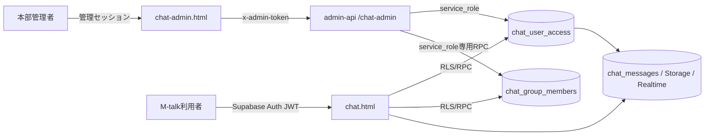

# M-talk 完全ガイド（概要・使い方・管理・セキュリティ）

社内連絡用チャット **M-talk** の全体像を1つにまとめた統合ドキュメント。
利用者・管理者・開発者のいずれが読んでも、ここだけで全体像がつかめることを目的とする。

- 利用画面: `https://marugo-s.github.io/line_report/chat.html`
- 管理画面: `https://marugo-s.github.io/line_report/chat-admin.html`
- Supabase プロジェクト: `hocbnifuactbvmyjraxy`（hocbn）
- 最終更新: 2026-08-24

> **この文書へ書いてはいけないもの**: endpoint、暗号鍵、VAPID 秘密鍵、
> メッセージ本文、顧客名、実データ。構造と手順だけを書く。

## 正本との関係

この文書は**統合版**であり、各領域の一次情報（正本）は従来どおり別ファイルにある。
仕様が食い違った場合は、必ず下記の正本が優先する。

| 領域 | 正本 |
| --- | --- |
| 利用者側の機能仕様 | [CHAT-TALK-GUIDE.md](./CHAT-TALK-GUIDE.md) |
| 管理・権限モデル | [CHAT-ADMIN-PERMISSIONS.md](./CHAT-ADMIN-PERMISSIONS.md) |
| セキュリティ不変条件 | [SECURITY.md](./SECURITY.md) |
| 店舗スタッフ向け操作手順 | [操作マニュアル.md](./操作マニュアル.md) |
| 用語と読む順番 | [DOCS-INDEX.md](./DOCS-INDEX.md) |

---

## 目次

1. [M-talk とは](#1-m-talk-とは)
2. [使い始める](#2-使い始める)
3. [日常の使い方](#3-日常の使い方)
4. [通知（Web Push）](#4-通知web-push)
5. [権限モデル](#5-権限モデル)
6. [管理者の操作](#6-管理者の操作)
7. [セキュリティ](#7-セキュリティ)
8. [仕組み（技術構成）](#8-仕組み技術構成)
9. [設計上の割り切り・できないこと](#9-設計上の割り切りできないこと)
10. [困ったとき](#10-困ったとき)
11. [変更するときのルール](#11-変更するときのルール開発者向け)

---

## 1. M-talk とは

社内連絡用のグループチャット。`public/chat.html` の1ファイルに UI とロジックが入り、
Supabase の Auth / Realtime / Storage / Edge Function で動く静的Webアプリ。

### LINE との違い

同じシステム（LINE Report）の一部だが、**LINE と M-talk は別物**。混同しやすいので整理する。

| | LINE（店舗公式アカウント） | M-talk（chat.html） |
| --- | --- | --- |
| 相手 | 店舗ごとのLINEルーム・友だち | 社内メンバー |
| ログイン | LINEアプリ | メールアドレス＋パスワード |
| 利用許可 | `line_user_permissions`・ルーム承認 | `chat_user_access`（**別系統**） |
| 主な用途 | レシート送信、売上検索、予算登録、予約通知 | 社内連絡、資料共有、予定・予約の確認 |
| 管理画面 | `index.html`（本部管理） | `chat-admin.html`（M-talk専用） |

**重要**: M-talk の利用停止は LINE Bot の利用許可に影響しない。逆も同じ。
両者の権限は完全に分離している。

### 何ができるか

- テキスト・画像・感情イラストの送信
- 1対1トークと複数人ルーム
- 返信・リアクション・メンション・既読
- ルーム横断のメッセージ検索
- 予約配信（日時を指定して後から送る）
- ルームの予約表・予定カレンダーの閲覧と編集
- 店舗ルームでの `#メモ` による資料登録、レシート解析
- Web Push 通知

---

## 2. 使い始める

### 登録

1. メールアドレスとパスワードで新規登録する（セルフ登録）。
2. 初回のみ表示名とアイコンを決める。
3. プロフィール作成時に `chat_user_access` が**既定で有効**な状態で作られる。

> 現在は承認待ちの仕組みを持たない。登録した時点で使い始められる。
> 本部管理者は後から、M-talk だけの利用停止・一時制限・論理削除を行える。

### アイコン

- 同梱の標準アイコン70点から選ぶか、画像をアップロードする。
- 選択結果は `chat_users.icon_url` に保存されるため、端末を替えても維持される。
- 複数人トークのヘッダーアイコンも、同じ標準アイコン集から選べる。

### 店舗Bot の見分け方

- 店舗Bot は `public/icons/store-bots/` の店舗ロゴを表示する。
- 円の右下に赤文字の `bot` マークが付く。
- トーク一覧では、Bot が1人でも参加しているルームの名前横に青い `BOT` バッジが出る。

---

## 3. 日常の使い方

### 送信

- **PC**: Enter で送信、Shift+Enter で改行。
- **スマホ**: 送信ボタンで送信、Enter は改行。
- 店舗Botルームでは入力欄に「#メモ対応」と表示される。

### 履歴の見え方

- 招待・参加した**その時点以降**のメッセージだけが見える。参加前の本文は画面で隠しているのではなく、**DB が取得自体を拒否**する。
- 同じ境界を検索・Realtime・リアクション・未読数・通知バッジにも適用する。
- 初回は最新50件。上端までスクロールすると50件ずつ過去へ読み足す。
- メッセージ本文は共有端末に残さないため、`localStorage` などへ永続保存しない。

### 感情イラスト

- 入力欄の大きな `☺`（28px）から選ぶ。
- **感情**（93点）と**漫符・記号**（39点）をタブで切り替える。狭い画面ではタブ行を横スライドできる。
- 「大きく送る」と「文章内に入れる」を選べる。文章を入力すると顔ボタンが緑に点灯し、その状態で開くと「文章内に入れる」が最初から選ばれる。
- 送信内容はクライアントの申告を信用せず、**DBトリガが有効なIDから作り直す**。

### 画像

- 送信前に長辺1600px・JPEG品質0.82へ縮小する。
- 画像は**非公開バケット**に保存し、表示のたびに1時間有効な署名URLを作る。
- 添付・ドロップ・貼り付けのいずれでも「今すぐ送る／予約配信」を聞かれる。

### 返信・リアクション・メンション・既読

- **返信**: 同じルームの発言だけを返信先に指定できる（DBトリガで強制）。
- **リアクション**: 15種。1人が同じメッセージに付けられるのは**1つだけ**で、別の絵文字を選ぶと置き換わる。同じ絵文字をもう一度押すと取り消せる。押すと誰が付けたかを一覧で確認できる。
- **メンション**: クライアントの申告を信用せず、トリガが**そのルームの参加者だけ**に絞る。名指しされた人の通知は本文の頭に「@あなた宛」が付く。
- **既読**: 自分の発言に「既読 N」が出る。1対1では人数を出さず「既読」だけ。参加者どうしは互いの既読時刻を参照できるが、書き込めるのは自分の分だけ。
- 「…」メニューは上段にリアクション15種（5列×3段）、下段に返信・コピー・転送・削除を並べる。

### 検索

トーク下部メニューの「検索」は、投稿せず自分だけに見えるダイアログ（検索ランチャー）を直接開く。
以下の3つを提供し、どれもトーク発言や他メンバーへの通知を発生させない。

- トーク履歴・メッセージ検索
- 予定・予約カレンダーを開く
- 写真・メディアライブラリ

- トーク一覧上部の「トークルームとメッセージ検索」に一本化されている。Bot へのコマンド形式の会話検索は廃止した。
- 参加中の全トークを対象に、2文字以上で検索し250msデバウンスする。
- 結果をタップすると前後25件を読み込んでその発言へ飛ぶ。
- 日本語は単語区切りがないため全文検索ではなく `pg_trgm` を使う。
- 店舗Botの検索メニューでは、予定・メディア・売上検索を提供する。

### 個人メモ

入力欄下の「個人メモ」から、**送信せずに**自分だけへ残す注記を書ける。既存の「#メモ」
（店舗ルームへ送信してJournal Reportの資料へ登録する機能）とは無関係の別機能で、
名称の混同を避けるため画面上は「個人メモ」と表示する。

- 他の参加者・Bot・管理画面・Web Pushのいずれにも一切送信・表示されない。
- 本人であればどの端末からも同じ内容が見える。削除は本人だけができる（編集は不可）。
- 表示は破線・付箋色の枠で中央寄せにし、通常の吹き出しと混同しないようにする。
- 返信・引用・メンション・検索・転送のいずれの対象にもならない。

### サイレント送信（通知なし）

入力欄の🔔/🔕トグルで、送信ごとに通知の有無を選べる。

- 🔔（既定）は通常どおり通知する。🔕をONにすると、そのメッセージだけWeb Pushをスキップして静かに送る。
- 受信側にはそのメッセージへ🔕マークが付く。本文やトーク一覧のプレビューは通常と同じ。
- ルーム設定や全体の通知ON/OFFとは別の、メッセージ単位の切り替え。
- LINE側への予約通知の複製配信には影響しない。

### 予約配信

- 入力欄の「予約配信」から日時を指定する。
- 予約は**本人だけ**が見て取り消せる。
- 毎分の cron が到来分を本人として投稿する。
- 権限は**予約時と送信時の両方**で確認する。予約後に送信権限を失えば送られない。

### 予約・予定

トーク下部の「予約・予定」からタブ切替で見る。

- **予約タブ**: Gmail 予約取り込み（食べログ／一休／手入力）と同じ店舗データ。
- **予定タブ**: その M-talk ルームと、同じ店舗キーの LINE ルームのカレンダー予定。
- 注意事項（アレルギー、お誕生日、苦手、要望）だけ赤字。他はダークで白、ライトで黒。
- **閲覧権限**があれば見られる。**ルーム管理権限**があるメンバーだけが追加・編集・日付変更・キャンセルできる。
- 予約の生データ（`reservation_detail`）は画面へ返さない。

### 店舗固定ルームと `#メモ`

- 全店舗に固定ルーム（`is_store_room`）がある。**退出・削除はできない**。
- 店舗ルームへ `#メモ` / `#日報` / `#note`（全角シャープ可）を送ると、Journal Report の「資料」へ登録され、Bot が結果を返す。
- 画像・ファイルは、`#メモ` が無ければメディア閲覧へ保存する。レシートなら LINE と同じ解析・同じ売上レポートカードを返す。

### ゴミ箱

- 管理権限のあるメンバーが、店舗固定以外のルームをゴミ箱へ移せる。ゴミ箱タブから復元できる。
- **完全削除は、管理権限を持つルーム作成者だけ**がゴミ箱から実行できる。ルーム名の再入力が必要。
- 完全削除で消えるのは、そのルームのメッセージ・画像・そのルームの予定だけ。他ルームや店舗の予約・売上は消えない。
- ゴミ箱のルームには送信できない。

---

## 4. 通知（Web Push）

### 使えるようにする

- ベルのアイコンから通知をONにする。
- **iPhone / iPad はホーム画面へ追加した standalone 版だけ**が対象。通常のSafariタブではホーム画面への追加を案内する。
- OS 設定で通知を拒否している場合、ページからは再度お願いできない。端末設定での許可が必要。

### 未読数

画面・タブタイトル・ホーム画面アイコンの数字は、すべて DB の集計を正本にする。
既読保存の成否にかかわらず再集計するため、画面だけ先に既読になる状態を残さない。
アプリがバックグラウンド中に届いた発言は、開いているルームでも未読として数える。

### 通知が来なくなったとき

- 通知ONかつ権限許可済みなのに購読が消えている場合、画面上部に**「通知が切れたので、ここをタップして再開」**が出る。
- 再開はこのバーかベルの**明示操作でだけ**行う。任意の画面タップを再開操作にすると、同一端末由来の購読が増殖する。
- 端末の切り分けには「通知テスト」を使う。本人が提示した現在の購読1件だけへ送る診断専用の経路で、他端末・他ユーザーへは送らない。
- iPhone の通知テストはホーム画面へ戻せるよう約4秒遅れて届く。アプリを開いたままではバナーが出ないことがある。

---

## 5. 権限モデル

M-talk の権限は**2階建て**。全体権限とルーム権限の両方を満たさないと使えない。

### 全体（`chat_user_access`）

| 項目 | 効果 |
| --- | --- |
| `access_enabled` | false なら M-talk 全体を停止 |
| `restricted_until` | 未来日時なら、その日時まで一時停止 |
| `can_start_direct` | 新しい1対1トークを開始できる |
| `can_create_group` | 新しい複数人ルームを作成できる |
| `can_browse_users` | 友だち・招待候補のユーザー一覧を見られる |
| `deleted_at` | M-talk 上の論理削除。再ログインしても利用不可 |

### ルーム別（`chat_group_members`）

| 項目 | 効果 |
| --- | --- |
| `can_view` | ルーム、参加者、参加時刻以降の本文、検索、画像、既読、未読、通知 |
| `can_send` | 本文、画像、感情イラスト、リアクション、予約送信 |
| `can_invite` | 招待リンクの発行・更新、利用中ユーザーの追加 |
| `can_manage` | ルーム名・アイコン・設定、メンバー退出、ゴミ箱・復元 |

### 必ず守られる規則

1. `can_send` / `can_invite` / `can_manage` は `can_view` が前提。`can_view=false` なら他3つも自動的に false になる。
2. **1対1は当事者2人で固定**。第三者の追加・招待はできず、`can_invite` と `can_manage` は常に false。
3. **Bot は管理画面から停止・削除・権限変更できない**。
4. ルームの完全削除は、`can_manage` だけでは許可せず、**作成者本人**に限る。

### 使えない理由の見え方

利用者側では、閲覧専用のルームで送信しようとすると
「このルームは閲覧専用です。メッセージは送信できません。」と表示される。
全体停止・期限付き停止の場合は、管理者が入力した**停止理由と期限**が画面に出る。

管理者側では、ユーザー別アクセス一覧に理由コードが出る（→ [6章](#6-管理者の操作)）。

---

## 6. 管理者の操作

管理画面 `chat-admin.html` は **M-talk だけ**を管理する。LINE Bot の権限、店舗管理権限、
Supabase Auth の利用可否には連動しない。**本部のフル管理セッションだけ**が使える。

### ユーザーの停止・削除・復元

1. 管理画面を開き、通常の本部管理トークンでログインする。
2. 「ユーザー」で、M-talk 利用・1対1開始・ルーム作成・ユーザー一覧表示を個別に変更する。
3. 一時的に止めるなら「利用停止」、期限を切るなら停止期限を入れる。停止理由は利用者の画面にも表示される。
4. M-talk から外すなら「M-talkから削除」。**表示名の再入力**が必要。

**「削除」の意味**（重要）

管理画面の削除は、Supabase Auth や `chat_users` の物理削除ではない。

- `chat_user_access` を無効化し `deleted_at` を設定する。
- 全ルームへのアクセスを全体判定で即時遮断する。ルーム別の権限値は**復元時に元へ戻せるよう保持**する。
- 未送信の予約送信を取り消し、Web Push 購読を無効化する。
- **過去の発言、他ユーザーの履歴、作成済みルームは残る。**
- 誤操作は同じ管理画面から復元できる。

物理削除しない理由は、`chat_users` を消すと外部キーの連鎖で作成ルームと履歴まで失われ、
`auth.users` を消すと M-talk 以外にも影響するため。

### ルーム別の権限

「ルーム」でグループまたは1対1を選び、参加者ごとに閲覧・送信・招待・管理を切り替える。
「解除」は通常ルームの4権限を無効化する論理的な解除で、履歴は保持され再設定できる。

### 権限テンプレートの一括適用（2026-08-24 追加）

複数のメンバーへ同じ権限をまとめて設定する。

1. ルームを選び、「権限テンプレート」から `閲覧のみ` / `一般メンバー` / `ルーム管理者` を選ぶ。
2. 「対象」で**このルームの全員**か**チェックしたメンバー**を選ぶ。
3. **「変更内容を確認」を押す**。誰がどう変わるかの差分が一覧表示される。この時点では**何も書き込まれない**。
4. 内容を確認してから「この内容で適用」を押す。

- Bot と論理削除済みユーザーは自動的に対象外になり、「対象外」として表示される。
- 1度に変更できるのは **100件まで**（ルーム×ユーザーの組み合わせ数）。性能ではなく被害範囲の制限。
- 適用は1つのトランザクションで行うため、成功と失敗が混ざらない。
- 1対1に `ルーム管理者` を適用しても、招待・管理は false のままになる。

### ユーザー別アクセス一覧（2026-08-24 追加）

ユーザー行の「アクセス」から、その人の全参加ルーム・4権限・**使えない理由**を一画面で確認する。
ルーム名・店舗・種別・権限状態で絞り込める。

| 理由コード | 意味 |
| --- | --- |
| `user_deleted` | M-talk 上で論理削除済み |
| `user_disabled` | 全体の利用が停止されている |
| `user_restricted` | 期限付きで停止中 |
| `room_view_denied` | そのルームの閲覧が不可 |
| `room_send_denied` / `room_invite_denied` / `room_manage_denied` | 対応する権限が不可 |
| `room_direct_locked` | 1対1のため招待・管理は付与できない |
| `room_trashed` | ルームがゴミ箱にある |

判定は利用者側とまったく同じ条件で行い、画面側で再計算しない。
メッセージ本文や顧客情報はこの一覧に出さない。

### 監査ログから元に戻す（2026-08-24 追加）

誤った権限変更を差分確認のうえ取り消せる。

1. 「監査ログ」で対象の行の「元に戻す」を押す。
2. 「現在値 → 復元後」の差分が出る。この時点では何も書き込まれない。
3. 内容を確認してから「この内容で復元」を押す。

- 戻せるのは**ユーザー権限の変更・ユーザー削除・ルーム権限の変更・ルームアクセス解除**だけ。ルーム完全削除やメッセージ消去のような復元不能な操作は対象外。
- **ほかの管理者が後から変更していた場合は取り消さずに止まり**、再読み込みを促す。古い画面の値で他人の変更を巻き戻さない。
- 同じ履歴を**2度**取り消すことはできない。
- 削除された状態へ**戻す**方向の復元は行わない。復元は常に安全側へ倒す。
- 復元操作そのものも監査ログに残り、元の履歴と関連付けられる。
- テンプレートの一括適用そのものは対象外。取り消したいときは対象ごとの履歴から戻す。

### 監査ログ

利用停止・論理削除・ルーム権限変更・テンプレート適用・復元のすべてに、
操作者・対象・変更前後・日時が記録される。管理画面の「監査ログ」で確認できる。

---

## 7. セキュリティ

### 信頼境界



### 中核の考え方

**画面でボタンを隠すだけでは守りにならない。** Data API を直接呼ばれても、
DB の RLS・RPC・Storage ポリシーで同じ判定を行う。UI・RLS・RPC・Storage・Push・
予約送信・Realtime・未読・検索のすべてに同じ権限を強制する。

### 具体的な防御

- **`service_role` をブラウザへ渡さない。** 管理変更は `admin-api` と service-role 専用 RPC を経由する。
- **管理APIは本部フル管理セッション限定。** 店舗スコープ・ルームスコープ・cron スコープからは 403。`/chat-admin/*` を店舗許可リストへ追加しない。
- **非メンバーは**ルームの存在・参加者・本文・画像を取得できない。
- **生の `chat_group_members` INSERT/DELETE を許可しない。** 自己参加・退出の迂回を防ぐため、ルーム作成・メンバー追加は権限検査付き RPC だけを使う。
- **保護列を直接更新できない。** `created_by`、`is_direct`、`direct_key`、`store_key` などはトリガで拒否する。
- **停止・削除・閲覧不可のユーザー**を Realtime、未読数、Web Push の対象から外す。
- **予約送信は予約時と送信時の両方**で送信権限を確認する。
- **予約画像の payload は登録時と配信時に再構築**し、画像サイズは数値だけに限定する。画面側もサイズを HTML 文字列へ連結しない（過去に保存型 XSS 経路を修正済み）。
- **同時更新の保護**: ユーザー全体権限は更新時刻の競合を検出して HTTP 409、ルーム権限は DB で行ロックしてから指定項目だけを更新する。
- **画像バケットは非公開。** 閲覧は `can_view`、保存は `can_send` が必要。update / delete のポリシーは作らない。アイコン用の公開バケットとは分ける。
- **カード形式の発言は `service_role` のみ。** ブラウザからの投稿はトリガで必ず `text` か `image` になり、カードを詐称できない。
- **画像パスの強制**: `groups/<group_id>/…` 以外のパスを指定した投稿を弾く。

### 署名URLの性質

発行済みの画像署名URLは最大1時間有効。権限を取り消した後に**新しいURLを発行することは拒否する**が、
すでに発行済みのURLを即時失効させる仕様ではない。

### リポジトリ全体の不変条件（抜粋）

M-talk に限らず、この システム全体で守るルール。詳細は [SECURITY.md](./SECURITY.md)。

1. 公開フロントは直接 DB / RPC を叩かない。業務データは必ず Edge Function 経由。
2. `anon` / `authenticated` に SECURITY DEFINER 関数の EXECUTE を渡さない。
3. 新しい関数には `SET search_path = public` を固定する。
4. 新しい RLS ポリシーは `auth.x()` を `(select auth.x())` で包む。
5. 本番スキーマ変更は必ず migration ファイル経由。直接 DDL を打つと履歴がズレる。
6. 公開システムマップにはコード・SQL 構造だけを載せ、実データを含めない。

### 運用時の確認項目

1. anon、一般ユーザー、停止ユーザーで管理APIが 401 / 403 になる。
2. 停止ユーザーの既存 JWT で本文・画像・Realtime・RPC を利用できない。
3. 閲覧のみでは本文を読めるが送信・リアクション・予約送信ができない。
4. 招待不可のメンバーが招待トークンを発行・更新できない。
5. 1対1の空席へ第三者が生 INSERT できない。
6. 論理削除後も Auth ユーザー、過去発言、既存ルームが残る。
7. 店舗・ルーム限定の管理セッションから `/chat-admin/*` を取得できない。
8. テンプレートの事前確認が1件も書き込まない。適用後に閲覧不可の行で他3権限が有効にならない。
9. 1対1へルーム管理者テンプレートを適用しても、招待・管理が無効のままになる。
10. 別の管理者が先に更新した監査ログの復元が 409 で止まる。同じ監査ログを2度復元できない。

---

## 8. 仕組み（技術構成）

### 構成

- **フロント**: GitHub Pages の静的HTML。`public/chat.html` に UI とロジックが同居する。
- **認証**: Supabase Auth（メール＋パスワード）。
- **データ**: Supabase Postgres。権限は RLS と RPC で強制する。
- **リアルタイム**: Supabase Realtime。
- **画像**: Supabase Storage の非公開バケット＋署名URL。
- **サーバー処理**: Supabase Edge Functions。

### 主なテーブル

| テーブル | 役割 |
| --- | --- |
| `chat_users` | 表示名とアイコン。`id` は `auth.users(id)` |
| `chat_user_access` | M-talk だけの利用状態と全体権限 |
| `chat_groups` | トークルーム。`is_direct` が真なら1対1 |
| `chat_group_members` | 参加関係とルーム別の4権限 |
| `chat_messages` | 発言。`kind` は `text` / `card` / `image` / `sticker` |
| （同表の `is_silent`） | true ならそのメッセージだけ Web Push をスキップする |
| `chat_read_states` | 既読位置 |
| `chat_message_reactions` | リアクション |
| `chat_stickers` | 感情イラストの台帳 |
| `chat_permission_templates` | 権限テンプレート（管理用） |
| `chat_private_notes` | 個人メモ。本人のみ閲覧・削除でき、更新(編集)ポリシーは存在しない |
| `chat_admin_audit_log` | 管理操作の監査ログ |
| `chat_scheduled_messages` | 予約送信 |
| `chat_push_subscriptions` | Web Push の購読 |
| `chat_push_user_preferences` | 通知 ON/OFF とプレビュー可否 |
| `chat_push_dispatches` | 同一メッセージの重複送信防止 |

### 発言の種別

`content` にはどの種別でもプレーンテキスト版を入れる。トーク一覧のプレビューと
Web Push の本文は `content` を見るため、`payload` が読めなくても表示が壊れない。

| kind | 誰が作れるか |
| --- | --- |
| `text` | 全員 |
| `image` | 全員。ただしトリガが payload を作り直す |
| `sticker` | 全員。ただし有効なIDだけをトリガが台帳から作り直す |
| `card` | `service_role` のみ |

### Realtime の購読

`chat-global` チャンネルで購読する。RLS がそのまま効くため、
**未参加ルームの新着は配信自体されない**。

メッセージ、ルーム、参加関係、本人のルーム権限変更、本人の全体利用状態変更、
リアクション、既読状態を購読する。権限を変更すると、対象ユーザーの画面が即座に再評価される。

### 予約通知の複製

予約通知のトーク配信は LINE と**同じ cron で発火するが、送信は独立**しており、
LINE の成否を待たない。重複は専用テーブルで防ぐ。

- 新規予約・変更・キャンセル: `gmail-alert-cron`
- 本日の予約まとめ: `reservation-today-cron`（トークは0件でも送る。LINE は0件だと送らない）
- 予定まとめ: `calendar-tomorrow-cron`（1ルームあたり最大5スロット。それぞれ時刻と
  対象日（前日＝明日の予定 / 当日＝本日の予定）を設定できる）

### 管理API

| Method | Path | 用途 |
| --- | --- | --- |
| GET | `/chat-admin/state` | 集計、ユーザー、ルーム、メンバー権限、監査ログ |
| PATCH | `/chat-admin/users/:id` | 全体利用と3つの全体権限、一時制限・理由 |
| POST | `/chat-admin/users/:id/remove` | 表示名再入力後に M-talk だけ論理削除 |
| POST | `/chat-admin/users/:id/restore` | 論理削除を解除 |
| GET | `/chat-admin/users/:id/access` | 実効アクセス一覧 |
| PATCH | `/chat-admin/rooms/:id/members/:userId` | ルーム4権限を更新 |
| DELETE | `/chat-admin/rooms/:id/members/:userId` | 通常ルームの4権限を無効化 |
| GET | `/chat-admin/templates` | 権限テンプレート一覧 |
| POST | `/chat-admin/templates/apply` | テンプレートの一括適用 |
| POST | `/chat-admin/audit/:id/revert` | 監査ログからの復元 |

書き込み系は `dry_run` を明示的に false にしたときだけ実行する。省略時は事前確認。

---

## 9. 設計上の割り切り・できないこと

意図的にそうしている点。変えるなら明確な判断が要る。

- **発言は編集できない。** 自分の発言は削除できる（他人の発言は削除できない）。誤送信の訂正は
  削除のみで、内容を書き換える手段は無い。
- **個人メモは送信されない。** ルームのタイムラインに挟まれるが、通信相手には一切届かない。
  他の参加者からは存在自体がわからない。
- **検索から途中へジャンプしている間は新着を継ぎ足さない。** 間の発言を読み込んでいないため並びに穴が空く。「最新へ」で読み直す。
- **参加前の履歴は読めない。** 後から招待された人に過去ログは見えない。
- **発行済みの画像署名URLは即時失効しない**（最大1時間）。
- **新規登録に承認待ちがない。** 登録した時点で使い始められる。
- **通話機能はない。** 実装するなら WebRTC が必要で、回線によっては中継サーバーが要る。ブラウザアプリのため、アプリを閉じている間の着信呼び出しは作れない（特に iOS）。
- **iPhone / iPad の通知**はホーム画面へ追加した standalone 版だけが対象。
- **Bot は新規ルームへ自動参加しない。** 必要なルームへ明示的に追加する。
  なお LINE 側のグループは**仕様上 Bot 1体まで**という別の制限がある（→ [LINE-GROUP-BOT-IMPORTANT.md](./LINE-GROUP-BOT-IMPORTANT.md)）。M-talk とは別の話なので混同しない。

---

## 10. 困ったとき

| 症状 | 確認すること |
| --- | --- |
| ログインできない | メールアドレスとパスワード。管理者に M-talk の利用が停止されていないか確認する |
| 「利用できません」と出る | 全体停止・期限付き停止・論理削除のいずれか。画面に理由と期限が出る |
| 送信できない | そのルームの送信権限。閲覧専用の場合はメッセージが出る |
| ルームが見えない | 参加していないか、閲覧権限が無効。管理画面の「アクセス」で理由を確認できる |
| 過去の発言が見えない | 参加した時点より前の発言は仕様上見えない |
| 通知が来ない | 画面上部の再開バー。ベルの「通知テスト」で端末を切り分ける。iPhone はホーム画面版か確認する |
| iPhone で通知テストのバナーが出ない | アプリを開いたままだと出ないことがある。約4秒後に届くのでホーム画面へ戻る |
| 画像が表示されない | 署名URLの期限切れ。画面を再読み込みすると作り直される |
| 権限を戻したい | 管理画面の「監査ログ」→「元に戻す」。他の管理者が後から変更していると止まる |

管理者が権限を変更すると、対象ユーザーの画面は Realtime で即座に再評価される。
再ログインは不要。

---

## 11. 変更するときのルール（開発者向け）

### 壊してはいけない条件

- 権限は `chat.html` 関連だけに効かせ、LINE Bot の `line_user_permissions` や他画面の権限を変更しない。
- `auth.users` の ban / 削除、`chat_users` の物理削除を使わない。
- `service_role` をブラウザへ渡さない。
- UI だけでなく RLS・RPC・Storage・Push・予約送信・Realtime・未読・検索まで同じ権限を強制する。
- 1対1は当事者2人固定。第三者追加、招待、保護列の変更を許可しない。
- ルーム完全削除は管理権限を持つ作成者だけ。便利機能の対象に含めない。
- 既存 migration は編集せず、新しい migration を追加する。
- 4権限の正規化は `chat_admin_normalize_member_permissions` へ集約されている。**独自に権限を組み立てない。**

### 注意点

- Service Worker の登録URLは `chat-sw.js` へ固定する。`?v=` を付けると別 Worker として扱われ、既存の Push 購読が失効する端末がある。資産更新時はキャッシュ名を変える。
- `chat.html` の重要な表示修正時は Service Worker のキャッシュ世代も更新する。iOS ホーム画面版が古い JavaScript を保持し続ける。
- `pg_trgm` はこのプロジェクトでは `public` スキーマにある。演算子クラスのスキーマを決め打ちしない。
- 店舗を追加するときは、ロゴSVG・`STORE_BOT_LOGOS`・対応テストの期待値を同時に追加する。
- 一括適用の上限は SQL と `admin-api` の**2か所**にある。変更するときは必ず両方そろえる（テストが一致を検証している）。

### 検証

```bash
npm run knowledge:search -- "<作業内容>"
npm run knowledge:check
npm run test:chat
npm run check
deno check --no-lock supabase/functions/chat-push/index.ts
git diff --check
npm run knowledge:update
```

- UI 変更は `./scripts/local-line-report-pages.sh` で PC と 320 / 390px を確認する。
- DB 変更は本番へ 1トランザクションで適用し、RLS impersonation 試験のあと ROLLBACK する。
  `BEGIN` と `ROLLBACK` は必ず**1回の呼び出しにまとめる**（分けると別セッションに乗り、本番へコミットされる）。
- DDL 後は Supabase Advisors を確認する。`chat_admin_audit_log` と `chat_permission_templates` の
  「RLS有効・ポリシーなし」は service-role 専用という意図的な構成。

---

## 関連文書

- [CHAT-TALK-GUIDE.md](./CHAT-TALK-GUIDE.md) — 利用者側の機能仕様（正本）
- [CHAT-ADMIN-PERMISSIONS.md](./CHAT-ADMIN-PERMISSIONS.md) — 管理・権限モデル（正本）
- [SECURITY.md](./SECURITY.md) — セキュリティ不変条件（正本）
- [操作マニュアル.md](./操作マニュアル.md) — 店舗スタッフ向け操作手順
- [DOCS-INDEX.md](./DOCS-INDEX.md) — 用語集と読む順番
- [店舗運用修正記録.md](./店舗運用修正記録.md) — 不具合と改修の運用ログ
- [LINE-USER-APPROVAL-SECURITY.md](./LINE-USER-APPROVAL-SECURITY.md) — LINE 側の利用許可・ルーム承認
