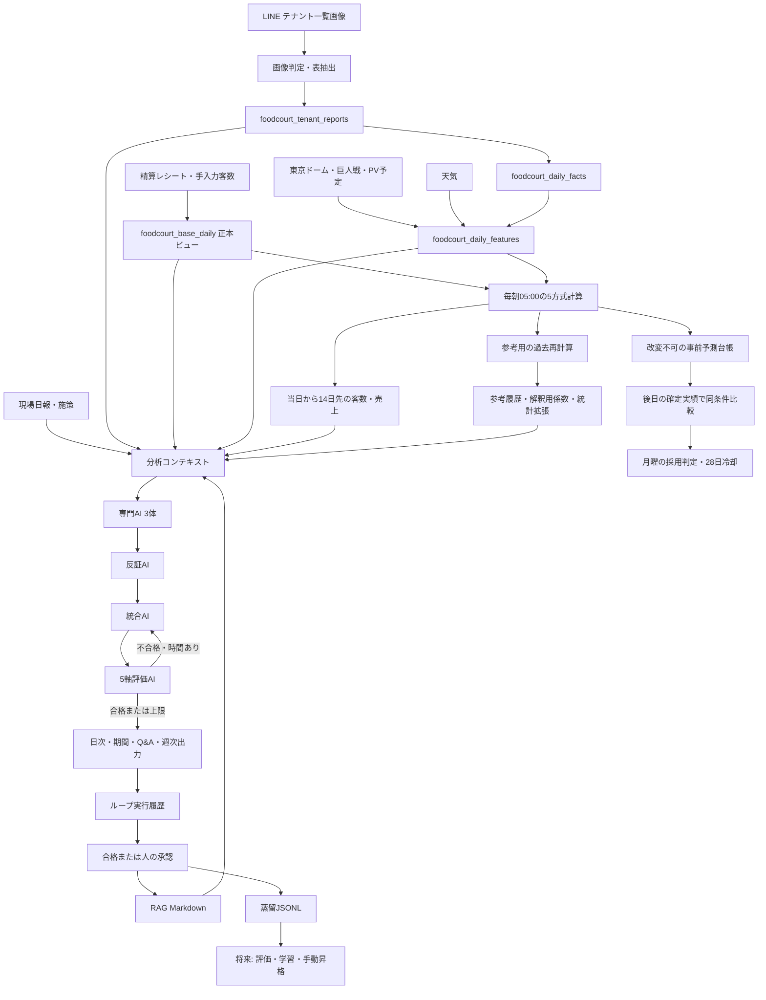

# フードコートAI学習・自己進化システム 完全設計書

> 2026-09-10 更新: 反証Gemini・評価Groq・画像Geminiが標準。設定・障害対策は [現行のモデル構成](./FOODCOURT-AI-RELIABILITY.md) を優先。以下に残るClaude構成・旧費用・旧実測は変更前の履歴であり、現在値ではない。

> 数値予測の更新: 2026-09-10、本番反映済み。現行の詳細正本は [FOODCOURT-FORECAST-AUDIT.md](./FOODCOURT-FORECAST-AUDIT.md)。AI回答・RAGの品質設定とは別の評価系統です。数値予測以外のモデル名・運用設定・件数は各節の確認日時点の記録で、今回の再監査対象ではありません。

> 対象: MARUGO S / FOOD STADIUM TOKYO 売上・来客分析基盤
>
> 基準日: 2026-07-16 JST
>
> 本番: Supabase `hocbnifuactbvmyjraxy` / GitHub Pages `MARUGO-s/line_report`
>
> 正本: 本書の説明よりコードとDBマイグレーションを優先する

## 1. この文書の目的

本書は、フードコート分析システムについて、現在実装されている機能、蓄積しているデータ、売上分析の切り口、AIの役割分担、学習と品質改善のループ、将来実装する機能、実用化に必要な最低データ量を一つにまとめた全体設計書である。

ここでいう「自己進化」は、次の4段階を区別する。

1. **統計モデルの自己再学習**: 完了実績で5方式の予測を発行し、後日の確定実績で比較して安全条件を満たした候補だけ採用する。
2. **回答の自己改善**: AI回答を別AIが採点し、不合格なら改善指示を反映して再生成する。
3. **承認済み知識の再利用**: 合格回答または人が承認した回答をRAG教材として次回へ渡す。
4. **モデル自体の更新**: 教師データでモデルの重みを学習し、評価後に新モデルを昇格する。

現在は **1〜3を実装済み**、4はデータセット出力と準備状況の判定までで、モデル重みの自動更新は行っていない。したがって現状は「統制付き自己改善システム」であり、無制限にコードやモデルを書き換える完全自律AIではない。

## 2. 実装状態の表記

| 表記 | 意味 |
|---|---|
| 実装済み | 本番経路でコード・DB・画面が接続されている |
| 一部実装 | 土台はあるが、データ量、評価、運用または自動化が不足している |
| 未実装 | 設計候補であり、本番処理にはまだ入っていない |
| 手動承認 | 自動生成・自動評価はするが、本番昇格は人が判断する |

## 3. 結論

現在のシステムは、次の意味ではすでに学習型である。

- 売上・客数・客単価、曜日、イベント、動員、天気を日次で結合する。
- 5方式を毎朝計算して事前予測台帳に保存する。採用方式は月曜の同条件比較と安全条件によってのみ変更する。
- AIは単独で数字を作らず、TypeScriptが計算した統計ブロックを解釈する。
- 数値、イベント・天気、現場運営の3専門AI、反証AI、統合AI、評価AIを役割分担させる。
- 回答を5軸採点し、不合格時は最大2回まで統合回答を改善する。
- 合格回答だけをMarkdown化してRAGへ保存し、関連する次回タスクで再利用する。
- 初回回答、評価、改善軌跡、最終回答を蒸留用JSONLとして書き出せる。

ただし、完全な自己進化型に必要な次の機能は未完成である。

- embeddingとベクトルDBを使う意味検索
- 固定評価セットによる自動回帰試験
- プロンプト候補の自動生成とA/B比較
- ファインチューニングまたは蒸留モデルの学習実行
- challengerモデルの段階配信、監視、ロールバック
- データドリフト・性能劣化・費用増加の自動停止
- 因果推論に必要な施策対照群と十分な日報データ

## 4. システム全体構成



## 5. 入力から保存まで

### 5.1 テナント一覧画像

対象店舗は現在 `marugoS`、基準店は `MARUGO S`、想定テナント数は11店である。

処理手順:

1. LINE画像に「テナント」「対象売上」「比較売上」「対象客数」などのマーカーがあるか判定する。
2. まずGroqの画像モデルで表を抽出し、成立しない場合はGeminiへフォールバックする。
3. テナント名、コード、対象売上、対象客数、比較売上、比較客数を構造化する。
4. 基準店を100とした比較、売上順位、客数順位、客単価、施設内売上シェアを計算する。
5. 月次集計画像の誤登録、同一日重複、精算レシート税抜売上との差を検査する。
6. 確認後、`foodcourt_tenant_reports`へ保存する。
7. DBトリガーで11店の日次明細を`foodcourt_daily_facts`へ正規化する。

重要な日付ルール:

- テナント一覧は翌朝発行される前日分の表である。
- `report_date`はレポート発行日、分析に使う売上日は原則その前日である。
- AIへ渡す前に売上日へ補正し、イベント・天気も同じ日付で結合する。

### 5.2 基準店実績の正本

予測モデルが使うMARUGO Sの売上・客数は、`foodcourt_daily_facts`だけではなく`foodcourt_base_daily`ビューを正本とする。

| 項目 | 正本 | 理由 |
|---|---|---|
| 税抜売上 | `line_receipt__marugoS.net_sales_yen`の日次合計 | テナント一覧の税抜売上と同じ基準 |
| 税込売上 | レシート税込合計 | 参考値として保持 |
| 客数・組数 | レシート集計、将来は手入力があれば優先 | 日報画像がない日も含める |
| 他テナント実績 | `foodcourt_daily_facts` | 施設内比較・相関・順位用 |

この分離により、「基準店の予測には欠損の少ない売上正本」「施設内比較には全テナント表」を使い分ける。

### 5.3 外部・現場データ

| データ | 主な保存先 | 蓄積内容 | 利用先 |
|---|---|---|---|
| 東京ドームイベント | `tokyo_dome_events` | 日付、会場、タイトル、カテゴリ、予想/実測動員、PV種別、日本戦、試合詳細 | 特徴量、相関、将来需要 |
| 巨人戦 | `giants_game_results` | 対戦相手、会場、動員、勝敗、スコア、点差、試合時間、開始時刻 | 野球特化分析、連勝連敗 |
| 天気 | `weather_daily` | 天気コード、最高/最低気温、降水量、降水確率、要約 | 雨、猛暑、イベントとの交互作用 |
| 現場日報 | `foodcourt_daily_logs` | 施策、担当者評価、課題、次の行動、動員、メモ | 施策と実績の照合 |
| 将来予測 | `forecast_predictions` | 予測値、上下限、採用モデル、特徴量、実績 | 仕入れ・人員判断、精度検証 |

## 6. 売上分析で攻めるセグメント

本システムは「売上が増えた/減った」だけではなく、次の順序で原因候補を分解する。

### 6.1 KPI構造

基本式は次の通り。

```text
売上 = 客数 x 客単価
```

前半期間と後半期間を比較し、売上差を客数要因、客単価要因、交互作用へ分解する。これにより、集客策を打つべきか、セット・ドリンク・高単価提案を打つべきかを取り違えない。

### 6.2 施設内ポジション

- 全11店中の売上順位、客数順位、客単価順位
- フードコート合計に対する売上シェア
- 施設平均・中央値との比較
- 基準店=100の相対指数
- 比較売上、比較客数がある場合の前期/前年相当比較

客単価は業態差が大きいため、順位だけで優劣を決めない。ワイン・スパイス業態として妥当な単価か、客数不足を単価で補えているかを競合業態プロファイルと合わせて読む。

### 6.3 自店時系列

- 全期間平均・中央値・最大・最小
- 直近3日などの勢い
- 前半対後半
- 同曜日平均
- 過去の同条件平均との差
- 異常値のZスコア
- 事前予測対実績のWAPE・MAE・偏り（MAPEは補助）

### 6.4 曜日・カレンダー

- 月曜から日曜の客数倍率とサンプル数
- 平日対土日
- 曜日とイベントの重なり
- 長期トレンド

曜日はイベント編成と強く重なるため、曜日単独の因果効果とは断定しない。

### 6.5 イベント種別・会場・動員規模

予測モデルのイベント区分:

| 内部区分 | 内容 |
|---|---|
| `pro` | 東京ドームのプロ野球 |
| `live` | 東京ドーム本体のライブ |
| `dome` | 東京ドーム本体のその他大型催事 |
| `hall` | 後楽園ホール、カナデビアホール等の小会場のみ |
| `soccer_pv` | サッカーPV |
| `japan` | サッカー以外の日本戦PV |
| `sports` | その他スポーツ中継 |
| `none` | イベントなし |

分析ではカテゴリだけでなく、タイトル、会場、実測/手入力/推定動員、開始時刻、想定客層を使う。同じ「ライブ」「野球」でも動員規模と来場客層が異なるため、カテゴリ平均だけで結論を固定しない。

### 6.6 野球詳細

- 勝ち試合対負け試合
- デーゲーム対ナイター
- 3時間以内対3時間超
- 接戦、中点差、大点差
- 2連勝以上、2連敗以上、その他
- 対戦相手、東京ドーム開催か他会場か
- 実測動員

これらは祝勝会需要、早期退場、試合終了時刻、ファン心理という仮説を検証する材料であり、サンプルが少ない区分は参考扱いにする。

### 6.7 天気

- 雨対非雨
- 天気区分別
- 最高気温30度以上対未満
- 雨と大型イベントの交互作用
- 気温とドリンク/滞在行動の仮説

### 6.8 他店舗との関係

MARUGO Sと他店の日次売上のピアソン相関を計算する。

- 負相関: カニバリゼーション候補
- 正相関: アンカー店舗または共通需要の候補
- 無相関: 独立した来店動機の可能性

相関は曜日やイベントという共通要因でも生じる。システムは相関を因果と断定しないよう反証AIと評価AIで検査する。

### 6.9 現場施策

日報の施策を次のカテゴリで蓄積する。

- 販促・集客
- メニュー提案
- 接客・サービス
- 環境・設備
- スタッフ
- その他

施策日は、同日の売上・客数・客単価、前日比、同曜日平均比、全日平均比、イベント、動員、天気と照合する。担当者の主観評価と実績が一致するかを示すが、現状は対照群がないため「施策が原因」とは断定しない。

### 6.10 統計拡張

`stats-ext-v1`は次を保存する。

- 曜日・イベント・天気係数の95%信頼区間
- 条件別の最小値、四分位、中央値、最大値
- 土日×大型イベント、雨×大型イベント等の交互作用
- 条件別の残差バイアス
- Cohen's dによる効果量

予測値そのものは採用モデルが計算し、統計拡張はAIが「どこまで信用してよいか」を判断する説明材料として使う。

## 7. 来客・売上予測の自己再学習ループ

### 7.1 毎朝の処理

```text
完了実績（発行日より前）＋発行時点のイベント・天気
    ↓ 毎朝05:00 JST、5方式で当日〜14日先を計算
改変不可の発行台帳・75予測（5方式×15日）
    ↓ 後日の確定実績と照合
本番評価：同じ対象日・方式・先行日数でWAPE/MAE/偏りを計算
    ↓ 月曜のみ、共通日数・改善幅・前後半・冷却期間の条件を検査
条件を満たした候補だけ採用／不足なら現行方式を維持
```

発行日より前の完了実績が28有効日以上必要。最新実績が3日以上前なら発行を停止する。各予測の学習は直近365有効日まで。実測動員を予測変数にせず、天気・イベントの入力値と更新日時を予測と同時に固定する。

同日再実行は最初の成功を保持する。JST09:00以降の発行は保存するが、朝の本番評価と方式切替の対象から外す。

### 7.2 候補モデルと採用条件

安全補正乗算（`mult-factor-v4-safe`）、直近4回同曜日（`weekday-4-v1`）、類似日（`similar-days-v1`）、客数・売上別の正則化回帰（`ridge-direct-v1`）、3候補の等重み平均（`ensemble-v1`）の5方式。初期採用は安全補正乗算。主評価は朝の1日前予測・直近28暦日。月曜日に、現行・候補・同曜日基準の共通21日以上で客数と売上のMAEがともに現行より5%を超えて改善し、前後半（各7日以上）でも両方改善することを確認する。同曜日基準以外の候補は同曜日基準にも両方勝つ必要がある。採用後28日は再切替を待つ。条件未達なら現行方式を維持する。

### 7.3 精度の読み方

- 本番評価は事前に保存した予測と後日の実績によるWAPE・MAE・偏り・同曜日基準比。MAPEは実績が正の日だけの補助指標。
- 過去再計算は参考。更新済みの天気・イベントが使われるため、当時の予報条件を再現した本番成績ではなく、採用判定にも使わない。
- 予測幅は同じ方式・先行日数の絶対誤差から計算する経験的80%幅。20日未満なら参考再計算に基づく幅と明示し、それも不足なら表示しない。MAPEや「100−MAPE」を確率・的中率と読まない。
- 学習曲線・全記録は参考履歴。方式や評価バージョンが変わった記録同士を改善・悪化と比較しない。
- 細部・実装参照・本番検証は [数値予測の現行正本](./FOODCOURT-FORECAST-AUDIT.md)。

## 8. 複数AIの役割分担

モデル名は環境変数で上書きできる。以下はコード上の既定値と優先経路である。

| AI | 役割 | 優先プロバイダ/既定モデル | 主な入力 |
|---|---|---|---|
| 専門AI 1 | 他店比較、時系列、要因分解、相関、異常値 | Groq / `openai/gpt-oss-120b` | 数値統計、競合業態、予測、日報効果対照 |
| 専門AI 2 | イベント、会場、動員、天気 | Gemini / `gemini-3.1-pro-preview` | イベント相関、予定、天気相関、日別実績 |
| 専門AI 3 | 現場施策、運営改善 | xAI / `grok-3-mini` | 日報、実績、予測、次のイベント |
| 反証AI | 捏造・因果断定・日付ずれの監査 | Gemini / gemini-3.5-flash | 3専門メモと計算済み根拠 |
| 統合AI | 最終回答の構成と矛盾解消 | OpenAI / `gpt-5.6-luna` | 全専門メモ、反証、統計、RAG |
| 改善再生成 | 評価指摘を反映した改稿 | OpenAI / `gpt-5.6-luna` | 前回答全文と改善指示 |
| 評価AI | 5軸採点 | Groq / openai/gpt-oss-120b | 実データ、専門メモ、最終回答 |

反証AI④は全surfaceでGemini 3.5 Flash（→ Groq）、評価AI⑥はGroq GPT-OSS（→ Gemini）が標準。統合はOpenAI→Gemini→Groq。旧Claude設定は新しい役割設定へ自動継承しない。Moonshotは構成外。

## 9. 回答品質ループ

### 9.1 対象画面

- `ask`: データへの自由質問
- `daily_summary`: 単日分析
- `period_summary`: 期間分析
- `weekly_report`: 週次経営レポート

全surfaceのコード既定は有効、最大2回である。これは「初回生成 + 最大1回の改善再生成」を意味する。環境変数でsurface別に無効化または最大5回まで変更できる。

### 9.2 評価軸

| 軸 | 検査内容 |
|---|---|
| 正確性 | 入力データと矛盾せず、数字を捏造していないか |
| 論理性 | 主張、根拠、結論が接続しているか |
| 専門性 | 飲食、フードホール、イベント需要を適切に理解しているか |
| 実用性 | 現場で実行できる提案か |
| 根拠性 | 計算済み数値、日報、イベントに基づいているか |

合格条件は「総合点が合格点以上」かつ「5軸すべてが合格点以上」。本番の合格点は2026-07-16時点で72点、設定可能範囲は30〜95点である。

### 9.3 時間制御

- 1リクエストのAI時間予算は最大110秒。
- Supabase側の150秒制限に約40秒の応答余裕を残す。
- 初回ループには最低5秒、改善ループには最低12秒残っている場合だけ開始する。
- 時間不足なら`timeout_prevented`として終了し、得られた最高点回答を返す。
- 全ループ不合格でも、最終回ではなく最高得点の回答を返す。

### 9.4 保存内容

`foodcourt_ai_loop_runs`は実行全体、`foodcourt_ai_loop_iterations`は各ループを保存する。

- surface、質問、対象期間・report ID
- モデルバージョン、最大ループ数、状態
- 最終点、最高点ループ、返却理由
- 各専門AI出力、反証メモ、統合回答
- 5軸点数、合否、改善点、リスクフラグ
- プロバイダ、モデル、トークン使用量

## 10. RAG学習

### 10.1 教材に採用する条件

次のいずれかを満たす回答だけを`foodcourt_ai_rag_documents`へ自動同期する。

- 品質評価ループで`passed`
- 人が`helpful`と評価

`not_helpful`、未完了、回答なし、不合格かつ人の承認なしは無効化する。

### 10.2 RAGファイルの内容

- 店舗、surface、作成日時
- 承認方法と評価点
- 分析タスク
- 対象データの`source_ref`
- 承認済み最終回答
- 評価AIが記録した再利用時の注意事項
- 人のメモ

### 10.3 現在の検索方式

- 同一店舗・同一surfaceから候補を取る。
- 日本語テキストを正規化し、文字bigramの重なりを計算する。
- 類似度0.03未満を除外する。
- 類似度、最終点、更新日時で並べ、最大2件をプロンプトへ渡す。
- 過去の数字や日付を現在の事実として流用しないよう明示する。

これは低コストで透明な字句検索であり、意味的に似ていて表現が違う質問には弱い。embeddingやpgvectorによるセマンティック検索は未実装である。

## 11. 蒸留データ

`GET /foodcourt/ai-distillation-dataset`は、承認済みrunを次の構造でJSONL化する。

- タスクと`source_ref`
- 初回回答と初回評価
- 全ループの回答、点数、改善指示
- 優先回答、採用ループ、最終点
- 人の評価
- モデルバージョン

現状の「蒸留」は**教師データ候補の自動収集と出力**までである。外部モデルのファインチューニング、学習ジョブ、モデル登録、オンライン比較、本番昇格はまだ行わない。

## 12. レポート・画面・配信

| 出力 | 保存・キャッシュ | 主な画面/配信 |
|---|---|---|
| 日次サマリー | `foodcourt_daily_ai_summary` | `foodcourt.html` |
| 期間サマリー | `foodcourt_period_ai_summary` | `foodcourt.html` |
| Q&A | ループrun/iteration | `foodcourt.html` |
| 日報 | `foodcourt_daily_logs` | `foodcourt-report.html` |
| 週次報告 | `foodcourt_weekly_reports`、HTML本文 | LINEリッチメッセージ、`foodcourt-weekly-report.html` |
| 月次振り返り | `foodcourt_monthly_retrospective` | 次月の日次・週次分析の文脈 |
| 学習進化 | 予測履歴、loop、RAG、readiness | `foodcourt-evolution.html` |

週次報告はルームごとにON/OFF、曜日、JST時刻を設定できる。cronは5分ごとに対象を確認し、`foodcourt_weekly_report_sends`でルーム×週の二重送信を防ぐ。生成済みHTMLはDBへ保存され、後から同じリンクで閲覧できる。

## 13. 本番DBの蓄積状況

2026-09-10に5方式の事前予測台帳を本番反映した。初回75予測の保存と再実行時の不変性を確認済み。夜間の初回発行は朝の採点対象外で、本番評価は蓄積開始段階である。

以下は**2026-07-16の旧方式・旧件数の履歴資料**であり、現在値ではない。最新の数値予測は [現行正本](./FOODCOURT-FORECAST-AUDIT.md) と管理画面を参照する。

| データ | 件数 | 期間/補足 |
|---|---:|---|
| テナント一覧レポート | 37 | 2026-06-08〜2026-07-15 |
| 全テナント日次facts | 386 | 36日、2026-06-07〜2026-07-14 |
| 基準店予測用正本 | 49日 | 2026-05-27〜2026-07-15、全49日がモデル利用可能 |
| 東京ドームイベント | 362 | 2026-06-01〜2027-02-14 |
| 天気 | 128 | 2026-03-22〜2026-07-27 |
| 巨人戦詳細 | 69 | 全会場の試合結果・動員 |
| 予測レコード | 118 | 客数・売上、過去検証と将来14日 |
| 予測学習履歴 | 11 | 2026-07-05〜2026-07-15 |
| 日次AIサマリー | 17 | 2026-06-29〜2026-07-14 |
| 期間AIサマリー | 5 | 対象期間2026-06-07〜2026-07-13 |
| 現場日報 | 2 | 2026-07-09〜2026-07-10 |
| 週次レポート | 3 | 2026-06-29〜2026-07-13 |
| 月次振り返り | 1 | 2026年6月分 |
| AIループrun | 29 | 完了28、失敗1 |
| AIループiteration | 50 | 初回と改善履歴 |
| 有効RAG教材 | 3 | Q&A 2、週次 1、すべて品質合格 |
| 人の評価 | 1 | `not_helpful` 1、`helpful` 0 |

旧方式の予測モデルスナップショット（2026-07-16、現行ではない）:

- 学習48日、バックテスト44日
- 採用モデル: `mult-factor-v1`
- 全期間MAPE: 客数45.3%、売上47.1%
- 直近14日MAPE: 客数34.5%、売上36.4%
- GLMの選択λ: 16
- 直近比較では乗算モデルがGLMより良く、乗算モデルを採用

条件別サンプル数の履歴（2026-07-16）:

- 曜日: 各曜日6〜7日
- プロ野球14日、ライブ10日、小ホール16日、ドーム本体その他2日、サッカーPV2日、イベントなし4日
- 雨19日、非雨29日
- 日本戦PV、その他スポーツ放映は0日

このため、曜日と主要イベントの方向性は見え始めているが、イベントなし、ドームその他、PV細分類、現場施策の結論はまだ不安定である。

## 14. 最低限必要なデータ量

### 14.1 「コードが動く最低量」と「業務で信頼する量」は違う

現行コードは発行前の完了実績28有効日以上を必要とする。ただし28日は技術上の開始条件であり、業務精度の保証ではない。必要量は次の3層で考える。

| 層 | 意味 |
|---|---|
| 技術最低量 | 処理が停止せず結果を出せる量 |
| 評価開始量 | 良し悪しを検証し始められる量 |
| 本番信頼量 | 季節・イベント偏りを抑えて意思決定に使う量 |

### 14.2 統計予測

| 目的 | 現行の必要条件 | 注意 |
|---|---|---|
| 日次発行・参考再計算の各学習 | 発行日より前の完了実績28有効日以上 | 学習は最大365有効日、最新実績の遅延も検査 |
| 方式の採用判定 | 朝の1日前予測、直近28暦日の共通21日以上 | 前後半各7日以上・両指標の改善・28日冷却が別途必要 |
| 経験的80%幅 | 同方式・同先行日数の確定誤差20日以上 | 本番不足なら参考再計算と明示、それも不足ならnull |
| 季節性・複雑な追加特徴量 | 現行では年周期・二次トレンドを使用しない | データ日数だけで導入せず、新IDで事前比較 |

解釈用の条件別ラベルでは `n<3` が参考不可、`3〜5` が参考程度、`6以上` が再現性ありとなる。ただしこれはUIの目安で、有意差や因果、予測精度を保証しない。

### 14.3 施策学習

施策効果を学ぶには、売上日数より日報の密度が重要である。

| 目的 | 推奨最低量 |
|---|---:|
| 施策と実績の個別振り返り | 日報1件から可能 |
| 同一施策の方向性確認 | 同条件で5〜10実施日 |
| 曜日・イベントを分けた比較 | 施策カテゴリごと20〜30日 |
| 因果に近い検証 | 実施/非実施の比較群を含む50〜100日以上 |

2026-07-16時点の日報は2件だったため、施策学習は「事例記録と仮説生成」の段階である。毎営業日、実施しなかった日も空欄ではなく「施策なし」として記録すると対照群を作りやすい。

### 14.4 RAG・プロンプト改善・蒸留

コードに実装されている安全ゲート:

| 段階 | 必要条件 |
|---|---|
| RAG再利用 | 承認済み1件以上 |
| プロンプト候補の評価開始 | 承認済み20件、人の`helpful` 5件、日次教材5件 |
| モデル蒸留の検討開始 | 承認済み100件、人の`helpful` 20件、日次教材30件、3surface以上 |

より安全な実務目安:

| 用途 | 推奨データ量 |
|---|---:|
| RAGの初期実用 | surfaceごと20〜50件 |
| プロンプトA/B比較 | 学習100〜300件 + 固定評価50〜100件 |
| 小型モデル蒸留の試験 | 高品質500〜1,000件 + 固定評価100〜200件 |
| 複数surfaceの安定モデル | 1,000〜2,000件、主要surfaceごと100件以上 |

件数だけでなく、次の分布を揃える必要がある。

- 日次、期間、Q&A、週次
- 好調日、不調日、通常日
- 平日、土日、イベントなし、野球、ライブ、小ホール、PV
- 雨、猛暑、通常天気
- 数値説明、原因仮説、予測、施策提案
- 合格例だけでなく、代表的な失敗と改善軌跡

2026-07-16時点は承認済み3件、人の`helpful` 0件、日次教材0件、2surfaceだったため、RAGの技術最低量は満たすが、プロンプト自動改善やモデル蒸留を開始する量には達していない。

## 15. 完全な自己進化型へ必要なシステム

### 15.1 到達条件

安全な「完全自己進化型」は、単にAIが自分の回答を学ぶ仕組みではない。次の閉ループが必要である。

```text
収集 -> 品質検査 -> 学習候補生成 -> 固定評価 -> challenger配信
     -> 本番観測 -> 劣化検知 -> 自動停止/ロールバック -> 人の承認
```

### 15.2 未実装または不足している機能

| 機能 | 現在 | 将来の完成条件 |
|---|---|---|
| データ品質 | 基本的な重複・日付・売上突合 | 欠損率、遅延、異常スキーマ、データ鮮度SLAを自動監視 |
| RAG | bigram字句検索 | embedding + pgvector + キーワードのハイブリッド検索、引用元表示 |
| 評価セット | runごとのAI自己評価 | 人が確定した固定問題、期待事実、禁止事項、surface別評価 |
| プロンプト改善 | 改善指示による単発改稿 | プロンプト候補生成、同一評価セット比較、統計的優位判定 |
| 蒸留 | JSONL出力 | 学習ジョブ、データ分割、重複除去、PII検査、モデル登録 |
| 生成AIモデル昇格 | `manual_only` | shadow/canary、費用・品質・速度の合格、手動承認 |
| ロールバック | 旧キャッシュ/モデル指定で対応可能 | 劣化検知時の自動切戻し、再生成停止 |
| ドリフト | 数値予測は事前予測の誤差・偏り・母数を表示 | 特徴量分布、残差、イベント構成、回答点の変化を自動検知 |
| エージェント再実行 | 統合AIだけ改善再生成 | 評価軸に応じて該当専門AIだけ再実行 |
| 因果推論 | 相関と仮説 | 施策なし日、類似条件マッチ、差分の差分、介入記録 |
| 費用統制 | 使用量をiterationへ記録 | surface別予算、日次上限、品質増分対費用の自動停止 |

### 15.3 推奨する実装順序

1. **日報入力率を上げる**: 毎営業日の施策有無、動員、課題を記録する。
2. **人の評価を増やす**: 役に立った/改善が必要を必ず付け、理由を短く残す。
3. **固定評価セットを作る**: まず50問、日次・期間・Q&A・週次を均等にする。
4. **RAGをハイブリッド検索へ移行する**: embeddingだけにせず、店舗・surface・日付・カテゴリの構造フィルタを併用する。
5. **プロンプト候補のオフライン比較を実行する**: 固定評価セットと候補下書きを使い、本番へ直接適用しない。
6. **shadow評価を実装する**: 現行回答をユーザーへ返し、候補版は裏で採点する。
7. **蒸留モデルを試験する**: 500〜1,000件を超えてから小型モデルで開始する。
8. **canaryとロールバックを実装する**: 5〜10%から段階配信する。

## 16. 自動化スケジュール

| 処理 | 予定 |
|---|---|
| 東京ドーム・巨人戦取得 | 毎日 JST 04:10 |
| 5方式の事前予測発行 | 毎日 JST 05:00 |
| 数値予測の採用判定 | 月曜 JST 05:00、共通日数・改善・冷却条件を満たすときだけ |
| 天気取得 | 毎日cron |
| 週次レポート判定 | 5分ごと、ルーム設定時刻に送信 |
| 日次/期間サマリー | 初回要求時生成しキャッシュ |
| RAG同期 | runまたは人の評価更新時にDBトリガーで即時 |

## 17. 主なDBオブジェクト

| 分類 | テーブル/ビュー |
|---|---|
| 画像原本 | `foodcourt_tenant_reports` |
| 全店日次 | `foodcourt_daily_facts` |
| 基準店正本 | `foodcourt_base_daily` |
| 日次特徴量 | `foodcourt_daily_features` |
| イベント・天気 | `tokyo_dome_events`, `giants_game_results`, `weather_daily` |
| 事前予測の正本 | `foodcourt_forecast_issuances`, `foodcourt_forecast_snapshots` |
| 最新予測・参考解釈 | `forecast_predictions`, `foodcourt_forecast_factors`, `foodcourt_forecast_history` |
| 現場 | `foodcourt_daily_logs` |
| AIキャッシュ | `foodcourt_daily_ai_summary`, `foodcourt_period_ai_summary`, `foodcourt_monthly_retrospective` |
| 週次 | `foodcourt_weekly_reports`, `foodcourt_weekly_report_sends` |
| 品質ループ | `foodcourt_ai_loop_runs`, `foodcourt_ai_loop_iterations` |
| 人の評価 | `foodcourt_ai_feedback` |
| RAG | `foodcourt_ai_rag_documents` |
| 設定 | `line_admin_console_settings`, `room_summary_settings` |

## 18. 主なAPI

| API | 用途 |
|---|---|
| `GET /foodcourt/reports` | テナントレポート取得 |
| `POST /foodcourt/ask` | データへの質問 |
| `GET /foodcourt/daily-summary` | 日次サマリー生成/取得 |
| `GET /foodcourt/period-summary` | 期間サマリー生成/取得 |
| `GET/POST /foodcourt/weekly-report` | 週次報告取得/生成 |
| `GET/PUT/DELETE /foodcourt/daily-logs` | 日報管理 |
| `GET /foodcourt/evolution-history` | `forecast_audit`（本番/参考評価・5方式・将来予測）と参考履歴 |
| `GET /foodcourt/ai-loop-runs` | 回答ループ履歴 |
| `POST /foodcourt/ai-loop-feedback` | 人の評価保存 |
| `GET /foodcourt/ai-rag` | RAG教材一覧 |
| `GET /foodcourt/evolution-readiness` | 学習準備状況 |
| `GET /foodcourt/ai-distillation-dataset` | 蒸留JSONL出力 |

## 19. セキュリティと統制

- フードコートの学習・予測テーブルは原則RLSを有効化し、Edge Functionsの`service_role`から扱う。
- `service_role`キーをブラウザへ出さない。
- 管理画面APIで認証・店舗スコープを確認する。
- cronの内部関数は認証トークンが無ければ処理しない。
- RAGには品質合格または人の承認だけを入れ、`not_helpful`を除外する。
- 生成AIモデルの昇格は件数を満たしても`manual_only`を維持する。数値予測の方式切替は第7節の独立した安全条件で判定する。
- 事前予測台帳は追記専用RPC経由。匿名・一般ユーザーから直接参照できず、サービス権限でも直接改変できない。
- RAGの過去回答より、その回の実データを常に優先する。
- 個人情報を含む自由入力は蒸留前に匿名化・PII検査する必要がある。

## 20. 運用KPI

### データKPI

- 基準店実績の欠損日数
- テナント一覧の受信遅延・重複・売上不一致
- イベントの動員入力率
- 天気取得成功率
- 日報入力率と施策なし日の記録率

### 予測KPI

- 主評価（本番・直近28日・1日前）の客数/売上WAPE、MAE、偏り、同曜日基準比
- 評価できた日数、ゼロ実績日数、天気・イベント別の母数と誤差
- 台帳に保存した予測幅の実績包含率（参考幅の区別を含む）
- 発行遅延・欠損・除外件数、採用方式と判定理由
- 比較条件が同一か、過去再計算の値を本番精度と混同していないか

### 生成AI KPI

- surface別合格率、平均点、5軸平均
- 1回目で合格した割合
- 改善後の点数増分
- `evaluation_failed`, `timeout_prevented`, `max_loop_best`率
- 回答1件あたり時間、トークン、費用
- RAG参照率と参照後の合格率差
- `helpful`率と`not_helpful`理由

### 学習KPI

- 承認済み教材数、surface分布、条件分布
- 重複率、古い事実の混入率
- 固定評価セットの現行対候補スコア
- challengerの品質、速度、費用
- 本番昇格後の回帰とロールバック回数

## 21. 現時点の実装マトリクス

数値予測は2026-09-10更新。生成AI・日報の件数と設定は旧確認日時点の記録であり、現在の管理画面で再確認する。

| 領域 | 状態 | コメント |
|---|---|---|
| 画像抽出と保存 | 実装済み | Groq優先、Geminiフォールバック |
| 全店比較・正規化 | 実装済み | 11店factsへ同期 |
| レシート売上正本 | 実装済み | 税抜売上と客数を予測へ利用 |
| イベント・天気取得 | 実装済み | 将来予定も蓄積 |
| 巨人戦詳細 | 実装済み | 勝敗、点差、時間、動員 |
| 統計事前計算 | 実装済み | 要因分解、相関、Z値、CI、効果量等 |
| 5方式の発行・安全な方式選択 | 本番反映済み | 毎朝台帳保存、月曜の事前予測比較 |
| 当日〜14日先の15日予測 | 本番反映済み | 誤差数が十分なとき経験的幅を表示 |
| 5+1 AI構成 | 実装済み | 3専門、反証、統合、評価 |
| 品質改善ループ | 実装済み | 全surface既定ON、最大2回 |
| 合格点設定 | 実装済み | 30〜95、現在72 |
| 日報と実績の照合 | 実装済み | データ量は2件で不足 |
| 日次・期間・週次キャッシュ | 実装済み | 再課金を抑制 |
| 週次HTML保存・LINE配信 | 実装済み | 二重送信防止あり |
| RAG自動Markdown化 | 実装済み | 3件、字句検索 |
| 人の評価 | 実装済み | 利用件数不足 |
| 蒸留JSONL | 実装済み | 学習実行は未実装 |
| readiness画面 | 実装済み | 自動昇格なし |
| embedding検索 | 未実装 | pgvector等が必要 |
| 固定評価セット | **承認済み回答の基準スナップショットまで実装** | 比較実行前に手動確認 |
| プロンプトA/B | **候補下書きまで実装** | shadow評価から開始 |
| モデル重み更新 | 未実装 | 500〜1,000件以降に試験 |
| canary/自動ロールバック | 未実装 | 完全自己進化の安全装置 |
| 因果推論 | 一部実装 | 相関と交絡注意のみ、対照データ不足 |

## 22. 重要な制約

1. 予測精度はデータ日数だけでなく、イベント構成の偏りに左右される。
2. MAPEは実績が小さい日に大きくなりやすい。現行ではWAPE・MAE・偏りを主にし、MAPEを補助として母数と併記する。
3. イベントの動員推定は実測ではない場合があり、規模感の参考に留める。
4. 日報の担当者評価は主観であり、実績との一致だけで因果を確定できない。
5. AI評価点は評価モデルの判断であり、人の満足度を完全には代替しない。
6. 合格回答だけを再利用すると、評価AIの偏りを増幅する危険がある。固定評価と人の承認が必要である。
7. 自動学習データに過去回答の誤りが混ざると誤りを自己強化する。出典、時点、失効条件を保持する必要がある。
8. 「完全自己進化」は無監督の自動昇格を意味しない。業務システムでは、人が止められる統制付き進化を完成形とする。

## 23. コードの正本

| 領域 | ファイル |
|---|---|
| フードコート取込・分析・AIオーケストレーション | `supabase/functions/_shared/foodcourt_compare.ts` |
| 品質判定・RAG類似度・readiness | `supabase/functions/_shared/foodcourt_loop_utils.ts` |
| 蒸留JSONL構築 | `supabase/functions/_shared/foodcourt_distillation.ts` |
| 予測発行cron | `supabase/functions/foodcourt-forecast-cron/index.ts` |
| 数値予測・評価・採用判定 | `supabase/functions/_shared/foodcourt_forecast_engine.ts` |
| API | `supabase/functions/admin-api/index.ts` |
| イベント取得 | `supabase/functions/tokyo-dome-events-cron/index.ts` |
| 分析画面 | `foodcourt.html` |
| 日報画面 | `foodcourt-report.html` |
| 週次報告画面 | `foodcourt-weekly-report.html` |
| 学習進化画面 | `foodcourt-evolution.html` |
| 品質ループ設計ログ | `docs/AI_LOOP_ENGINEERING_DESIGN.md` |

## 24. 次の到達目標

短期の最優先は「モデルを増やすこと」ではなく、次の3点である。

1. 日報を毎営業日記録し、施策なし日も含む比較可能なデータを作る。
2. AI回答へ人の評価を付け、`helpful` 5件、日次教材5件、承認済み20件の最初の安全ゲートを超える。
3. 50問以上の固定評価セットを作り、現在のプロンプトを変えずに基準点を確定する。

この3点が揃った後に、ハイブリッドRAG、プロンプト候補比較、shadow運用、蒸留モデルの順で進める。現在のデータ量ではRAG再利用は開始できるが、モデル重みを学習して自動昇格させる段階ではない。

---

数値予測の仕様・本番状態は2026-09-10更新。第13節の旧件数・旧MAPEと生成AI側の設定は各節の確認日時点の履歴である。今後も現行仕様、履歴スナップショット、最低データ条件を分けて保守する。
